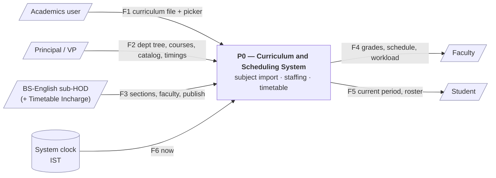
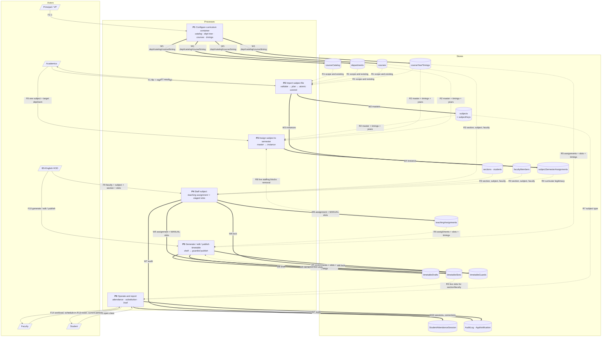

# Subject import → teaching assignment → timetable: flow, schema, DFD

Worked example used throughout: the sub-department **`Basic Science - English`**
(`parentDepartmentId` → `Basic Science`, `managedDepartments: ["MECH", "EEE", "CIVIL"]`)
importing the B.Tech first-year curriculum and running Year 1 for three branches.

Everything lives under `colleges/{collegeId}/…`. No entity outside that path is touched
by any process below.

---

## 1. Cast

| Actor | Role / login | What they own here |
|---|---|---|
| Principal / VP | `PRINCIPAL`, `VICE_PRINCIPAL` | department tree, Courses, Course Catalog, Course-Year Timings |
| Academics | `ACADEMICS` (internal office role) | Course Structure import, master Subjects, Assign to Semester |
| BS-English sub-HOD | `HOD` on `departments/{bsEnglishId}` | sections/staffing/timetable for **Year 1 of MECH/EEE/CIVIL only** |
| Branch HODs (MECH/EEE/CIVIL) | `HOD` on their own dept | Years 2–4 of their branch; **view-only** on Year 1 |
| Faculty, Students | `STAFF` / `STUDENT` | read-only consumers |
| Timetable Incharge | `PANEL_MEMBER` / `COLLEGE_STAFF` | delegated co-editor for one course-year (`lib/departments/timetableIncharge.ts`) |

### The three configuration objects that must exist first

```
Basic Science               hasSubDepartments: true, parentRunsOwnSections: false, assignedYears: [1]
├── Basic Science - English    managedDepartments: ["MECH","EEE","CIVIL"], assignedYears unset → inherits [1]
├── Basic Science - Maths      managedDepartments: [...]
└── …                           parentDepartmentId → Basic Science

MECH / EEE / CIVIL          assignedYears: [1,2,3,4], own Course doc per catalogue programme
```

* A branch may be grouped under **at most one** sub-department
  (`findBranchClaimConflicts`, 409 on write).
* A sub-department never sets `hasSubDepartments` (the tree is one level deep).

---

## 2. Data schema (Firestore)

All doc-ID formulas are authoritative — they are how the app joins things.

### 2.1 Configuration (read by every stage)

| Collection / doc | Key fields | Notes |
|---|---|---|
| `courseCatalog/{catalogId}` | `regulations[]`, `regulationBatches{reg→year}` | the dedupe group: every department's Course doc for one programme shares this `catalogId` |
| `courses/{courseId}` | `name`, `departmentId`, `catalogId`, `durationYears`, `isActive` | one doc **per department** per programme |
| `departments/{deptId}` | `name`, `parentDepartmentId`, `hasSubDepartments`, `parentRunsOwnSections`, `assignedYears[]`, `managedDepartments[]`, `secondaryDepartments[]`, `courseScopes{catalogId→{assignedYears,secondaryDepartments}}`, `isFreshman` | resolved only through `lib/college/academicStructure.ts` + `lib/departments/managedBranches.ts` |
| `courseYearTimings/{courseId}_year{N}` | `collegeStart/End`, `periods[{periodNumber,start,end}]`, `semesters[{semester,start,end}]` | defines the period grid **and** which semester today falls in |
| `subjectCategories/{code}` | `code`, `fullForm` | user-defined categories beyond the 9 AICTE built-ins |

### 2.2 Curriculum

**`subjects/{id}` — master subject** (`src/types/teaching.ts:34`)

Two shapes share one collection (branch on which fields the POST carried):

* **Master** — `courseId` + `regulation`, *no* `department` / `year`.
  Department-independent; visible to every department running the same `catalogId`.
* **Semester-scoped (legacy)** — `semester` + `department`, no course link. HOD-created
  from `/hod/subjects`.

| Field | | Field | |
|---|---|---|---|
| `collegeId` | | `courseId` / `courseName` | origin department's Course doc |
| `name`, `code`, `shortCode` | | `regulation` | immutable once set |
| `lectureHours`, `tutorialHours`, `practicalHours` | required on master | `hoursPerWeek` | = L+T+P |
| `credits`, `type` (`THEORY\|PRACTICAL\|TUTORIAL\|PROJECT`) | | `category` + `customCategory` | |
| `serialNumber` | curriculum-table row order | `internalMarks`/`externalMarks`/`totalMarks` | decorative only |
| `academicYear` | session tag, optional | `isActive`, `createdAt`, `updatedAt` | |

Doc IDs:

* Course-structure import → `cs_` + `sha256(collegeId|groupKey|regulation|subjectIdentityKey).hex[0..24]`,
  where `groupKey = catalogId || courseId` and `subjectIdentityKey = code|name|category|L|T|P`.
  Deterministic ⇒ two concurrent imports of the same subject collide on `tx.create` (409);
  they never create twins.
* Single add (POST `subjects`) → auto ID, uniqueness enforced by the lock doc below.
* Bulk master import (`MasterSubjectImportService`) → its own deterministic scheme.

**`subjectKeys/{sha256(scope|regulation|code).hex[0..40]}` — uniqueness lock**
(`src/lib/subjects/subjectKeys.ts`). `scope` = `catalogId` when the course has one, else
`courseId`. Written in the same transaction as the subject; a lock whose owner no longer
carries that code/regulation is stale and taken over. This is the only thing that makes
"same code twice for this course+regulation" race-proof.

**`subjectSemesterAssignments/{subjectId}_{departmentId}_{semester}` — the instance**
(`src/types/teaching.ts:112`, built by `buildSubjectInstancePayload`)

This is the record that says *"this subject is curricularly offered by this department in
this year-semester"*. Everything downstream gates on it.

| Field | |
|---|---|
| `subjectId`, `masterSubjectId` | both point at the master (one is a query helper) |
| `subjectName`, `subjectCode`, `shortCode` | snapshot from master |
| `courseId`, `courseName` | **the performing department's** Course doc, not the master's origin |
| `departmentId`, `departmentName` | the department the subject is offered *by* |
| `year`, `semester` | `year` resolved server-side from `courseYearTimings`, never trusted from the client |
| `regulation`, `academicYear` | snapshot |
| `type`, `category`, `customCategory`, `lectureHours`, `tutorialHours`, `practicalHours`, `hoursPerWeek`, `credits`, `totalHoursPerSemester`, marks | snapshot; `isCustomized: true` when per-department hour overrides applied |
| `isActive` | soft delete |

Pre-migration instances used `{subjectId}_{departmentId}` (no semester). The service
creates the new key and deletes the old one **only if its `semester` matches**.

### 2.3 Staffing

**`teachingAssignments/{autoId}`** (`src/types/teaching.ts:155`) — again two shapes:

* **Course/section-scoped** (the one used here): `courseId`, `courseName`, `sectionId`,
  `sectionName`, `year`, `timetableSemester`.
* **Semester-scoped (legacy)**: `academicYear` + `semester` + free-text `section`.

| Field | |
|---|---|
| `facultyId`, `facultyName` | name always resolved server-side from the faculty doc |
| `department` | **`section.department`** → `"MECH"`, not the manager |
| `departmentId` | **`course.departmentId`** → MECH's dept id |
| `subjectId`, `subjectName`, `subjectCode`, `shortCode` | snapshot at creation |
| `hoursPerWeek` | body override or `subject.hoursPerWeek` |
| `assignedBy`, `assignedByName` | |
| `assignmentAcademicYear`, `assignmentSemester` | resume labels only |
| `isPast` | historical record — no conflict checks, no slots |
| `subjectType` | **joined at read time only**, never written |

### 2.4 Timetable

| Collection / doc | Key fields |
|---|---|
| `timetableDrafts/{sectionId}` **or** `{sectionId}_sem{N}` | `status: DRAFT\|PUBLISHED`, `slots: DraftSlot[]`, `facultyIds[]` (array-contains index over `slots`), `semester`, `academicYear`, `diagnostics[]`, `generatedAt/publishedAt` |
| `timetableSlots/{id}` | `assignmentId`, `facultyId/Name`, `subjectId/Name`, `courseId`, `year`, `sectionId`, `department`, `day`, `periodNumber`, `classroom?`, `labBatch?`, `source: MANUAL\|GENERATED`, `isPinned`, `semester`, `academicYear`, `effectiveDate?`, `mergeWithNext?` |
| `timetableGuards/section_{sectionId}`, `timetableGuards/faculty_{facultyId}` | `{updatedAt, lastWriter}` — **no data, lock only** |

* The draft doc lives **outside** `timetableSlots` deliberately: the class-leader and
  faculty routes read `timetableSlots` with no publish filter, so a draft in there would
  be visible to students mid-edit.
* **Published slot ID** (deterministic, `publishDraft.ts:51`):
  `pub_{sectionId}_{academicYear}_{semester}_{day}_{period}_{assignmentId}` — every part
  `[^A-Za-z0-9_-] → _`. Republishing an unchanged cell reuses the same ID, so anything
  pointing at a slot (e.g. a leave substitution's `timetableSlotId`) keeps working.
* **Manual slots** get auto IDs and are *pinned*: the generator schedules around them and
  publish never deletes them.

### 2.5 Read-time joins (never persisted)

* `TeachingAssignment.subjectType` ← `Subject.type`
* `TimetableSlot.subjectType` ← `Subject.type`
* `TimetableSlot.substituteFacultyId/Name/Date` ← approved leave's `PeriodSubstitution`
  (`lib/leave/periodCoverage.ts`)

---

## 3. Process flow

### P1 — Configure the curriculum container *(Principal/VP, one-time)*

1. Course Catalog: add B.Tech, its `regulations` (`R23`), `regulationBatches`.
2. Departments: create `Basic Science` (`hasSubDepartments`, un-tick
   `parentRunsOwnSections`), children `Basic Science - English/…`, then on each child set
   `managedDepartments = ["MECH","EEE","CIVIL"]` (the parent HOD does this from
   *Settings → Sub-Departments*; `findBranchClaimConflicts` 409s an overlap).
3. Courses: one B.Tech doc per branch **and** one under `Basic Science`.
4. Course-Year Timings: configured **once, on the department that actually runs the shared
   year** (Basic Science / its sub-department), not per branch.

### P2 — Import the subject file *(Academics → Course Structure)*

UI: `src/app/(dashboard)/academics/course-structure/page.tsx`, `.csv/.xlsx`.

**Picker (once per file):** Regulation + Course + Department.
For this scenario: `R23` + *Basic Science's* B.Tech Course doc + `Basic Science - English`.

**Server: `POST /api/college/subjects/import-and-assign`**
(`ROLES = PRINCIPAL | VICE_PRINCIPAL | SUPER_ADMIN | ACADEMICS` — **HOD is not allowed**).

```
GET  ?courseId&departmentId&regulation       →  scope (teachable years, semesters/year, what's assigned)
POST {mode, courseId, departmentId, regulation, records}  →  200/201 | 400 | 409 | 422

mode: "validate"  → dry run, writes nothing, returns the plan
mode: "commit"    → same, then ONE transaction, then a read-back verification
records: [{rowNumber, data: {year, semester, category, name, code, L, T, P, …}}]   ≤ 250 rows
```

**Scope resolution (`buildContext`)**

1. `courseOwnershipError` — the course must be run by this department. A sub-department
   owns no Course doc of its own, so `related = {self, parent}` and the chosen Course must
   belong to `Basic Science`. Also rejects a `parentRunsOwnSections: false` parent
   (*"doesn't run sections of its own — import into one of its sub-departments"*).
2. `regulation` must be in `courseCatalog.regulations`.
3. `teachableYearsForDepartment` → `managerTeachingYears` → own `assignedYears` is empty
   for a sub-department, so it falls back to the **parent's** `[1]` → **teachableYears =
   `[1]`**. Every row must be `year: 1`, else `errors[]` and nothing imports.
4. `semestersByYear` comes from `courseYearTimings/{courseId}_year{1}.semesters`.

**Row validation (`validateCourseStructureRows`)** — required `year`, `semester`,
`category`, `name`, `lectureHours`, `tutorialHours`, `practicalHours`; category resolved
against built-ins + `subjectCategories`; `type` inferred from P hours if blank; credits
default `L + T + P/2`; `Internal + External == Total` when all three are given; the semester
must exist in that year's configured semesters; ≤ 500 planned writes (else *"split by
year"*).

**Plan (`buildPlan`)** — per row:

* `subjectIdentityKey` → existing master reused, or a deterministic new ID.
  A reused master that `isActive === false` is an **error**, not a silent revival.
* instance ID = `{masterId}_{departmentId}_{semester}` → `create` / `unchanged` /
  `reactivate` (the pre-migration semester-less key is folded in).
* Warnings, never blockers: a slot already holding another regulation's subjects; a year
  this regulation doesn't govern yet.

**Commit (one `db.runTransaction`)**

1. Re-read course, departments, catalog, timings, categories; rebuild the whole context —
   any drift ⇒ `CourseStructureConflictError` → **409, nothing saved**.
2. Re-run validation against the fresh scope.
3. `tx.getAll` every target: a new master that already exists ⇒ 409; a reused master
   missing/deactivated ⇒ 409; an instance someone else created concurrently ⇒ 409.
4. `tx.create` new masters, `tx.set` instances, `tx.delete` legacy keys.
5. `verify()` reads every written instance back and checks `regulation`, `courseId`,
   `departmentId`, `year`, `semester`, `isActive`. Problems are logged, not hidden.

**Outcome:** `201` committed · `200` validated · `400` un-evaluatable · `409` drift ·
`422` row errors (nothing written) · `500` with `"Nothing was saved."`

### P3 — Alternative, one-at-a-time *(Academics → Subjects)*

`POST /api/college/subjects` (master shape) → `claimSubjectKey` transaction → then
`POST /api/college/subject-semester-assignments` → `SubjectInstanceService.assignSubjectInstance`:

* Year resolved by scanning `courseYearTimings` for a year that actually configures this
  semester — a client-supplied `year` is **cross-checked, not trusted**.
* `scopedYears` = `courseScopes[catalogId].assignedYears ?? assignedYears`, inherited from
  `parentDepartmentId` when the sub-department has none; empty ⇒ *"not configured"*, never
  *"teaches everything"*.
* `unassignSubjectInstance` refuses if any live teaching assignment still uses the
  instance (`teachingAssignmentUsesInstance`).

### P4 — Staff the subject *(BS-English HOD → Teaching Assignments)*

UI: `/hod/teaching-assignments` → `POST /api/college/teaching-assignments` (course/section shape).

Order of gates (`route.ts:356`):

1. Load course + section + subject + faculty (name re-resolved server-side, availability checked).
2. **`canHodEditDepartmentYear(scope, allDepartments, section.department, section.year, course.catalogId)`**
   → `resolveBranchYearOwner("MECH", 1, catBtech)` → `findBranchManager` finds BS-English,
   `managerTeachingYears` includes 1 → owner = `Basic Science - English` ∈ scope → **allow**.
   For year 2 the owner is `MECH` itself → **403** for the BS-English HOD.
   *(Sections use the stricter `canHodExclusivelyOwnDepartmentYear`, which also drops the
   unconditional `childDepartmentNames` early-return, so the manager is the only editor.)*
3. Faculty must be in scope (`canHodEditDepartment`, or a faculty filed under the HOD's own
   parent department).
4. `PANEL_MEMBER` / `COLLEGE_STAFF` instead need `isTimetableIncharge(courseId, year)`.
5. `resolveRequestedSemester` → `timetableSemester`; `resolveCollegeAcademicYear` → session.
6. **Curricular legitimacy check** — the subject must have an instance. Three lookups, in order:
   1. `instancesFor(course.departmentId)` → **MECH: empty**
   2. `instancesFor(sectionDeptId)` → **MECH again: empty**
   3. `inheritedAssignmentDepartmentId(course, 1, depts)` → `findBranchManager("MECH")` →
      **BS-English id** → `instancesFor(BS-English)` → **found** ✓

   Nothing found ⇒ `400 "…use Assign to Semester first."`; wrong year ⇒ `400` naming the
   years that *are* assigned; an explicit `timetableSemester` that no instance carries ⇒ `400`.
   Skipped entirely for `isPast`.
7. **`createAssignmentWithSlots`** — one transaction:
   `lockGuards(section_{id}, faculty_{id})` (sorted) → duplicate / faculty-cap
   (`MAX_FACULTY_PER_SUBJECT`) / cell-clash checks → write assignment + slots → `bumpGuards`.
   All-or-nothing: a 409 means nothing was written.

Optional cross-department lending: `faculty-assignment-requests` — the target department's
HOD allocates, declares `busyPeriods`, and *that* creates the `TeachingAssignment`.

### P5 — Build and publish the timetable *(same HOD or their Timetable Incharge)*

UI: `/hod/timetable/{courseId}/{year}` (note: `courseId` here is **MECH's** Course doc —
the section's own).

`loadContext` gathers: sections, teaching assignments, faculty, course-year timings
(via `inheritedTimingCourseId` — MECH's year-1 timings don't exist, so Basic Science's
govern the clock), busy faculty, declared-busy periods from assignment requests, and the
section's pinned slots.

```
POST   /api/college/timetable/draft   →  solver writes timetableDrafts/{sectionId|_semN}
PATCH  (drag / merge cells / pin)     →  same draft doc
POST   /api/college/timetable/publish →  publishSectionDraft()  →  timetableSlots
POST   /api/college/timetable-slots   →  ad-hoc MANUAL (pinned) slot
```

**`publishSectionDraft`** (`lib/timetable/publishDraft.ts`) — one transaction:

1. Read the draft first (that also locks it).
2. `lockGuards(section_{id}, faculty_{id}…)` for every faculty in the draft.
3. Re-read this section's assignments; **drop** draft slots whose assignment was deleted
   while the draft sat unpublished (assignment deletion can't reach into a draft).
4. Split the section's live slots: `source === GENERATED` → stale (to be replaced);
   everything else → pinned, and a draft placement onto a pinned cell is a **409**.
5. Re-validate cells: two subjects may share a cell only if **both** are `PRACTICAL`;
   any number of faculty of the *same* subject may. Explicit *"no faculty double-booking
   check"* — years have independent period timings, so the same faculty may hold period 3
   in two sections **on purpose** (same rule in `draftPlacement.ts` / `pinSlot.ts`).
6. Deterministic new IDs; a duplicate ID ⇒ *"places the same subject twice in one period"*.
   `writes > 450` ⇒ 400 telling the user to split.
7. Delete stale, `tx.set` new slots (`source: GENERATED`, `semester`, `academicYear`,
   `effectiveDate`), `tx.update` draft → `PUBLISHED`, `bumpGuards`.

### P6 — Operate (read-only consumers)

`timetableSlots` is the single runtime truth. "Live" = `matchesCurrentSemester(slot.semester,
resolveCurrentSemester(courseYearTimings…))` **AND** `matchesCurrentAcademicYear` — judged
per slot's own course-year, so two courses can be in different semesters simultaneously.
Prior semesters and prior sessions are retained as history, never deleted.

| Consumer | Route / lib | Uses |
|---|---|---|
| Which period is running now | `lib/timetable/currentPeriod.ts` | slot's `day`/`periodNumber` vs `courseYearTimings.periods` (IST) |
| Student marks / opens class | `student-attendance/today-periods`, `student/me/today` | live slots for the section → `StudentAttendanceSession` (`id = assign_date_period`) |
| Student & class-leader timetable | `class-leader/timetable`, `sectionTimetableData.ts` | live slots + `subjectType` join |
| Faculty week & workload | `faculty-schedule`, `faculty/me` | slots where `facultyId` matches, `subjectType` join |
| Leave substitution overlay | `lib/leave/periodCoverage.ts` | attaches `substituteFaculty*` onto slots at read time |
| Attendance denominators | `attendance-percentage-report`, `section-attendance-report` | `denominator=timetable` counts *not-posted* periods too |
| Not-posted cron | `lib/attendance/notPostedSweep.ts` | dedupes per period, heartbeats `systemJobs/attendance-not-posted` |

---

## 4. DFD — Level 0 (context)



---

## 5. DFD — Level 1

Legend: **solid `-->`** = actor/system flow · **thick `==>`** = write ·
**dotted `-.->`** = read (store → process).



Guards `D12` are written by every writer of `D9` / `D11` — that is what serialises
check-then-write.

### Flow dictionary

| # | Name | From → To | Payload |
|---|---|---|---|
| F1 | Subject file | Academics → P2 | CSV/XLSX rows; picker `{courseId, departmentId, regulation}`, `mode` |
| F2 | Config | Principal → P1 | department tree, catalog, courses, timings |
| F2.1 | Config writes | P1 → stores | `managedDepartments`, `assignedYears`, `regulations`, `periods` / `semesters` |
| W2 | Master subjects | P2 → D5 | deterministic `cs_…` id, `regulation`, L-T-P, `category` |
| W3 | Instances | P2 → D6 | `{subjectId}_{departmentId}_{semester}`, `year` server-resolved |
| R4 | Curricular check | D6 → P4 | 3-step lookup incl. **`inheritedAssignmentDepartmentId`** |
| W5 | Assignment + staged slots | P4 → D9, D11 | `department = section.department`, `departmentId = course.departmentId` |
| W8 / W9 | Draft → live | P5 → D10, D11 | `pub_{sectionId}_{year}_{sem}_{day}_{period}_{assignmentId}` |
| W6 | Guard bump | P4 / P5 → D12 | `{updatedAt, lastWriter}` |
| F10 | Publish | HOD → P5 | `draftId`, `effectiveDate` |

---

## 6. The shared-year bridge (why three lookups, not one)

The whole scenario rests on **the section, the subject and the assignment each carrying a
different department pointer**, and the manager relationship being the only thing joining them.

```
                 manage (Department.managedDepartments)
 Basic Science - English  ──────────────────────────▶  MECH   EEE   CIVIL
        │  parentDepartmentId                            │        │
        ▼                                                │        │
   Basic Science   (assignedYears [1], owns Course doc)  │        │
                                                           │        │
 SECTION               department = "MECH"   ← year 1 owned by  BS-English
                       courseId   = MECH's Course doc
                       year       = 1
                                                           │
 SUBJECT INSTANCE      departmentId = BS-English  ◀────────┘  (import ran against
                       courseId = Basic Science's Course doc    Basic Science's course)
                                                           │
 TEACHING ASSIGNMENT   department  = "MECH"                 │
                       departmentId = MECH                  │
                       timetableSemester = 1                │
                                                           ▼
 TIMETABLE SLOT        department = "MECH"   ← period grid read from Basic Science's
                       courseId = MECH            CourseYearTiming via inheritedTimingCourseId
```

| Indirection | Function | Resolves |
|---|---|---|
| Who owns this branch at this year? | `resolveBranchYearOwner` / `findBranchManager` (`lib/departments/managedBranches.ts`) | `"MECH", 1` → `Basic Science - English`; `"MECH", 2` → `MECH` |
| Where is the subject actually assigned? | `inheritedAssignmentDepartmentId` (`lib/timetable/sharedYearTiming.ts`) | MECH's course + year 1 → BS-English's dept id |
| Where are the period timings? | `inheritedTimingCourseId` (same file) | MECH's course + year 1 → Basic Science's course id |
| May this HOD write it? | `canHodEditDepartmentYear` (staffing) / `canHodExclusivelyOwnDepartmentYear` (sections) | owner ∈ own/child scope |

Each of the three falls back to *null* for any year the department owns itself, so a
branch's Years 2–4 never borrow another department's configuration.

---

## 7. Concurrency and failure notes

* **Import** is all-or-nothing: scope re-read inside the transaction, targets re-read via
  `tx.getAll`, deterministic master IDs make concurrent imports collide rather than
  duplicate. 409 = drift; 422 = row errors, zero writes.
* **Staffing and publish** both go through `lib/timetable/guards.ts`
  (`lockGuards` → checks → `bumpGuards`, refs sorted to avoid deadlock). Guards hold no
  readable data — they exist only to be touched.
* **Uniqueness** of a subject code uses `subjectKeys` lock docs, not a query-then-write.
* **`in` queries cap at 30** — the code chunks (`getInChunks`, `slice(0, 30)`); never
  truncate a filter silently.
* **Firestore commit ceiling 500** — the import caps at 500 planned writes, publish at 450
  (leaving room for guards + draft).
* Soft-delete everywhere: `Subject.isActive`, `SubjectSemesterAssignment.isActive`,
  `Course.isActive`, `Department.isActive` — but **`colleges/{id}.isActive` is inert**
  (see `docs/college-entity-hardening.md`).

---

## 8. File map

| Concern | File |
|---|---|
| Import route | `src/app/api/college/subjects/import-and-assign/route.ts` |
| Import service | `src/lib/subjects/services/CourseStructureImportService.ts` |
| Row rulebook | `src/lib/subjects/courseStructureValidation.ts`, `csvColumns.ts` |
| Import UI | `src/app/(dashboard)/academics/course-structure/page.tsx` |
| Master CRUD | `src/app/api/college/subjects/route.ts`, `subjects/[id]/route.ts` |
| Uniqueness lock | `src/lib/subjects/subjectKeys.ts` |
| Instance service | `src/lib/subjects/services/SubjectInstanceService.ts` |
| Instance API | `src/app/api/college/subject-semester-assignments/route.ts` |
| Teachable years | `src/lib/subjects/teachableYears.ts` |
| Staffing API | `src/app/api/college/teaching-assignments/route.ts` |
| Staffing txn | `src/lib/teaching/createAssignment.ts`, `deleteAssignment.ts` |
| Draft / publish | `src/app/api/college/timetable/{draft,publish}/route.ts`, `src/lib/timetable/publishDraft.ts` |
| Guards | `src/lib/timetable/guards.ts` |
| Live-slot filter | `src/lib/timetable/liveSlots.ts`, `slotQueries.ts` |
| Shared-year indirection | `src/lib/timetable/sharedYearTiming.ts` |
| Ownership rules | `src/lib/departments/managedBranches.ts`, `src/lib/departments/scope.ts`, `src/lib/college/academicStructure.ts` |
| Types | `src/types/teaching.ts` (Subject, SubjectSemesterAssignment, TeachingAssignment, TimetableSlot, TimetableDraft), `src/types/core.ts:558` (Department) |
| Tests | `CourseStructureImportService.test.ts`, `courseStructureValidation.test.ts`, `publishDraft.test.ts`, `guards.concurrency.test.ts`, `subjectKeys.test.ts` |
