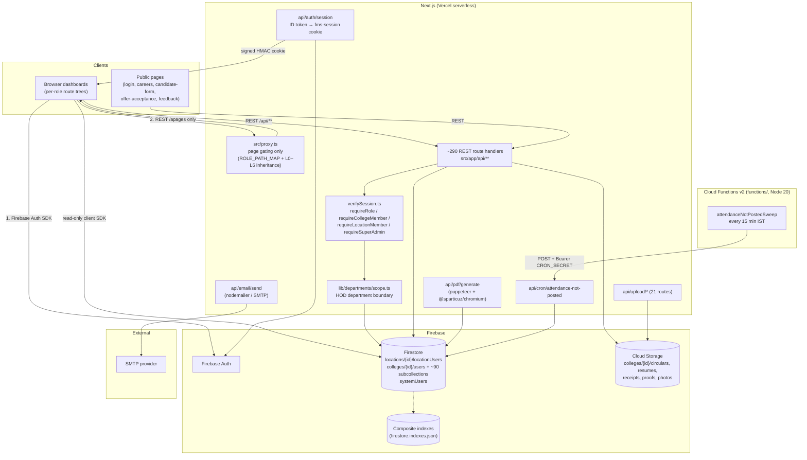

# FMS — High-Level Design (HLD)

> Ground-truth audit 2026-09-26. Every claim below was verified against source (`package.json`, `src/proxy.ts`, `src/lib/auth/*`, `src/app/api/**`, `functions/src/index.ts`, `firestore.rules`, CI config), not documentation.

## 1. System Architecture Overview

FMS is a **serverless, single-repo Next.js application** backed entirely by Google Firebase. There is no self-managed server, no SQL database, no Redis, and no external message queue.

**Communication styles actually present in the codebase:**

| Style | Where | Mechanism |
|---|---|---|
| REST (JSON over HTTPS) | The entire API surface — ~290 `route.ts` handlers under `src/app/api/{admin,college,location,management,finance,purchase,auth,cron,pdf,email,upload}` | Next.js App Router route handlers; the only API style |
| Server-Sent / polling-style freshness | Notifications & dashboards | TanStack Query refetching REST endpoints; no WebSockets anywhere in `package.json` or `src/` |
| Client-side Firestore reads (read-only paths) | Public careers page (`careers/[collegeId]`), circular viewers | Client Firebase SDK under `firestore.rules` constraints |
| Internal HTTP ping (scheduler → app) | `functions/src/index.ts` → `POST /api/cron/attendance-not-posted` with `Bearer CRON_SECRET` every 15 min IST | Firebase Scheduler → Next.js route |
| No gRPC, no Pub/Sub topics, no WebSockets | — | Verified: no such dependencies or code paths |

**Rendering model:** client-heavy dashboards (`"use client"` pages) fetching from REST APIs; role dashboards are physically separated route trees (`src/app/(dashboard)/<role>/...`). Server components exist but the dominant pattern is client fetch → REST → Firestore-admin.

## 2. System Diagram

## 3. Data Flow & Pipelines

### 3.1 Authentication (sign-in)
1. Client signs in with Firebase Auth (client SDK, `src/lib/firebase/client.ts`).
2. `POST /api/auth/session` verifies the ID token via `getAdminAuth()`, resolves the user's doc (`colleges/{id}/users/{uid}`, `locations/{id}/locationUsers/{uid}`, or `systemUsers/{uid}`), normalizes `COLLEGE_ADMIN`/`DIRECTOR` → `PRINCIPAL` and `DEPARTMENT_OFFICE` → `HOD` (truth kept in `realRole`), attaches held seat roles, and sets the httpOnly `fms-session` cookie — base64 JSON with an **HMAC-SHA256 signature** (`lib/auth/sessionToken.ts`; secret: `SESSION_SECRET` or the admin private key), 24h expiry.
3. Every subsequent page request passes `src/proxy.ts` (edge): the cookie's role → `ROLE_PATH_MAP` + inherited lower-level paths; unknown/unauthorized → redirect to `/login`.

### 3.2 Authenticated API call (the dominant pipeline)
1. Client page (TanStack Query / fetch) calls `/api/college/...` with cookies.
2. Route handler first line: `requireCollegeMember("HOD", ...)` (or the matching guard) → validates the HMAC cookie, resolves live roles (seat snapshot re-checked live via `lib/auth/liveRoles.ts`), rewrites the effective role for seat-holders (e.g. faculty holding the HOD seat evaluate as HOD).
3. Optional department scoping via `lib/departments/scope.ts` (`getHodDepartmentScope` — own + children + managed departments, capped at 30 names).
4. Firestore access through `getAdminDb()`; multi-doc writes in `db.runTransaction` or `ChunkedBatch`.
5. Response: JSON, or `{ error }` with 400/401/403/404/409/500. Side effects: `AuditLog` doc + `AppNotification` docs (`lib/notify.ts` → `colleges/{id}/notifications`).

### 3.3 Recruitment pipeline (largest domain)
Vacancy request (HOD, ratio-backed) → Principal approval → candidate collection (careers page / walk-in) → hiring batch with interviews → panel scoring (shared `/panel/interviews`, `/evaluation`) → salary negotiation → decision → offer letter PDF (`/api/pdf/generate`) → offer acceptance (public page) → faculty provisioning (`lib/firestore/facultyProvisioning.ts` creates Auth user + `facultyMembers` doc). State machine: `WorkflowStatus` (`src/types/core.ts`), candidate `CandidateStage` DEMO → INTERVIEW → SALARY_NEGOTIATION → DECISION.

### 3.4 Attendance pipelines
- **Faculty attendance:** check-in/check-out with geofence gates (`lib/attendance/geofence.ts`), face match + liveness (`faceMatch.js` model weights served from `public/models/`), leave/holiday/Sunday gates, IST day-truth (`istTime.ts`), late check-in transaction (`lateStatus.ts`, 09:05 cutoff, idempotent via `runTransaction`), manual entry with payroll lock after the 25th.
- **Student attendance:** `today-periods` (timetable-derived, substitute-aware, split-lab aware) → `POST` session (`${assignmentId}_${date}_${periodNumber}` doc, transactional roster merge) → `PATCH [id]` with `expectedUpdatedAt` optimistic concurrency (409) → office correction (HOD on-behalf) → reports (shortage/percentage/consolidated) → CSV export.
- **Sweep pipeline:** Cloud Scheduler (15 min) → `POST /api/cron/attendance-not-posted` → computes which faculty haven't posted a period's attendance within the window → `AppNotification`s. The Cloud Function itself is a thin pinger; all logic lives in the app.

### 3.5 Budget / finance pipeline
HOD budget request → Principal freeze/approval → Finance approval/return → fund allocation → expense / purchase clearance → payments/receipts; Management handles emergency budget requests. Excel export via `lib/finance/exportExcel.ts`, receipts to Storage via `upload/finance-receipt`.

### 3.6 File uploads
21 upload routes (`src/app/api/upload/*`) → Cloud Storage at `colleges/{id}/<domain>/...`; guards per route; images may be compressed client-side (`browser-image-compression`).

## 4. Infrastructure & Tech Stack

| Layer | Technology | Notes (verified) |
|---|---|---|
| App runtime | Next.js 16.2.9, React 19.2.4, Node 20 | Turbopack; `outputFileTracingIncludes` ships Chromium for the PDF route |
| Hosting | Vercel (serverless) | `serverExternalPackages`: puppeteer, @sparticuz/chromium, firebase-admin |
| AuthN | Firebase Auth (client) + Admin SDK verification | Session cookie HMAC-signed, httpOnly, 24h |
| Database | Firestore (native mode) | Root collections: `locations`, `colleges`, `systemUsers`; college subcollections hold ~90 domain types (users, facultyMembers, departments, sections, students, subjects, courses, attendance, studentAttendanceSessions, timetableSlots, hiringBatches, budget*, finance*, notifications, auditLogs, ...) |
| Rules & indexes | `firestore.rules` (657 lines), `firestore.indexes.json` (8 composite indexes for studentAttendance) | Deployed manually; not in CI |
| Storage | Firebase Storage | `storage.rules`; 21 upload routes |
| Scheduling | Firebase Cloud Functions v2 (`functions/`, nodejs20) | Thin 15-min pinger; logic in-app |
| Email | nodemailer via SMTP env vars | `/api/email/send`, `/api/college/email-requests` |
| PDF | puppeteer + @sparticuz/chromium (server), jspdf + html2canvas (client) | Fallback: raw HTML download when Chromium unavailable |
| State | Zustand (auth/ui/workContext) + TanStack Query | No Redux |
| Forms/validation | react-hook-form + zod 4 | `@hookform/resolvers` |
| CI | GitHub Actions (`node 20`, npm ci) | lint → tsc → build → test; **lint currently fails, blocking later steps** |

## 5. Cross-Cutting Concerns

- **Authorization (defense in depth):** (1) `proxy.ts` page gating — coarse, not security; (2) per-route guards in `verifySession.ts` — the real boundary for ~276 of 290 routes; (3) department scope in `lib/departments/scope.ts`; (4) Firestore rules — coarsest layer, sees only `{role, collegeId, locationId}` JWT claims, OR-combined matching.
- **Audit & notifications:** every cross-cutting write creates `AuditLog` + `AppNotification` entries; unions in `src/types/core.ts` extended per domain. Global roles (FINANCE, PURCHASE_DEPT) resolve via `systemUsers` — `lib/notify.ts` centralizes this after a real bug where copy-pasted notify helpers found zero recipients.
- **Time:** all attendance date-of-record logic is fixed IST (`Asia/Kolkata`, no DST) via `lib/attendance/istTime.ts`; servers run UTC and must never use ambient local time.
- **Error handling:** guard sentinels (`UNAUTHORIZED`, `NO_COLLEGE_CONTEXT`) → 401; validation → 400; optimistic concurrency (`expectedUpdatedAt`) → 409; generic 500 with server-side `console.error("[route-name]", err)`. No global error middleware exists — each route handles its own try/catch (verified convention across sampled routes).
- **Observability:** `console.error/info` only; Firebase Cloud Functions logger in `functions/`. No APM/trace SDK. Playwright HTML reports (`test-reports/`) for e2e failures.
- **Performance:** TanStack Query caching + `ChunkedBatch` for large writes; Firestore `in` queries capped at 30 values (department name lists deliberately `.slice(0, 30)`); server actions body limit 10 MB; `force-dynamic` on live reads instead of caching.
- **Known risks (ground truth):** session cookie signature derives from the admin private key unless `SESSION_SECRET` is set; `firestore.rules` repo file is ahead of the deployed ruleset; CI lint failure gates nothing after it; `requireRoleOrHigher` exists with zero call sites.

## 6. Module Index → LLD Documents

| Module | LLD |
|---|---|
| Auth & Authorization | `docs/architecture/lld/auth.md` |
| Recruitment / Hiring | `docs/architecture/lld/recruitment.md` |
| Attendance (Faculty) | `docs/architecture/lld/attendance-faculty.md` |
| Attendance (Student) | `docs/architecture/lld/attendance-student.md` |
| Academics (structure, subjects, sections, exams) | `docs/architecture/lld/academics.md` |
| Timetable & Teaching | `docs/architecture/lld/timetable.md` |
| Budget & Finance | `docs/architecture/lld/budget-finance.md` |
| Circulars & Communications | `docs/architecture/lld/circulars.md` |
| Users, Roles & Provisioning | `docs/architecture/lld/users-roles.md` |
| Platform Services (uploads, PDF, email, cron) | `docs/architecture/lld/platform-services.md` |
