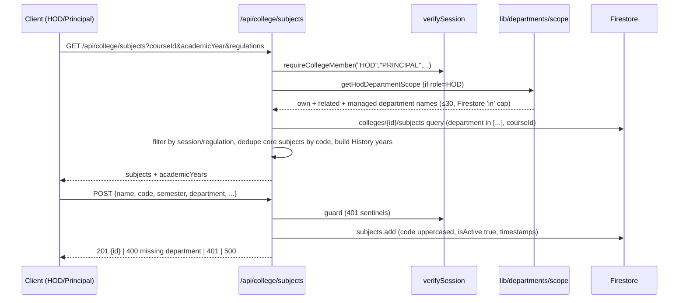

# LLD — Academics Module

## Module Overview

The academic backbone: derived academic structure (common first year vs department-direct), departments/sub-departments, courses + course catalog, subjects (per session/regulation), sections, students (roster, import Excel, cohort distribution/advancement/promotion), academic sessions/years, exam configurations and internal marks, mid-paper assignments. Interface surface: `/api/college/{departments, courses, course-catalog, course-academic-years, course-year-timings, subjects, sections, students, academic-sessions, academic-years, exam-configurations, exam-circulars, exam-guidelines, internal-exam-marks, mid-paper-assignments, subject-semester-assignments, teaching-assignments, class-leader, student-feedback}`.

## Component & Class Structure

| Component | Location | Responsibility |
|---|---|---|
| Academic structure | `src/lib/college/academicStructure.ts` | `getAcademicStructure` (server) / `structureFromDepartments` (callers holding the list) — **single source of truth**, inferred from departments, never stored |
| Regulations | `src/lib/college/academicSession.ts` | `regulationsForCourseYearByBatch`, `regulationsForBatchStartYear` |
| Semesters | `src/lib/college/semester.ts` | Semester propagation logic (unit-tested) |
| Department scope | `src/lib/departments/scope.ts`, `hodScope.ts`, `managedBranches.ts` | HOD scope (`editable ⊃ facultyManageable ⊃ own`), one-branch-one-subdepartment rule (409 + transaction) |
| Student cohort ops | `api/college/students/{distribute, distribute-cohort, promote}` | Share `evenSplit.ts`, `departmentHistory.ts`, `ChunkedBatch`; `dryRun` preflight |
| Import | `api/college/students/import-excel`, `subjects/import`, `src/lib/import/` | Excel parsing (exceljs) |
| Exams | `src/lib/exams/`, `src/types/examConfig.ts`, `examGuidelines.ts`, `midPaper.ts` | Internal marks (one batch per assignment), exam configs per course/year |
| UI | `src/components/academics/`, `src/components/students/` | DepartmentsPanel, roster editors |

## Sequence Diagram — subject listing & creation (representative)



## Data Models & Schemas

```ts
// Subject doc (colleges/{id}/subjects) — verified from route source
{ collegeId, department, name, code (uppercased), semester, hoursPerWeek, credits,
  type: "THEORY"|..., category?: "PEC"|"OEC" (electives dedupe by regulation|code),
  academicYear?, regulation?, courseId?, isActive, createdAt, updatedAt }

// Department (colleges/{id}/departments)
{ name, code?, assignedYears?: number[], hasSubDepartments?, secondaryDepartments?,
  managedDepartments?: string[],  // whole branches given to a sub-department
  courseScopes?: DepartmentCourseScope[], ... }

// Derived structure (academicStructure.ts) — never stored
type AcademicStructure =
  | { kind: "COMMON_FIRST_YEAR", freshmanDepartmentIds, subDepartments... }  // shared dept owns year 1 + manages branches
  | { kind: "DEPARTMENT_DIRECT" }                                            // default

// StudentRecord (colleges/{id}/students): real branch ALWAYS in student.department;
// sub-department is a management view only. Optional secondaryDepartment, labBatch.

// Sections, Courses, CourseYearTiming, ExamConfiguration: see src/types/*.ts
```

## API/Method Contracts

- `GET /api/college/subjects` — HOD sees own + sub + parent departments (bidirectional); electives (PEC/OEC) not deduped; core subjects deduped by `regulation|code`; returns `academicYears` history list from real data.
- `POST /api/college/subjects` — 201 `{id}`; 400 `department is required`; 401 sentinel; 500 logged.
- `POST /api/college/departments/...` — grouping a branch under a second sub-department → **409** (one-owner rule, transactional).
- `POST /api/college/students/distribute` / `distribute-cohort` / `promote` — `dryRun` flag for preflight; distribution conflicts (missing/blank student names, unsorted rosters) return **409**; promotion shares helpers with distribution.
- `POST /api/college/students/import-excel` — Excel → roster; validates against derived structure (freshman landing departments).
- `POST /api/college/exam-configurations`, `internal-exam-marks` — per course/year/session; internal marks = one batch per assignment (contrast with per-period student attendance).

## Error Handling & Edge Cases

- Structure is **derived** — never add a stored "structure type" flag; change only `academicStructure.ts`.
- Firestore `in` limit 30 → department name lists capped (`.slice(0, 30)`); an HOD with >30 departments silently loses scope (known, deliberate fail-closed).
- A first-year student keeps their real branch — any feature keying on the freshman sub-department must use `getHodDepartmentScope`, not `student.department`.
- `academicYear`-less subjects match any session (History dropdown built from actual data, not a fixed window).
- Cohort ops use `ChunkedBatch` for >500-doc writes; `dryRun` exists precisely because mis-targeted section naming is destructive. (Note: an `advance-year` route referenced by older docs no longer exists — do not reintroduce it without checking git history.)
- E2E coverage for this module in `tests/e2e/api/{subjects,sections,course-catalog,...}.spec.ts` + unit tests under `src/lib/college/__tests__/`.
