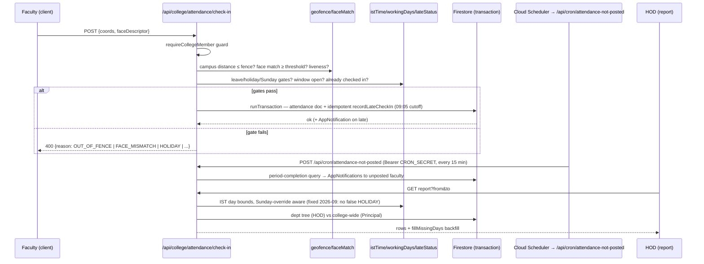

# LLD — Faculty Attendance Module

## Module Overview

Faculty/staff self-attendance: check-in/check-out with geofence + face verification, IST date truth, late check-in penalties, manual entry with payroll lock, monthly reporting/exports, and the "not posted" sweep. Interface surface: `/api/college/attendance/*` (`check-in`, `check-out`, `report`, `manual`, `import`, `today-status`, `face-registration`, `reference-photo`, `campus-location`, `check-in-permission`, `monthly-export`, `attendance-not-posted-settings`), `/api/cron/attendance-not-posted`, Management oversight routes (`/api/management/colleges/[collegeId]/...attendance...`).

## Component & Class Structure (src/lib/attendance/)

| File | Responsibility |
|---|---|
| `istTime.ts` | **Single source of time truth** — `getISTParts`, `istDateKey`, `istMidnightUTC`, `istMonthBounds`, `istDayOfWeek`, `parseISTDateParam`. Fixed `Asia/Kolkata` (no DST). |
| `geofence.ts` | Haversine distance + polygon containment against campus location |
| `faceMatch.ts` | EAR 0.92 / yaw 0.12 thresholds + liveness (face-api.js weights at `public/models/`) |
| `workingDays.ts` | Per-role Sunday override; classifies working days vs HOLIDAY |
| `lateStatus.ts` | 09:05 cutoff; `recordLateCheckIn` — idempotent via `runTransaction` |
| `attendanceWindow.ts` | Valid check-in/out windows per day |
| `checkInPermission.ts` | `PRINCIPAL/VP → HOD/unit-head` permission cascade |
| `fillMissingDays.ts`, `closeMissedCheckouts.ts` | Report backfill + missed-checkout closure |
| `rosterMonthlyExport.ts`, `importCsvColumns.ts` | Excel/CSV I/O |
| `notPostedSettings.ts` | Which roles/departments the sweep covers |
| `offlineSubmitQueue.ts` | Offline check-in queueing (unit-tested) |
| Types | `src/types/attendance.ts` |

## Sequence Diagram — check-in & report

## Data Models & Schemas (src/types/attendance.ts)

Attendance docs live at `colleges/{id}/attendance/{uid}_{dateKey}` (representative shape; see type file for exact fields): employee identity (`uid`, `facultyId`), `date: "YYYY-MM-DD"` (IST key), check-in/out timestamps + coordinates + method (`FACE`/`MANUAL`/`IMPORT`), `status` (PRESENT/LATE/ON_LEAVE/HOLIDAY/ABSENT), late/penalty metadata (`lateAttendancePenalty` idempotency key), manual-entry audit fields (entered-by, reason). Related: leave integration (`src/types/leave.ts`), holidays, working-day overrides.

## API/Method Contracts

- `POST /api/college/attendance/check-in` / `check-out` — geofence + face + calendar gates; 400 with machine-readable reason; late check-in notification via `notify()`.
- `GET /api/college/attendance/report?from&to` — HOD = department tree, Principal = college-wide; IST date params parsed via `parseISTDateParam`.
- `POST /api/college/attendance/manual` — 1-tier approval cascade; **payroll locked after the 25th**; audit + notify on approve.
- `POST /api/cron/attendance-not-posted` — Bearer `CRON_SECRET` only (401 otherwise); called by Cloud Functions every 15 min.
- `POST /api/college/attendance/import` — CSV via `importCsvColumns.ts`; dates via `istDateFromParts`.
- `POST /api/college/attendance/face-registration` (+ `/reset`), `reference-photo` — descriptor storage to Storage.

## Error Handling & Edge Cases

- All date math must go through `istTime.ts` — ambient `Date` getters caused real bugs (report/route.ts mislabeling overridden Sundays as HOLIDAY, fixed 2026-09).
- Late check-in is idempotent by transaction (retry-safe); duplicates can't double-penalize.
- Missed checkout handled by `closeMissedCheckouts` + `fillMissingDays` so reports never show null days.
- Face model weights must stay reachable in `proxy.ts` PUBLIC_PATHS (`/models`) or client registration breaks.
- Manual entry after the 25th is rejected (payroll freeze) with explicit 400.
- The Cloud Function is a thin pinger by design — never reimplement completion logic there.
