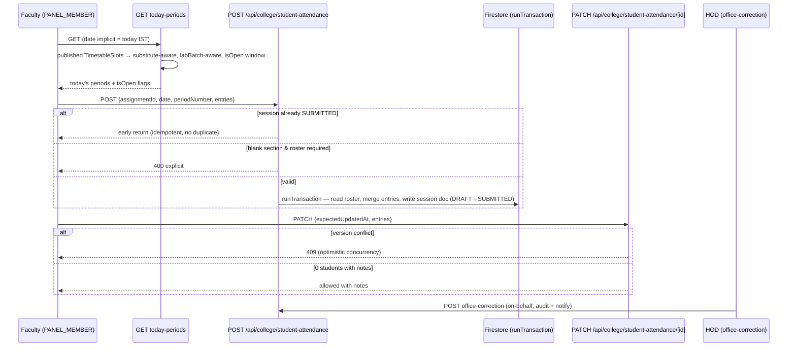

# LLD — Student Attendance Module

## Module Overview

Faculty marks present/absent per (assignment, date, timetable period); HOD office corrections; shortage/percentage reporting. Interface surface: `/api/college/student-attendance/*` (`today-periods`, route, `[id]`, `office-correction`, `office-correction/[id]`), `/api/college/student-attendance-history`, `/api/college/section-attendance-report`, `/api/college/faculty-attendance-completion`, `/api/college/attendance-percentage-report`. Note: `student-attendance/current-period` was **deleted 2026-09** (replaced by `today-periods`).

## Component & Class Structure

| Component | Location | Responsibility |
|---|---|---|
| Session domain types | `src/types/studentAttendance.ts` | `StudentAttendanceSession` (doc id `${assignmentId}_${date}_${periodNumber}`), entries, DRAFT/SUBMITTED status |
| Period resolution | `src/lib/timetable/currentPeriod.ts` | `getFacultyPeriodsForDate` (substitute-aware via `resolveSubstituteSlotsForDate` from `src/lib/leave/periodCoverage.ts`), split-lab `labBatch` awareness, `isOpen` IST window |
| Roster | `src/lib/students/sectionRoster.ts` | `fetchSectionStudents` — primary + `secondaryDepartment` merge; `labBatch`-scoped roster for split labs |
| Write gates | route handlers | `WRONG_DATE / NOT_SCHEDULED / OUTSIDE_WINDOW / PERIOD_MISMATCH` |
| Period status | `src/lib/attendance/periodAttendanceStatus.ts` | `IN_PROGRESS` classification |
| Reporting | `src/lib/studentAttendance/` (`percentage.ts`, `shortage.ts`, `absentReport.ts`, `exportCsv.ts`, `notPostedAggregation.ts`) | Reports + CSV; unit-tested |
| Types | `src/types/teaching.ts` | `TimetableSlot`, `TeachingAssignment` |

## Sequence Diagram — mark attendance for a period



## Data Models & Schemas (src/types/studentAttendance.ts)

```ts
type StudentAttendanceMark = "PRESENT" | "ABSENT";
type StudentAttendanceSessionStatus = "DRAFT" | "SUBMITTED";
interface StudentAttendanceEntry { studentId; rollNumber; name; status: StudentAttendanceMark | null }
interface StudentAttendanceSession {
  id: string;                 // `${assignmentId}_${date}_${periodNumber}`
  collegeId, department, assignmentId,
  sectionId?, sectionName, year?, semester?,   // two assignment shapes (course/section vs semester)
  subjectId, subjectName, subjectCode, facultyId, facultyName,
  date: "YYYY-MM-DD",
  periodNumber?,              // set once at creation from the active period, never edited
  labBatch?,                  // split-lab half; entries scoped to matching StudentRecord.labBatch
  status, entries[], expectedUpdatedAt (version field for PATCH)
}
```

Collections: **`colleges/{id}/studentAttendance`** (one doc per `${assignmentId}_${date}_${periodNumber}`); reporting composites in `firestore.indexes.json`: 4 **COLLECTION_GROUP** composite indexes on `studentAttendance` (status+sectionId+date, status+facultyId+date, status+subjectId+date, status+department+date) among 61 indexes total.

## API/Method Contracts

- `GET /api/college/student-attendance/today-periods` — faculty's periods today with `isOpen` (IST), substitute + lab-batch aware.
- `POST /api/college/student-attendance` — create+submit a session; idempotent early-return for an already-SUBMITTED `(assignment,date,period)`; 400 on blank section / gate failure (`WRONG_DATE|NOT_SCHEDULED|OUTSIDE_WINDOW|PERIOD_MISMATCH`).
- `PATCH /api/college/student-attendance/[id]` — body carries `expectedUpdatedAt`; mismatch → **409**; 0-student submission allowed only with notes.
- `POST /api/college/student-attendance/office-correction` (+ `[id]`) — HOD on-behalf correction with audit trail.
- `GET /api/college/section-attendance-report` — modes `absentOnly | shortage | threshold | consolidated | dailyPercent`.
- `GET /api/college/faculty-attendance-completion` — `from/to | allTime | year+month` ranges.

## Error Handling & Edge Cases

- Consecutive periods of the same assignment are **independent sessions** — never carried forward.
- Concurrency: PATCH uses version check → 409; POST is transactional (read+merge+write) so double-taps can't fork rosters.
- Split-lab periods roster only matching-`labBatch` students; `sectionId` is absent on semester-scoped assignments (free-text section name).
- Absent `periodNumber`/`labBatch` on pre-migration docs must be treated as ordinary whole-section sessions.
- Reporting is index-backed; new query shapes require matching `firestore.indexes.json` composites.
