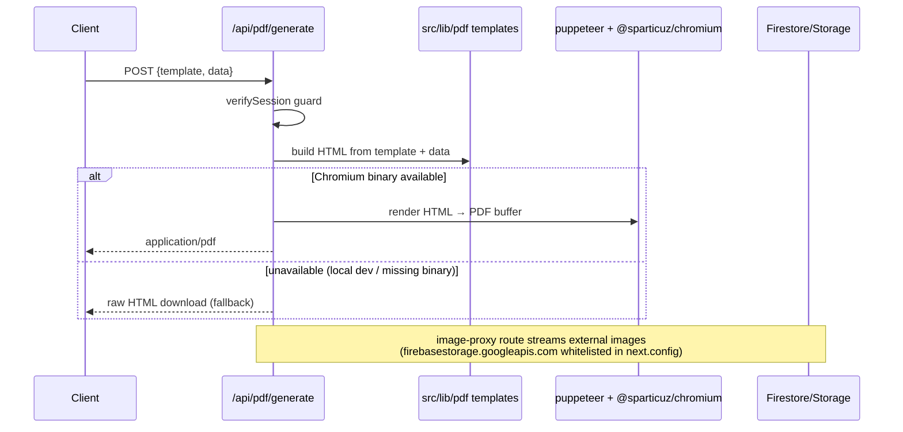
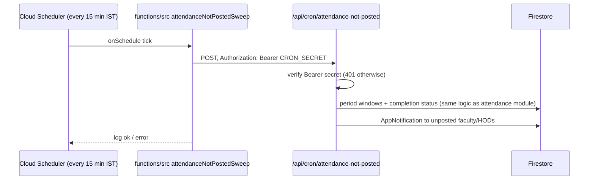

# LLD — Platform Services Module

## Module Overview

Shared infrastructure every domain leans on: file uploads (21 routes), server-side PDF generation, email, the scheduled attendance sweep, in-app notifications, audit logs, and shared UI/data primitives (`DataTable`, `navConfig`, `ChunkedBatch`, `notify.ts`).

## Component & Class Structure

| Service | Location | Notes |
|---|---|---|
| Uploads | `src/app/api/upload/*` — certificate, circular, resume, joining-letter, profile-photo, faculty-document, supporting-staff-document, leave-proof, finance-receipt, purchase-grn, indent-receipt, budget-circular, budget-report, consultancy-doc, hackathon-doc, innovation-doc, ipr-doc, phd-doc, research-service-doc, seed-funding-doc, sponsored-project-doc | Each route self-guards; writes to `colleges/{id}/<domain>/` in Storage; client-side compression via `browser-image-compression` |
| PDF | `src/lib/pdf/`, `/api/pdf/generate`, `/api/pdf/image-proxy` | HTML templates → puppeteer + `@sparticuz/chromium` (binary shipped via `outputFileTracingIncludes` for exactly that route); **fallback: raw HTML download when Chromium unavailable** (e.g. local dev) |
| Email | `/api/email/send`, `src/lib/email/`, `/api/college/email-requests` | nodemailer; SMTP env vars; `EMAIL_FROM` |
| Cron | `functions/src/index.ts` → `/api/cron/attendance-not-posted` | Function = thin pinger (secret `CRON_SECRET`, `APP_URL`); all logic in the app route |
| Notifications | `src/lib/notify.ts` (`notify`, `notifyRole`), `src/components/notifications/`, `useNotifications` | `AppNotification` docs under `colleges/{id}/notifications`; GLOBAL-role resolution via `systemUsers` |
| Audit | `AuditLog` union in `src/types/core.ts`, `/api/college/audit-logs`, `/api/admin/audit-logs`, `/api/college/finance-audit-logs` | Every cross-cutting write appends one |
| Shared UI | `src/components/shared/DataTable.tsx` (68 importers), `PageHeader`, `StatusBadge`, `FileUpload`; `src/components/layout/navConfig.ts` (27 importers) | See guardrails |
| Batch writes | `src/lib/firestore/chunkedBatch.ts` | 500-op Firestore batch cap |

## Sequence Diagram — PDF generation (representative platform flow)

## Data Models & Schemas

- **AppNotification** (`colleges/{id}/notifications`): `{ collegeId, toUid, type (domain union), title, message, read, link, createdAt }`.
- **AuditLog** (`colleges/{id}/auditLogs` + finance-scoped variant): actor, action type (per-domain union in `core.ts`), target refs, metadata, IST timestamps.
- **Uploads**: Storage object path `colleges/{collegeId}/{domain}/{filename}`; metadata refs stored on the owning domain doc (e.g. `Circular.attachments`, `VacancyRequest` resume).
- **Config**: `next.config.ts` — `serverExternalPackages: [puppeteer, puppeteer-core, @sparticuz/chromium, firebase-admin]`; `experimental.serverActions.bodySizeLimit: "10mb"`; images remote-pattern `firebasestorage.googleapis.com`.

## API/Method Contracts

- `POST /api/upload/<domain>` — `requireCollegeMember(...)` per domain; returns `{url}` / Storage path; 403 on wrong scope; 400 on missing/oversized file (10 MB server-action cap noted above).
- `POST /api/pdf/generate` — guard → HTML → PDF; fallback HTML on Chromium absence; `GET /api/pdf/image-proxy` for remote images inside PDFs.
- `POST /api/email/send` — SMTP relay; `/api/college/email-requests` provides an approval workflow (Principal approves before send).
- `POST /api/cron/attendance-not-posted` — Bearer `CRON_SECRET` only; app-internal, never exposed to clients.
- `notify(db, collegeId, toUid, type, title, message, link?)` and `notifyRole(db, collegeId, role, ...)` — the only sanctioned notification helpers.

## Error Handling & Edge Cases

- Chromium/puppeteer is **not** in `package.json` for local dev — the PDF route must always keep its HTML fallback; `outputFileTracingIncludes` exists because Vercel's file tracer misses the compressed binary.
- The scheduler pings the deployed app URL (`APP_URL`) — misconfiguration logs and skips (seen in `functions/src/index.ts`), it does not throw.
- Never reimplement attendance-completion logic in the Cloud Function — it exists so the app owns the business rules.
- `navConfig.computeItemModule` walks backwards to the nearest section header — misplaced items silently change Super Admin visibility mapping; `BOTTOM_NAV_ITEMS` must be updated in tandem.
- `DataTable` groups/paginate interact badly today (per-page grouping) — avoid combining both until fixed.
- All timestamps written by platform services are `new Date()` server-side; attendance-domain consumers must convert via `istTime.ts` before treating them as calendar days.
