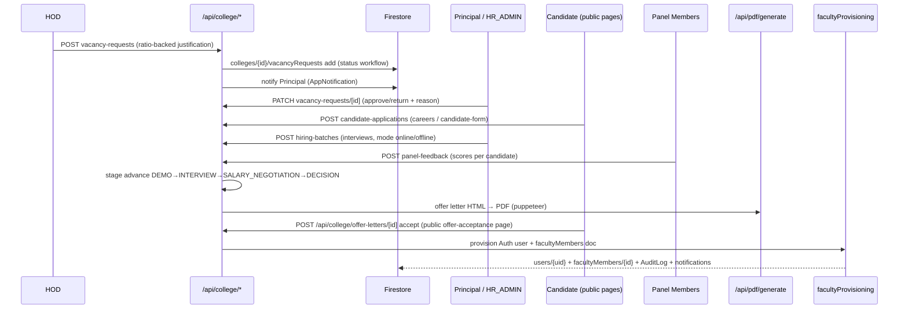

# LLD — Recruitment / Hiring Module

## Module Overview

The largest domain: vacancy request → approval → candidate collection → hiring batch → interviews/panel scoring → salary negotiation → decision → offer letter (PDF) → acceptance → faculty provisioning. Interface surface: `/api/college/vacancy-requests`, `/candidates`, `/candidate-applications`, `/hiring-batches`, `/hiring-terms`, `/offer-letters`, `/panel-feedback`, `/faculty-requirement`, plus location routes `/api/location/{vacancy-requests,candidates,interviews,offers}` and public pages `careers/[collegeId]`, `candidate-form`, `offer-acceptance`, `/api/admin/general-admin-vacancies`.

## Component & Class Structure

| Component | Location | Responsibility |
|---|---|---|
| Firestore data access | `src/lib/firestore/hiring.ts` | Typed CRUD for `vacancyRequests`, `candidates`, `candidateApplications`, `hiringBatches`, `hiringBatches/{id}/panelFeedback` |
| Pipeline rules | `src/lib/hiringPipeline.ts` | Stage transitions, allowed next steps |
| Provisioning | `src/lib/firestore/facultyProvisioning.ts` | Post-offer: Auth user + `facultyMembers` doc creation |
| Offer letters | `src/lib/offerLetterContactBlock.ts`, `api/college/offer-letters` | PDF data assembly, accept/decline handling |
| Dashboard UI | `src/components/hiring/`, `src/hooks/useHiring.ts`, `useHiringActivity.ts`, `usePrincipalPendingHiring.ts` | HOD requirement panel, HR batches, panel scoring, Principal approvals |
| Panel scoring | shared routes `/panel/interviews`, `/evaluation`, `src/app/api/college/panel-feedback` | PANEL_MEMBER feedback capture |

## Sequence Diagram — vacancy → hire



## Data Models & Schemas (src/types/recruitment.ts, core.ts)

```ts
VacancyRequest {
  id, collegeId, department, hodUid, hodName,
  position, positionCategory?: "TEACHING"|"SUPPORTING_STAFF"|"GENERAL_ADMIN",
  qualification?, requiredCount, availableCount,
  justification?, hodJustification?,        // separate fields by design
  status: WorkflowStatus,                    // src/types/core.ts:241
  studentStrength?, totalFacultyRequired?,
  cadreRatioData?: [{key,label,required,current,gap,surplus}],
  hodAcknowledged?, hiringMode?: InterviewMode, // chosen at creation; drives interview flow
  principalResponse?: {action, reason?, respondedAt, principalUid},
  createdAt, updatedAt
}
CandidateStage = "DEMO"|"INTERVIEW"|"SALARY_NEGOTIATION"|"DECISION"
InterviewSubStage = "PANEL_IN_PROGRESS"|"INTERVIEW_DONE"
CandidateSource = "WALK_IN"|"CAREERS_PAGE"|"ADVERTISEMENT"|"REFERRAL"
// hiringBatches/{id}/panelFeedback subcollection per panelist
```

Collections: `colleges/{id}/{vacancyRequests,candidates,candidateApplications,hiringBatches,offerLetters}`.

## API/Method Contracts

- `POST /api/college/vacancy-requests` — HOD; 201 `{id}`; 400 invalid body; 403 non-HOD.
- `PATCH /api/college/vacancy-requests/[id]` — Principal approve/return; body `{action: WorkflowStatus, reason?}`; 404 cross-tenant.
- `GET /api/location/vacancy-requests` — location roles via `verifySession`.
- `POST /api/college/hiring-batches` — create batch + interviews; `POST .../panel-feedback` — panelist scoring (one per candidate per stage).
- `POST /api/college/offer-letters` / `GET` PDF assembly; acceptance is unauthenticated via signed/expiring link data (`offer-acceptance` page).
- All handlers: guard first, then `NextResponse.json`; errors map 400/401/403/404/500.

## Error Handling & Edge Cases

- Stage transitions validated against `WorkflowStatus`/`hiringPipeline.ts`; illegal jumps rejected (400).
- `hiringMode` (online vs offline) drives venue/coordinator vs meeting links; undefined on legacy docs = Offline — every reader must handle absence.
- Duplicate provisioning guarded in `facultyProvisioning.ts` (verified by unit test `facultyProvisioning.test.ts`).
- Public candidate pages read via client SDK under `firestore.rules` — only published vacancies are readable.
- Cross-tenant ids return 404 (not 403) to avoid existence leaks.
