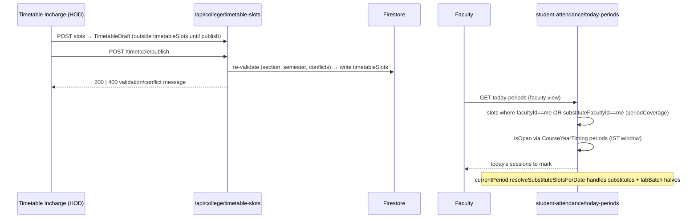

# LLD — Timetable & Teaching Module

## Module Overview

Course-year timings, teaching assignments (two shapes), timetable slots + drafts + rules, substitutes, timetable incharges, and the current-period resolution consumed by student attendance. Interface surface: `/api/college/{course-year-timings, teaching-assignments, timetable-slots, timetable, timetable-incharges, faculty-assignment-requests}` and the lib layer `src/lib/timetable/`.

## Component & Class Structure

| Component | Location | Responsibility |
|---|---|---|
| Period clock | `src/lib/timetable/currentPeriod.ts` | `getFacultyPeriodsForDate`, `getCurrentTimetableSlot`, `checkFacultyPeriodWindow`; substitute-aware via `resolveSubstituteSlotsForDate` imported from `src/lib/leave/periodCoverage.ts`; split-lab awareness — consumed by student attendance |
| Grid | `src/lib/timetable/buildGrid.ts` | Render weekly grid from slots |
| Context loading | `src/lib/timetable/loadContext.ts`, `sharedYearTiming.ts` | Shared-first-year timing fallback for freshman year |
| Hours math | `src/lib/timetable/hoursMatch.ts` | Faculty workload vs assignment hours (unit-tested) |
| Coverage | `src/lib/leave/periodCoverage.ts` | Authority: `facultyId === facultyMemberId` OR `substituteFacultyId` |
| Types | `src/types/teaching.ts`, `src/types/core.ts` | `TeachingAssignment`, `TimetableSlot`, `TimetableDraft`, `TimetableRules` (`teaching.ts`); `CourseYearTiming` (`core.ts:767`) |

## Sequence Diagram — publishing a timetable & resolving the current period



## Data Models & Schemas (src/types/teaching.ts)

```ts
CourseYearTiming { // src/types/core.ts:767, doc id `${courseId}_year${year}`
  collegeId, departmentId, courseId, year,
  collegeStartTime: "HH:MM", collegeEndTime: "HH:MM",   // Principal-set day bounds
  numberOfPeriods, periodDurationMinutes,
  lunchBreak: BreakConfig, shortBreaks: BreakConfig[],
  periods?: PeriodTiming[],      // HOD's explicit breakdown; overrides the formula when set
  semesters?: SemesterDuration[] // absent/empty = one continuous whole-year timetable
}
TeachingAssignment {
  // two shapes:
  course/section-scoped: { courseId, year, sectionId, ... }
  semester-scoped:       { academicYear, semester: number, section: string } // free-text section, no sectionId
  facultyId, subjectId, subjectName, subjectCode, hoursPerWeek, assignedBy,
  // resume/table fields (course/section-scoped only): isPast?, assignmentAcademicYear?,
  // assignmentSemester?: string (free-text, distinct from `semester`), timetableSemester?: number
}
TimetableSlot { day: "MON".."SAT", periodNumber, year, sectionId, facultyId,
  substituteFacultyId?, labBatch?, source?: "MANUAL"|"GENERATED", isPinned?, classroom? }
TimetableDraft { status: "DRAFT"|"PUBLISHED", ... }   // staging; promoted on publish
TimetableRules  { workingDays, maxPerDay, ... }
```

Collections: `colleges/{id}/{timetableSlots, timetableDrafts, timetableRules, teachingAssignments, courseYearTimings, timetableIncharges, facultyAssignmentRequests}`.

## API/Method Contracts

- `GET/POST /api/college/timetable-slots` — slot CRUD; HOD/incharge scoped.
- `POST /api/college/timetable/draft` then `POST /api/college/timetable/publish` — publish re-validates (sectionId required, semester resolution, non-empty draft, conflict re-check); validation/conflict failures return **400** with a message (not 409).
- `GET /api/college/teaching-assignments` — role-scoped (HOD = own department via scope lib).
- `POST /api/college/course-year-timings` — upsert `courseId_yearN` timing docs; drives all period windows.
- `POST /api/college/timetable-incharges` — delegates timetable authority (checked by `useIsTimetableIncharge`).
- `GET /api/college/faculty-assignment-requests` — faculty-initiated assignment change requests.

## Error Handling & Edge Cases

- Drafts live outside `timetableSlots` until publish — never read drafts for attendance/period logic.
- Substitute resolution must run **per date** (absences change daily), and split labs produce two half-periods distinguished by `labBatch`.
- `semester` vs `assignmentSemester` on `TeachingAssignment` are distinct fields — conflating them is a known trap.
- Period windows come from `CourseYearTiming.periods` (college start/end + per-period times), resolved in IST via `currentPeriod.ts` — never local clocks.
- E2E coverage: `tests/e2e/api/{timetable-slots,teaching-assignments,mid-paper-assignments}.spec.ts`.
