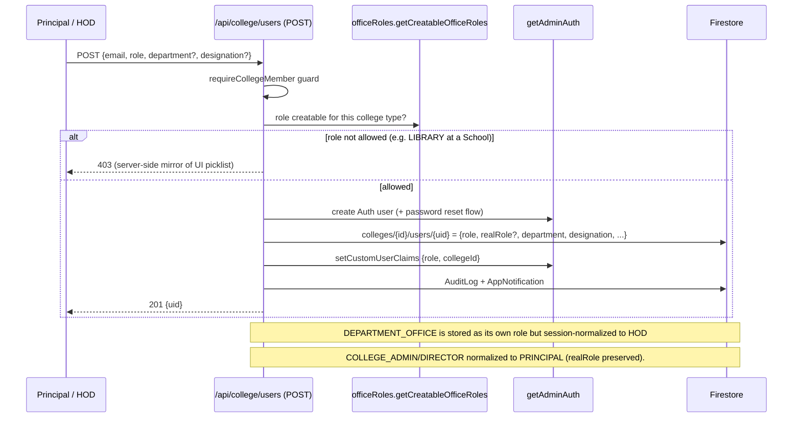

# LLD — Users, Roles & Provisioning Module

## Module Overview

User lifecycle across the three profile scopes (system / location / college), role creation with college-type gating, role seats (faculty holding the HOD seat), internal-office role eligibility, supporting-staff categorization, and faculty/staff provisioning from hiring. Interface surface: `/api/admin/users`, `/api/college/users`, `/api/college/faculty`, `/api/college/supporting-staff`, `/api/college/role-seats`, `/api/college/department-office`, `/api/location/users`, `/api/college/faculty-lookup`, `/api/college/webmaster/reset-password`.

## Component & Class Structure

| Component | Location | Responsibility |
|---|---|---|
| Role registry | `src/types/core.ts` | `UserRole`, `ROLE_LABELS`, `ROLE_DASHBOARD_PATHS`, `ROLE_LEVEL`, `ROLE_SCOPE`, `LOCATION_SCOPED_ROLES` (derived from `ROLE_SCOPE`) |
| Office-role gating | `src/lib/roles/officeRoles.ts` | `getCreatableOfficeRoles(collegeType)`: Engineering/Pharmacy/Dental → all 8 (ACADEMICS, IQAC_COORDINATOR, T_AND_P, R_AND_D, PLACEMENT_DEPT, LIBRARY, EXAM_CELL, WEBMASTER); Degree → IQAC/Placement/Library/ExamCell; Polytechnic → Placement/Library; School → none. **Enforced client + server (`api/college/users` POST) — keep both in sync** |
| Seats | `src/types/roleSeats.ts`, `src/lib/roles/seats.ts`, `seatRoles.ts`, `seatContext.ts`, `activeHodDepartment.ts` | HOD seat held on top of a faculty login; live resolution in `lib/auth/liveRoles.ts` |
| Provisioning | `src/lib/firestore/userProvisioning.ts`, `facultyProvisioning.ts` | Auth user + profile doc + custom claims `{role, collegeId, locationId}` |
| Supporting staff | `src/types/supportingStaff.ts`, `src/lib/designations/config.ts` | `staffCategory` split; `hasSupportingStaffSplit` per college type; Technical → HOD, Non-Technical → College Office/Principal |
| College type | `src/lib/designations/config.ts`, `useCollegeType` | Engineering/Pharmacy/Dental/Degree/Polytechnic/School switches |

## Sequence Diagram — creating a role-scoped user



## Data Models & Schemas

```ts
// Profile docs — scope decides collection
systemUsers/{uid}                  // SUPER_ADMIN, MANAGEMENT, FINANCE, PURCHASE_DEPT
locations/{id}/locationUsers/{uid} // ADMINISTRATION, HR_ADMIN, ADMIN_OFFICE, LOCATION_DEPT_HEAD
colleges/{id}/users/{uid}          // everything else: { role, realRole?, department?, designation?, ... }
colleges/{id}/facultyMembers/      // teaching staff: { facultyId, department, designation, ... } — teaching only
colleges/{id}/supportingStaff/     // split by staffCategory
roleSeats docs                     // seat → holder: PANEL_MEMBER holding the HOD seat

// JWT claims (visible to firestore.rules): { role, collegeId, locationId } — seats invisible to rules
```

## API/Method Contracts

- `POST /api/college/users` — create college user; server re-checks `getCreatableOfficeRoles`; 201 `{uid}`; 403 on college-type violation; 409 duplicate email.
- `GET /api/college/users` — role-filtered directory; `PATCH [uid]` role/detail updates (audit-logged).
- `POST /api/college/faculty` / `import` — faculty create/bulk (Excel); designation picklist excludes Technical designations of every college type.
- `GET /api/college/faculty-lookup` — cross-department faculty resolution (used by teaching/timetable).
- `POST /api/college/role-seats` — grant/revoke seat (e.g. appoint HOD on a faculty login); `department-office` route manages office-head appointments (real HOD only — `isDepartmentOffice` fence).
- `POST /api/college/webmaster/reset-password` — gated by `canRoleAccessRole` hierarchy.

## Error Handling & Edge Cases

- Role picklists (client) and `api/college/users` (server) enforce the same office-role list — changing one without the other is a real security gap.
- `ROLE_SCOPE` must stay in lockstep with where profiles actually live; FINANCE/PURCHASE_DEPT/ACCOUNTS are marked `COLLEGE` until the Phase 2/3 tenancy migration moves their docs — flip scope only with the migration.
- Seat-holders read as their seat role everywhere; `realRole`-gated exceptions: appointing/removing office heads and Sub-HODs (a DEPARTMENT_OFFICE can't remove their appointer).
- `COLLEGE_ADMIN` is a Principal- appointed profile; `DIRECTOR` is Super-Admin-provisioned — both normalize to `PRINCIPAL` at session.
- Bulk imports (`faculty/import`, `supporting-staff/import`) use `ChunkedBatch`; partial failures reported per row.
- The Technical/Non-Technical supporting-staff split has been reverted/re-decided several times in git history — treat changes as deliberate product decisions.
