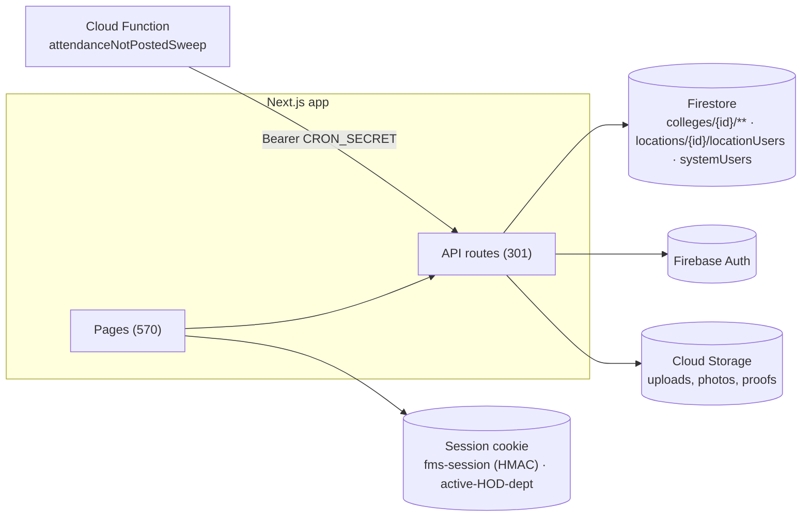

# FMS — Data Stores Overview (as-is)

Single datastore family: **Firebase**. No SQL, no Redis, no external MQ (`AGENTS.md` Stack; no other client libs in `package.json`).

## 1. Firestore

**Roots** (`src/lib/firestore/userProvisioning.ts:38-78`):

| Root | Contents |
|---|---|
| `colleges/{collegeId}/…` | Everything college-scoped: users, facultyMembers, supportingStaff, students, departments, courses, courseCatalog, subjects, subjectSemesterAssignments, sections, timetableSlots, timetableIncharges, teachingAssignments, courseYearTimings, academicYears, settings/{general, circulars, circularPermissions, timetableRules, attendance-not-posted}, holidays, summerHolidays, workingDays, attendanceRecords, attendanceCheckInPermissions, lateAttendanceCounters, studentAttendance, leaveRequests, leaveBalances, employeeLeaveProfiles, staffAdjustments, otherLeaveCategories, permissionRequests, onDutyRequests, vacancyRequests, hiringBatches, hiringTerms, candidates, candidateApplications, panelFeedback, studentFeedback, offerLetters, facultyAccountRequests, circulars, budgetCycles, budgetRequests, emergencyBudgetRequests (mgmt), financeBudgets, financeFundAllocations, financePayments, financeReceipts, financeExpenseRequests, financePurchaseClearance, indentRequests, salaryStructures, publications, researchProfile(s), consultancyProjects, sponsoredProjects, seedFunding, phdSupervision, hackathons, innovations, discoveryInnovation, researchServices, roleSeats, notifications, auditLogs, timetableIncharges, distributionLocks, students/{id}/departmentHistory, examConfigurations, internalExamMarks?, examCirculars, examGuidelines, emailRequests, facultyAssignmentRequests, collegesDirectory refs |

Evidence for the above: `code_search` of `.collection(` across `src/lib` (180 matches sampled 2026-09-28), e.g. `src/lib/leave/balanceEngine.ts:37-43` (leaveBalances, leaveRequests, employeeLeaveProfiles), `src/lib/budget/managementApproval.ts:39` (budgetRequests), `src/lib/departments/timetableIncharge.ts:22-44` (timetableIncharges), `src/lib/students/distributionLock.ts:24` (distributionLocks), `src/lib/students/departmentHistory.ts:24-26`, `src/lib/attendance/checkInPermission.ts:8`, `src/lib/attendance/lateAttendancePenalty.ts:8` [UNVERIFIED for any collection not shown in sampled matches — per-module data-model.md cites specific files].

| Root | Contents |
|---|---|
| `locations/{locationId}/locationUsers` | Location role profiles (`userProvisioning.ts:38`) |
| `systemUsers/{uid}` | GLOBAL role profiles + role map (`userProvisioning.ts:45`) |

**Conventions**

- No formal schema/migrations; shapes defined by `src/types/*.ts` and per-route writes. "Migrations" are one-off scripts (now deleted from repo; git history) — current live data migrations are handled by hand-run scripts `[GAP: no migration framework]`.
- Multi-doc writes: `db.runTransaction` or `ChunkedBatch` (`src/lib/firestore/chunkedBatch.ts`), cap 500 (`AGENTS.md`).
- Optimistic concurrency: `expectedUpdatedAt` → 409 (e.g., student attendance PATCH; `AGENTS.md`).
- Soft deletes: not a general pattern; status fields (`REGULAR`/`GRADUATED` students, faculty `status`) instead `[UNVERIFIED globally]`.
- Audit fields: `createdAt`/`updatedAt` by convention; `AuditLog` docs for cross-cutting events.

**Indexes**: `firestore.indexes.json` (927 lines; 40+ composite indexes incl. `studentAttendance` 4 composites COLLECTION_GROUP). `orig.indexes.json` backup was removed 2026-09-28. Deployed ruleset lags repo (SHARED_FILES.md).

## 2. Firebase Auth

Accounts for staff/faculty/students; custom claims not used for roles (JWT carries only `{role, collegeId, locationId}` per SHARED_FILES.md — set as claims or in session cookie; session cookie is the operative auth artifact).

## 3. Cloud Storage

Attachments/photos/proofs via `api/upload/*` (21 routes). Paths per feature: `colleges/{id}/circulars/…` (`AGENTS.md` circulars), profile photos, leave proofs, GRN, receipts, resumes, joining letters, phd/ipr/hackathon/innovation/consultancy/sponsored/seed docs, faculty documents, certificates, budget circulars/reports.

## 4. Client-side persistence

- `fms-session` cookie (httpOnly, 24h, HMAC-signed) — the session.
- `ACTIVE_HOD_DEPT_COOKIE` — active HOD department switcher.
- Zustand persisted UI state (`src/store/`).
- Offline attendance submit queue (`src/lib/attendance/offlineSubmitQueue.ts` + test) — IndexedDB/local `[UNVERIFIED mechanism]`.

## 5. Mermaid — store landscape

*Explanation: everything converges on Firestore through the app's API layer; the cookie jar is the only client-side security-relevant store; Storage holds binaries.*

## 6. Risks

1. Schema drift: types in `src/types/*.ts` vs legacy docs in Firestore; compat shims exist (`src/lib/faculty/academicProfileCompat.ts`, `fieldRenames.ts`, `legacyKeyDeletes.ts` — test names confirm) `[GAP: no single schema registry]`.
2. Rules lag repo (SHARED_FILES.md) — HIGH.
3. COLLECTION_GROUP indexes on `studentAttendance`, `leaveRequests` (status), `budgetRequests` (status), `users`/`facultyMembers` (employeeId) imply cross-college queries exist — verify each against rules `[UNVERIFIED]`.
