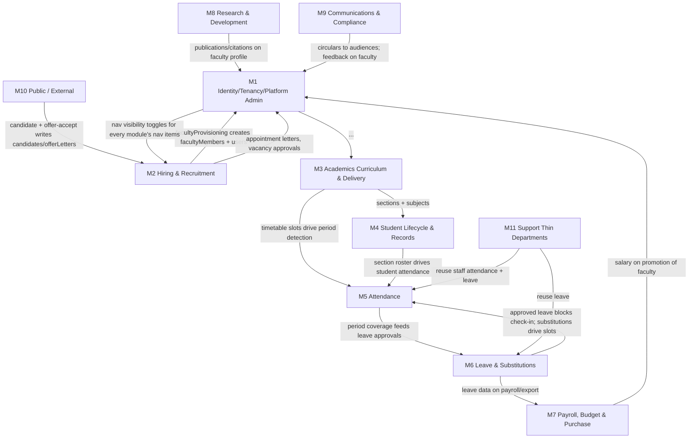

# FMS — Module Map (as-is)

> Derived from the audit module map and verified against actual route folders, API namespaces, collections and dashboards. Where the codebase's real shape differs from the map, it is flagged.

## M0 — Module inventory and evidence summary

| ID | Module | Submodules (IDs assigned) | Primary API namespaces | Primary UI roots | Status |
|---|---|---|---|---|---|
| M1 | Identity, Tenancy & Platform Admin | M1-SM1 Locations & Colleges, M1-SM2 Users/Roles/Seats, M1-SM3 Nav Visibility, M1-SM4 Audit Logs, M1-SM5 College Settings (Academic Year, Course Catalog) | `api/admin/*`, `api/administration/*`, `api/college/users`, `api/college/role-seats`, `api/college/settings/*`, `api/college/course-catalog`, `api/college/academic-*`, `api/management/*` (read-only oversight), `api/college/webmaster/*` | `/super-admin`, `/administration`, `/webmaster`, `/management` | Implemented |
| M2 | Hiring & Recruitment Pipeline | M2-SM1 Vacancy Requests, M2-SM2 Candidates & Applications, M2-SM3 Interviews & Panel Scoring, M2-SM4 Offer Letters, M2-SM5 Credential Requests & Provisioning, M2-SM6 Hiring Batches/Terms (execution shell) | `api/college/vacancy-requests`, `api/college/candidates`, `api/college/candidate-applications`, `api/college/hiring-batches`, `api/college/hiring-terms`, `api/location/*` (candidates, interviews, offers, vacancy-requests), `api/college/offer-letters`, `api/college/appointment-letters`, `api/college/faculty-account-requests`, `api/panel-feedback`, `api/admin/general-admin-vacancies` | `/administration`, `/hr-admin`, `/admin-office`, `/hod`, `/college-office`, `/principal`, `/panel`, `/coordinator`, `/evaluation`, `/candidate-profile`, `/accounts`, `/college-accounts`, `/location-dept-head` | Implemented (largest module) |
| M3 | Academics: Curriculum & Delivery | M3-SM1 Course Catalog & Courses, M3-SM2 Subjects & Import, M3-SM3 Subject-Semester Assignment, M3-SM4 Sections & Sub-Departments, M3-SM5 Teaching Assignments & Assignment Requests, M3-SM6 Timetable Draft/Publish + Incharge, M3-SM7 Course-Year Timings, M3-SM8 Internal Exams / Marks / Mid-Paper-Setter | `api/college/courses`, `course-catalog`, `subjects`, `subject-semester-assignments`, `sections`, `teaching-assignments`, `faculty-assignment-requests`, `timetable-slots`, `timetable/draft`, `timetable/publish`, `timetable-incharges`, `course-year-timings`, `exam-configurations`, `internal-exam-marks`, `mid-paper-assignments`, `exam-circulars`, `exam-guidelines` | `/academics`, `/hod`, `/principal`, `/college-staff`, `/panel`, `/exam-cell`, `/college-office` | Implemented; subject/timetable/attendance chain recently rebuilt (branch context) |
| M4 | Student Lifecycle & Records | M4-SM1 Student Add/Import/Edit, M4-SM2 Promotions & Graduation, M4-SM3 Sectioning & Lab Batches, M4-SM4 Class Leader binding | `api/college/students*` (incl. `import-excel`, `distribute-cohort`, `promote`, `bulk-delete`), `api/college/sections`, `api/college/class-leader/timetable`, `api/college/class-work-records` | `/college-office/students`, `/hod/students`, `/hod/sections`, `/principal/students`, `/class-leader`, `/panel/students` | Implemented |
| M5 | Attendance | M5-SM1 Staff/Faculty self attendance, M5-SM2 Staff attendance admin (import/manual/reports), M5-SM3 Student attendance marking, M5-SM4 Student attendance reports, M5-SM5 Cron sweep not-posted, M5-SM6 Location staff attendance & shifts (cross-M1) | `api/college/attendance/*` (check-in/out, face, manual, import, report, monthly-export, today-status), `api/college/student-attendance*`, `api/college/faculty-attendance-completion`, `api/college/attendance-percentage-report`, `api/college/section-attendance-report`, `api/cron/attendance-not-posted`, `api/location/staff-attendance*`, `api/location/shifts*`, `api/management/colleges/[id]/*attendance*` | `/hod/attendance*`, `/principal/attendance*`, `/college-office/staff-attendance`, `/exam-cell/*attendance*`, `/panel/mark-attendance`, `/library`, `/t-and-p`, `/location-*`, `/management/attendance` | Implemented |
| M6 | Leave & Substitutions | M6-SM1 Leave Applications & Approvals, M6-SM2 Leave Profiles & Balances & History, M6-SM3 Staff Adjustments (manager-assigned), M6-SM4 Adjustment Requests (self-service consent), M6-SM5 Permissions (short-leave) | `api/leave/*` (applications, adjustment-requests, adjustment-response, balances, profiles, staff-adjustments, permissions, period-coverage, handover-candidates, types, other-categories, seed), `api/college/leave-history-report*` | `/hod/leave*`, `/principal/leave*`, `/college-office/leave*`, every role's `/leave` self-service pages, shared `/leave/adjustments`, `/leave/revise/[id]`, `/leave/od-proof/[id]`, `/management/leave-approvals` | Implemented |
| M7 | Payroll, Budget & Purchase | M7-SM1 Budget Cycles & Requests, M7-SM2 Emergency Budgets, M7-SM3 Finance Fund Allocations/Payments/Receipts/Expenses, M7-SM4 Indents & Purchase Clearance, M7-SM5 Salary Structures, M7-SM6 Financial Reports & Audit | `api/college/budget-*`, `api/college/finance-*`, `api/college/indent-requests`, `api/college/finance-purchase-clearance`, `api/college/salary-structures`, `api/finance/budget-requests/overview`, `api/purchase/indents/overview`, `api/management/emergency-budget-requests*`, `api/college/faculty/[id]/promotion-salary`, `api/college/users/[uid]/promotion-salary` | `/principal/budget*`, `/hod/budget*`, `/hod/indents`, `/finance/*`, `/purchase/*`, `/management/budget`, `/accounts/salary-structures` | Implemented |
| M8 | Research & Development | M8-SM1 Publications & Citation Metrics, M8-SM2 Research Profiles, M8-SM3 Projects (Consultancy/Sponsored/Seed), M8-SM4 PhD Supervision/Hackathons/Innovations/IPR, M8-SM5 RND Coordinator seat review | `api/college/publications*`, `citation-metrics`, `research-profile*`, `consultancy-projects`, `sponsored-projects`, `seed-funding`, `phd-supervision`, `hackathons`, `innovations`, `discovery-innovation`, `research-services`, `research-review` | `/r-and-d/*`, `/rnd-coordinator` | Implemented |
| M9 | Communications & Compliance | M9-SM1 Circulars (+settings/permissions), M9-SM2 Audit Logs (college), M9-SM3 Student Feedback | `api/college/circulars*`, `circular-settings`, `circular-permissions`, `api/college/audit-logs`, `api/public/student-feedback`, `api/college/student-feedback` | `/principal/circulars`, `/hod/circulars`, `/panel/circulars`, `/exam-cell/circulars`, `/circulars/[id]`, `/panel/feedback`, `/principal/audit-logs` | Implemented |
| M10 | Public / External-Facing | M10-SM1 Candidate application form, M10-SM2 Careers page, M10-SM3 Offer acceptance, M10-SM4 Faculty public profile, M10-SM5 Location interview self-check-in page | `api/public/candidate-form/[collegeId]/[candidateId]`, `api/public/offer-acceptance/[collegeId]/[offerId]`, `api/public/faculty-public`, `api/location-interview/[id]` [UNVERIFIED — page exists, API path needs confirm] | `/careers/[collegeId]`, `/candidate-form/...`, `/offer-acceptance/...`, `/faculty-public/*`, `/location-interview/[id]`, `/feedback/[id]/[sub]` | Implemented |
| M11 | Support / Thin Departments | M11-SM1 Library, M11-SM2 T&P, M11-SM3 IQAC Coordinator, M11-SM4 Placement Dept | Reuse M5 staff-attendance APIs, M6 leave APIs, `api/college/faculty/me`, profile module APIs | `/library/*`, `/t-and-p/*`, `/iqac-coordinator/*`, `/placement-dept/*` | Implemented (thin) |

## Mermaid — module dependency graph

*Explanation: M1 is the platform base (tenants, users, seats, nav visibility); M10 is an ingress into M2; M3→M4→M5 form the academic operating chain; M6/M7/M8/M9/M11 hang off the base. The `M1 --> "..."` edge is shorthand: nav visibility (M1-SM3) governs every module's sidebar entries.*

## Code-to-module mapping heuristics used

- API folder under `src/app/api/admin|administration|location|management` → M1; `api/college/vacancy-requests|candidates|hiring-*|offer-letters|panel-feedback|faculty-account-requests` → M2; `courses|course-catalog|subjects*|sections|teaching-assignments|timetable*|exam*|mid-paper*|course-year-timings` → M3; `students*|class-leader|class-work-records` → M4; `attendance*|student-attendance*|faculty-attendance-completion|attendance-percentage-report|section-attendance-report` + `api/cron` → M5; `api/leave/*` + `leave-history-report*` → M6; `budget*|finance-*|indent-requests|purchase|salary-structures|financial-years|finance-reports` → M7; `publications|research-*|citation-metrics|consultancy-projects|sponsored-projects|seed-funding|phd-supervision|hackathons|innovations|discovery-innovation` → M8; `circular*|audit-logs|student-feedback` → M9; `api/public/*` → M10.
- UI roots match the dashboard role dirs (page counts counted 2026-09-28): principal 90, hod 86, college-office 49, finance 30, panel 28, management 27, r-and-d 22, administration 20, location-dept-head 19, super-admin 18, location-staff-admin 17, purchase 16, exam-cell 15, hr-admin 13, college-staff 13, academics 12, webmaster 11, t-and-p 11, library 11, accounts 11, college-accounts 9, placement-dept 7, iqac-coordinator 7, admin-office 5, leave 3 (shared), class-leader 3, rnd-coordinator 2, vice-principal 1, evaluation 1, coordinator 1, circulars 1, candidate-profile 1 — plus public roots.

## Known map-vs-code mismatches

1. Module map lists M2 dashboards including "College Accounts" and "Webmaster" — college-accounts pages exist (9), webmaster's M2 exposure is via `webmaster/credential-requests` + `users` (faculty account requests), confirmed by `src/app/(dashboard)/webmaster/*`.
2. Module map's M1 mentions "Course Catalog" under college-wide settings — implemented under `api/college/course-catalog` + `/principal/courses`, owned operationally by Principal (M3-SM1 shares it); flagged as a shared boundary, not a gap.
3. M5 "import" for staff attendance exists (`api/college/attendance/import`), and student attendance has no import — reports only; the module map's "mark, import, reports" for student attendance is partially true (no import path found) `[GAP — flagged]`.
