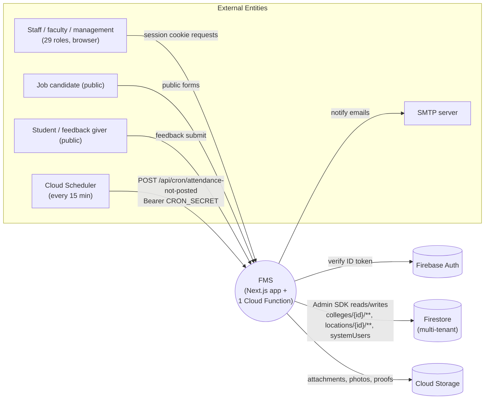

# FMS — As-Is System Context (00-overview)

> Audit basis: code inspected 2026-09-28 on branch `guna-subjects-timetable-updates`.
> Stack evidence: `package.json` (Next.js 16.2.9, React 19.2.4, TypeScript 5.9.3, firebase 12.x, firebase-admin 14.x, zustand 5, @tanstack/react-query 5, exceljs, jspdf, face-api.js, leaflet, nodemailer).

## 1. What this system is (as-is)

FMS is a multi-tenant **Faculty Management System for a group of colleges**, organized along two tenancy axes:

- **Locations** (campus/city) contain location-scoped roles: `ADMINISTRATION`, `HR_ADMIN`, `ADMIN_OFFICE`, `LOCATION_STAFF_ADMIN`, `LOCATION_DEPT_HEAD` — profiles at `locations/{id}/locationUsers/{uid}` (`src/lib/firestore/userProvisioning.ts:38`).
- **Colleges** (belong to a location) contain college-scoped roles: `PRINCIPAL`, `VICE_PRINCIPAL`, `HOD`, `COLLEGE_OFFICE`, `PANEL_MEMBER`, `STUDENT`, internal-office roles, etc. — profiles at `colleges/{id}/users/{uid}` (`src/lib/firestore/userProvisioning.ts:65`).
- **Global roles** (`SUPER_ADMIN`, `MANAGEMENT`, `FINANCE`, `PURCHASE_DEPT`) — profiles at `systemUsers/{uid}` (`src/lib/firestore/userProvisioning.ts:45`).

Role normalization at session issue (`src/app/api/auth/session/route.ts`): `COLLEGE_ADMIN`/`DIRECTOR` → `PRINCIPAL`; `DEPARTMENT_OFFICE` → `HOD`. True role preserved in `session.realRole` (`src/lib/auth/verifySession.ts:17-22`).

## 2. Single app, one deployable

There is exactly **one** application: the Next.js App Router app under `src/`.

- Frontend + backend in one codebase: `src/app/(dashboard)/**` pages (570 `page.tsx` files) and `src/app/api/**` route handlers (301 `route.ts` files; counted 2026-09-28).
- `src/proxy.ts` is the edge gate for dashboard **pages only**; it explicitly skips `/api/` (`src/proxy.ts:104`: `pathname.startsWith("/api/")` → `NextResponse.next()`).
- `functions/` is a separate Firebase deploy target (Node 20, `firebase.json` `functions[0].source`), containing one scheduled function `attendanceNotPostedSweep` that pings `POST /api/cron/attendance-not-posted` every 15 min IST with `CRON_SECRET` (`functions/src/index.ts:20-44`).
- Hosting: Vercel serverless (per `AGENTS.md`; `next.config.ts` `outputFileTracingIncludes` exists for the PDF route's Chromium binary `[UNVERIFIED — not re-read this pass]`).

## 3. External actors (Level-0 view)

| Actor | How they interact | Evidence |
|---|---|---|
| All staff roles (29 `UserRole` values) | Browser dashboards under `/src/app/(dashboard)/<role-path>/…` | `src/types/core.ts:5-61` (`UserRole`), `src/types/core.ts:111` (`ROLE_DASHBOARD_PATHS`) |
| Job candidate (public) | `/careers/[collegeId]`, `/candidate-form/[collegeId]/[candidateId]`, `/offer-acceptance/[collegeId]/[offerId]`, `/location-interview/[id]` | page routes list, `src/proxy.ts:16-30` (`PUBLIC_PATHS`) |
| Student feedback giver (public) | `/feedback/[id]/[sub]` (+`/[item]`), `POST /api/public/student-feedback` | page routes; `src/app/api/public/student-feedback/route.ts` |
| Public faculty profile viewer | `/faculty-public/[param]`, `GET /api/public/faculty-public` | page routes |
| Cloud Scheduler (Firebase) | 15-min POST to `/api/cron/attendance-not-posted` with Bearer `CRON_SECRET` | `functions/src/index.ts:34-39` |
| SMTP server | `POST /api/email/send` via `nodemailer` | `src/app/api/email/send/route.ts`; `SMTP_*` env per `AGENTS.md` |
| Firebase Auth | Client SDK sign-in; ID token → session cookie | `src/app/api/auth/session/route.ts` |
| Firebase Firestore + Storage | All persistence via `getAdminDb()`/`getAdminStorage()` (`src/lib/firebase/admin.ts`) | SHARED_FILES.md; `src/lib/notify.ts:27` pattern |

## 4. Mermaid — Level 0 context diagram

*Explanation: one process (the Next.js app; the Cloud Function is just a scheduler arm of it), six external entities, three Firebase-backed stores. All business data lives in Firestore under three roots: `colleges/{id}/…`, `locations/{id}/…`, `systemUsers/{uid}` (evidence: `src/lib/firestore/userProvisioning.ts:38-78`).*

## 5. Non-goals / absent as-is

- No SQL database, no Redis, no message queue, no external webhooks inbound (`AGENTS.md` "Stack"; grep for queue/webhook infra found none).
- No CI deploy of Firestore rules/indexes — manual `firebase deploy` only (SHARED_FILES.md "firestore.rules" section).
- No `middleware.ts`; `src/proxy.ts` replaces it (`AGENTS.md` Stack; `next.config.ts`).
- No native mobile app; mobile is responsive UI (`BottomNav`, `MobileDrawer` in `src/components/layout/`).

## 6. Where to read next

- Module map & dependencies: `module-map.md`
- Auth/tenancy/RBAC internals: `cross-cutting-architecture.md`
- Role matrix: `roles-permissions-matrix.md`
- Data stores: `data-stores-overview.md`
- Cron/emails/uploads: `integrations-and-jobs.md`
