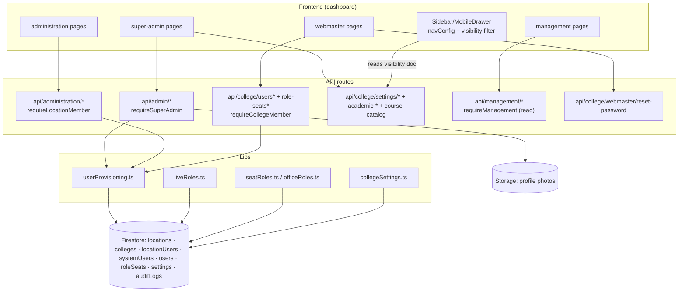

# M1 — Architecture (as-is)

## Frontend
- **Super Admin** (`/super-admin`, 18 pages): locations/colleges CRUD, users + per-user module editing (`users/[uid]/[module]/edit`), role-assignments, settings, audit-logs, dashboard.
- **Administration** (`/administration`, 20 pages): location college management (`colleges`, `colleges/[id]/edit`, `colleges/new`), college people (`users`, `users/new`, `users/[uid]/edit`), principals (`administration/principals`), settings, vacancies→M2, interviews/offers→M2.
- **Webmaster** (`/webmaster`, 11 pages): credential-requests (faculty account requests), users (provisioned accounts), requests, history, reset-password surface.
- **Management** (`/management`, 27 pages): locations, users/new, role-assignments, faculty drill-down (`faculty/[collegeId]/departments/...`), attendance oversight (→M5), budget (→M7), leave-approvals (→M6), stats/dashboard.
- State: Zustand `authStore`/`uiStore`; TanStack Query for lists; `LocationDeptSwitcher` for location context.
- Role-based UI: nav entries gated by `navConfig.ts` roles arrays; per-college visibility toggles filter further (`filterVisibleNavItems` hiddenModules/hiddenItems — navConfig.ts:39-52 comment).

## Backend
- Controllers = Next.js route handlers; no separate service layer for M1 (logic inline in routes) except provisioning helpers:
  - `src/lib/firestore/userProvisioning.ts` — writes `locations/{id}/locationUsers/{uid}` (line 38), `systemUsers/{uid}` (45), `colleges/{id}/users/{uid}` (65), and `auditLogs` (86).
  - `src/lib/auth/liveRoles.ts` — resolves held roles live from the three roots (lines 42, 70-71); cache TTL revocation.
  - `src/lib/roles/seatRoles.ts` — seat ordering/pick; `officeRoles.ts` — college-type office-role catalog.
- Guards: `requireSuperAdmin` (admin routes), `requireLocationMember` (administration/location routes), `requireCollegeMember` (college users), `requireManagement` (management reads), `requireRole` (role-seats; allows MANAGEMENT per comment verifySession.ts:84-91).
- Validators: request-shape checks inline; zod in newer routes `[UNVERIFIED per route]`.

## Data architecture
- Collections: `locations`, `colleges`, `locations/{id}/locationUsers`, `systemUsers`, `colleges/{id}/users`, `colleges/{id}/roleSeats`, `colleges/{id}/settings/{general, navVisibility?}`, `colleges/{id}/auditLogs`, `academicYears`, `courseCatalog` (course catalog under college — see M3-SM1 boundary note).
- Key fields: `FMSUser {uid, role, realRole?, seatRoles?, department?, collegeId, locationId}` (types/core.ts `FMSUser`); `RoleSeat {role, uid, ...}` (types/roleSeats.ts); `settings/general` (collegeSettings.ts:26).
- Indexes: `users [role asc, name asc]`, `users [role asc, departments CONTAINS]`, `users COLLECTION_GROUP [employeeId]` (firestore.indexes.json entries — orig file shown; current file supersedes with same entries `[ASSUMPTION]`).
- No migrations; no soft deletes; audit docs append-only.

## Integration architecture
- Photo uploads: `api/admin/users/[uid]/photo`, `api/admin/users/me/photo`, `api/location/users/me/photo`, `api/college/users/me/photo` → Storage.
- Password/email ops: webmaster reset-password route; email requests live in M2-SM5 but webmaster dashboard consumes them.

## Security / tenancy
- Tenancy enforced by guard choice per route: `requireSuperAdmin` (global), `requireLocationMember` (location), `requireCollegeMember` (college). MANAGEMENT routes are global-read with explicit collegeId path params.
- Seats: `roleSeats` docs; holder's effective role resolved by `pickEffectiveRole`/`orderHeldRoles`; live re-check in guards via `resolveHeldRoles` (liveRoles.ts).
- Nav visibility (M1-SM3): college settings doc toggles module/nav visibility; enforced client-side only.

## Runtime/deployment
- No dedicated infra; same Next.js app + Firestore. No jobs.

## Mermaid — component diagram

*Explanation: four admin dashboards over five guard-scoped API groups; one provisioning lib writes all three user roots; live role resolution sits in the request path of every guarded route (see cross-cutting).*

## Dependencies and boundaries
- Outbound: M2 consumes provisioning; M3 consumes settings/academic-years/catalog; M9 consumes auditLogs. Inbound: none.
