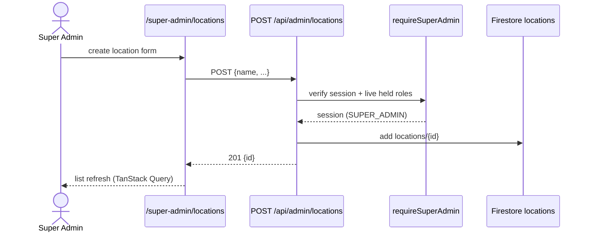
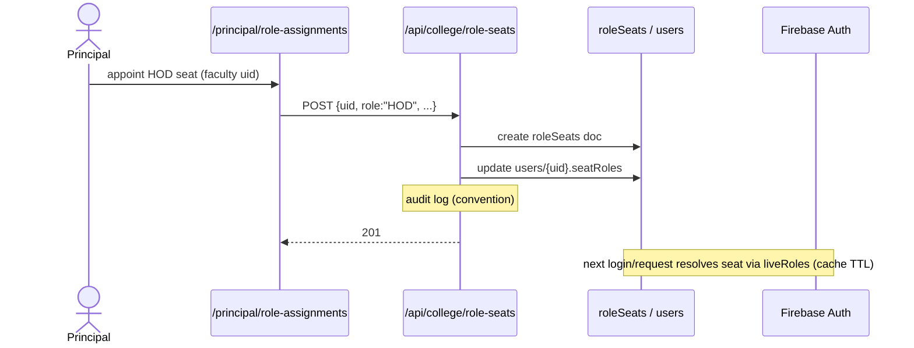

# M1 — Data Flow (as-is)

## M1-SM1 Locations & Colleges

**Actors:** SUPER_ADMIN (create/edit), MANAGEMENT (read oversight), ADMINISTRATION (location-scoped college mgmt).
**Trigger:** admin creates a campus (location) or a college under it.
**Preconditions:** session valid; guard passes.
**Main flow:**
1. `POST /api/admin/locations` (`requireSuperAdmin`) → writes `locations/{id}`.
2. `POST /api/admin/colleges` → writes `colleges/{id}` with `locationId` link.
3. `PATCH /api/admin/locations/[id]` / `colleges/[id]/edit` page → update.
**Postconditions:** tenants exist; subsequent provisioning can target them.
**Errors:** unauthorized (401 guard sentinel), validation 400.
**Stores:** `locations`, `colleges`.

## M1-SM2 Users / Roles / Seats

**Actors:** SUPER_ADMIN (global users), ADMINISTRATION (location users), PRINCIPAL/VP/COLLEGE_OFFICE (college users incl. office roles per college type), HOD (department office/dept settings), MANAGEMENT (Principal-seat appointment via role-seats).
**Main flow (college user create):**
1. `POST /api/college/users` (`requireCollegeMember` + role matrix in route; office-role create validated against `getCreatableOfficeRoles` college type — enforced server-side per AGENTS.md).
2. Provisioning: `colleges/{id}/users/{uid}` + Firebase Auth user; `auditLogs` entry (userProvisioning.ts:65-86).
**Seat flow:** `POST /api/college/role-seats` (`requireRole("PRINCIPAL","MANAGEMENT","SUPER_ADMIN","ADMINISTRATION")` — comment verifySession.ts:84-91) → `roleSeats` doc → holder sessions resolve seat via `resolveHeldRoles`/`pickEffectiveRole` on next guarded request (live within TTL).
**Normalization:** at `POST /api/auth/session`, COLLEGE_ADMIN/DIRECTOR→PRINCIPAL, DEPARTMENT_OFFICE→HOD in cookie `role`; `realRole` preserved.
**Errors:** 403 role/scope; 400 college-type disallows office role; 409 seat conflict `[ASSUMPTION]`.

**Async:** none — all synchronous Firestore writes. Notifications: seat/role changes may notify via `notifyRole` where flows choose to `[UNVERIFIED per route]`.

## M1-SM3 Nav visibility

**Actors:** PRINCIPAL/VP (college), SUPER_ADMIN (view/all).
**Flow:** `GET/PUT /api/college/settings/nav-visibility` → read/write visibility doc (under `colleges/{id}/settings`); Super Admin twin `api/admin/settings/nav-visibility` (requireSuperAdmin).
**Consumers:** `Sidebar`/`MobileDrawer`/`BottomNav` via `filterVisibleNavItems` (navConfig.ts) — hidden modules/items; defaults from `lib/navVisibilityDefaults.ts`.
**Note:** UI-only; API guards unaffected.

## M1-SM4 Audit logs

**Writers:** per-flow route code (e.g., `userProvisioning.ts:86`, `lib/leave/decideFinalStage.ts:93`, `lib/budget/managementApproval.ts:66`).
**Readers:** `GET /api/admin/audit-logs` (global), `GET /api/college/audit-logs` (college; PRINCIPAL).
**Gap:** no central emit; coverage uneven (cross-cutting #10).

## M1-SM5 College settings (Academic year / Course catalog custody)

**Flow:** `GET/PUT /api/college/settings/general` (collegeSettings.ts:26 → `settings/general`); `academic-years`/`academic-sessions`/`course-academic-years` maintain year bindings; course catalog CRUD shared with M3-SM1 (`/principal/courses` UI).
**Label logic:** `academicSessionLabel` (lib/college/academicSession.ts + test).
**Consumers:** every academic module reads academic year/session context (M3–M5).
