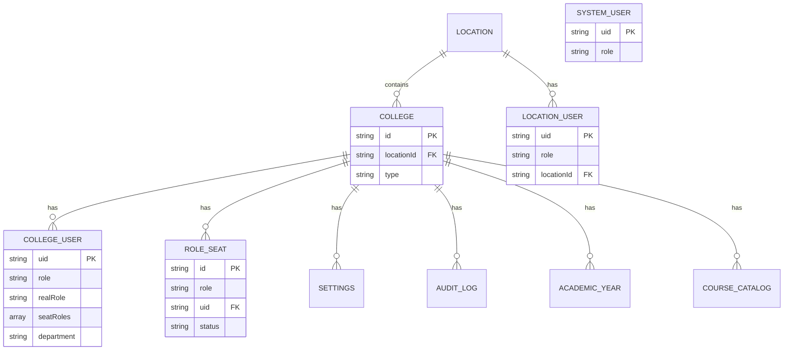

# M1 — Data Model (as-is)

Firestore is schemaless; shapes below come from `src/types/core.ts` (`FMSUser`, `College`, `Location`) and provisioning code.

## Entities

| Entity | Path | Key fields | Source |
|---|---|---|---|
| Location | `locations/{id}` | name, address?, `locationUsers` subcol | userProvisioning.ts:38 |
| College | `colleges/{id}` | name, `locationId`, type (college-type gates office roles/designations), settings subcol | colleges route; AGENTS.md |
| LocationUser | `locations/{id}/locationUsers/{uid}` | uid, role (ADMINISTRATION/HR_ADMIN/ADMIN_OFFICE/LOCATION_STAFF_ADMIN/LOCATION_DEPT_HEAD), locationId | userProvisioning.ts:38 |
| SystemUser | `systemUsers/{uid}` | uid, role (SUPER_ADMIN/MANAGEMENT/FINANCE/PURCHASE_DEPT) | userProvisioning.ts:45 |
| CollegeUser | `colleges/{id}/users/{uid}` | uid, role, realRole?, seatRoles?, department?, designation?, employeeId?, status | userProvisioning.ts:65; core.ts FMSUser |
| RoleSeat | `colleges/{id}/roleSeats/{id}` | role, uid, collegeId, department?, assignedAt/By, status | types/roleSeats.ts |
| Settings (general) | `colleges/{id}/settings/general` | academic year config, college preferences | collegeSettings.ts:26 |
| Settings (nav visibility) | `colleges/{id}/settings/{doc}` | hiddenModules/hiddenItems map | lib/navVisibilityDefaults.ts |
| AuditLog | `colleges/{id}/auditLogs/{id}` (+ global admin stream) | action, performedBy, timestamp, meta | core.ts unions; decideFinalStage.ts:93 |
| AcademicYear | `colleges/{id}/academicYears/{id}` | year, label, course bindings | courseScopeValidation.ts:22-24 |
| CourseCatalog | `colleges/{id}/courseCatalog/{id}` | catalog entries + regulations | courseSelections.ts:29 |

## Relationships

- College `n:1` Location (via `locationId`).
- Users partitioned by ROLE_SCOPE: COLLEGE → college users; LOCATION → locationUsers; GLOBAL → systemUsers (core.ts:202 + userProvisioning).
- RoleSeat `n:1` CollegeUser (uid), `n:1` role definition.
- AuditLog standalone (actor uid string).

## Mermaid ER

*Explanation: ER is logical; physical Firestore nests subcollections under `colleges/{id}`. `systemUsers` stands alone (global).*

## Indexes used (M1)
- `users [role asc, name asc]`, `users [role asc, departments CONTAINS]`, `users COLLECTION_GROUP [employeeId]` (firestore.indexes.json; orig backup identical entries).
