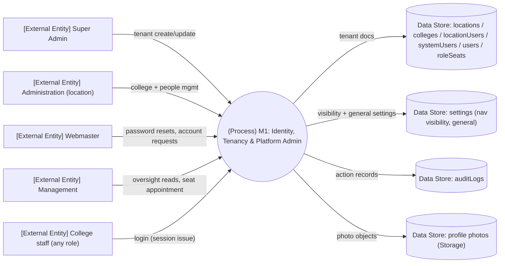

# M1 — DFD Level 0 (context)

System as one process; external entities and major data flows touching M1 responsibilities.

*Explanation: M1 is the entry point for every login (session issuance lives in the shared auth flow) and the owner of tenant/user stores. All flows are synchronous request/response.*
