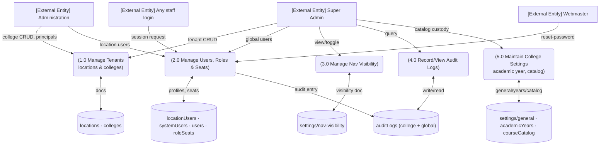

# M1 — DFD Level 1

*Explanation: five processes map 1:1 to submodules M1-SM1..SM5. P2 feeds D4 directly (provisioning writes audit). Session issuance (login) is part of P2's responsibilities (auth/session route).*
