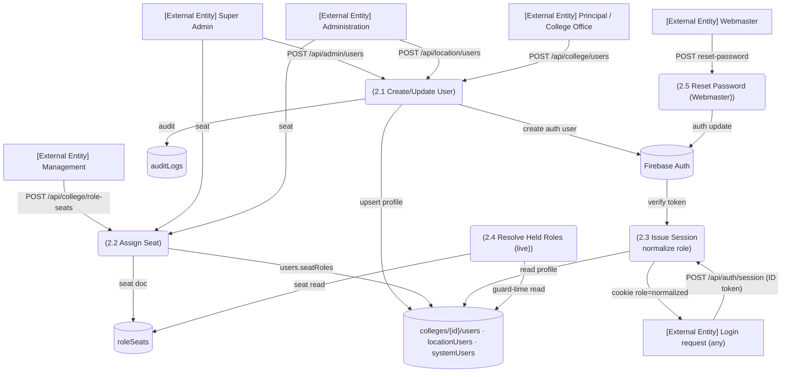

# M1 — DFD Level 2: M1-SM2 Users, Roles & Seats

*Explanation: user creation writes both Firestore profile and Firebase Auth account; session issuance normalizes mirror roles; held-role resolution happens at every guarded request (cache TTL), reading profiles and seats.*
