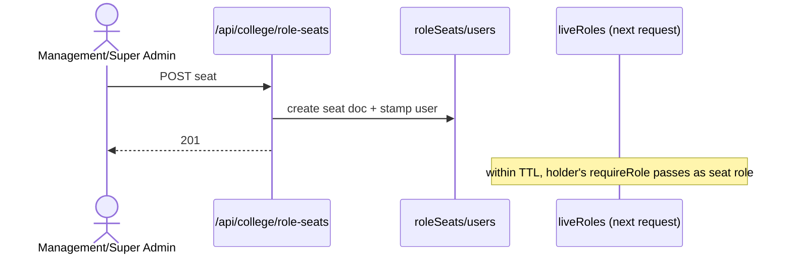

# Flow — M1-F2: Assign a Role Seat (e.g., HOD seat to a faculty member)

- **Flow ID:** M1-F2
- **Actors/Roles:** PRINCIPAL/VP (appoint dept seats), SUPER_ADMIN/MANAGEMENT/ADMINISTRATION (Principal seat per verifySession.ts:84-91 comment)
- **Trigger:** `/principal/role-assignments` or `/management/role-assignments`
- **Preconditions:** target account exists in college; role seatable (`src/types/roleSeats.ts`); no conflicting active seat `[ASSUMPTION]`
- **Main success scenario:**
  1. `POST /api/college/role-seats` (`requireRole(...)` per route).
  2. Write `roleSeats` doc {role, uid, collegeId, dates}.
  3. Stamp `users/{uid}.seatRoles` (seatRoles.ts helpers).
  4. Audit + optional notify.
- **Alternate/error:** role not seatable → 400; duplicate seat → 409 `[ASSUMPTION]`; unauthorized → 401/403.
- **UI:** `/principal/role-assignments`, `/management/role-assignments`.
- **API:** `POST /api/college/role-seats`; `PATCH /api/college/role-seats/[id]`; `POST /api/college/role-seats/convert-legacy` (one-time migration).
- **Backend:** `src/lib/roles/seatRoles.ts` (`orderHeldRoles`, `pickEffectiveRole`), guards' `resolveHeldRoles` consumption.
- **DB:** `roleSeats`, `colleges/{id}/users`.
- **Permission checks:** backend `requireRole`; frontend nav.
- **Validation:** seat role in allowed set; target in same college.
- **State transitions:** seat ACTIVE → (remove) ended.
- **Side effects:** next guarded request resolves seat live (liveRoles.ts TTL); notifications to holder `[UNVERIFIED]`; audit.
- **Concurrency:** two concurrent seats for same role/department → last-write wins unless route checks `[UNVERIFIED]`.
- **Code evidence:** verifySession.ts:84-91 comment (who may appoint Principal seat); `src/lib/roles/seatRoles.ts` + `seatRoles.test.ts`; `src/lib/auth/liveRoles.ts:42,70-71`.

