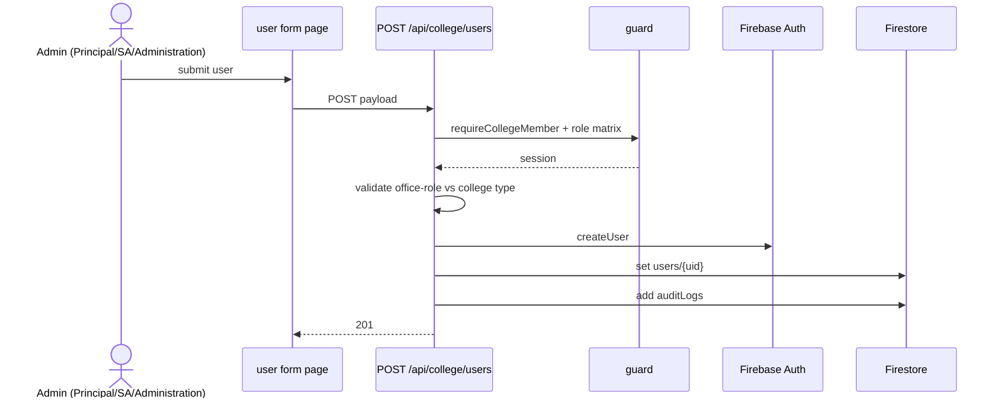

# Flow — M1-F1: Create College User (role/office-role provisioning)

- **Flow ID:** M1-F1
- **Actors/Roles:** PRINCIPAL, VICE_PRINCIPAL, COLLEGE_OFFICE (per role matrix), SUPER_ADMIN (via admin routes)
- **Trigger:** Admin fills user form (`/principal/staff/new`, `/administration/users/new`, `/super-admin/users/new`)
- **Preconditions:** session valid; actor's college context set; target role creatable by actor; office roles gated by college type (`src/lib/roles/officeRoles.ts getCreatableOfficeRoles`)
- **Main success scenario:**
  1. `POST /api/college/users` — guard `requireCollegeMember` + per-role authorization inline.
  2. Validate payload (role, department for HOD-type roles, designation, email uniqueness).
  3. Create Firebase Auth user; write `colleges/{id}/users/{uid}` (userProvisioning.ts:65).
  4. Append `auditLogs` doc (userProvisioning.ts:86).
  5. Optional notify to role holders `[UNVERIFIED per route]`.
- **Alternate/error scenarios:**
  - College type disallows office role → 403/400 (server-enforced; AGENTS.md "keep both in sync").
  - Email exists → 409 `[ASSUMPTION]`; validation → 400; guard fail → 401/403.
- **UI routes:** `/principal/staff/new` (also `/principal/staff/non-technical/new` for non-teaching), `/administration/users/new`, `/super-admin/users/new`.
- **API endpoint(s):** `POST /api/college/users`; variants: `POST /api/admin/users`, `POST /api/location/users`.
- **Backend service(s):** `src/lib/firestore/userProvisioning.ts` (`provisionCollegeUser` at line 65 region), `src/lib/roles/officeRoles.ts`.
- **DB tables:** `colleges/{id}/users`, Firebase Auth, `colleges/{id}/auditLogs`.
- **Permission checks:** guard + route-level role matrix + college-type office-role gate (server-side) + nav UI gate (client-side).
- **Validation rules:** required fields per role; designation picklist per college type (`lib/designations/config.ts`); department required for department-scoped roles.
- **State transitions:** none (single write).
- **Side effects:** Auth account; audit log; optional notification; profile photo via `upload/profile-photo` later.
- **Reports/exports:** none.
- **Concurrency/idempotency:** duplicate email → Auth error surfaced as 409 `[ASSUMPTION]`; no idempotency key.
- **Code evidence:** `src/lib/firestore/userProvisioning.ts:65-86`; `src/app/api/college/users/route.ts`; `src/lib/roles/officeRoles.ts` (AGENTS.md internal-office section); guard list in SHARED_FILES.md.

