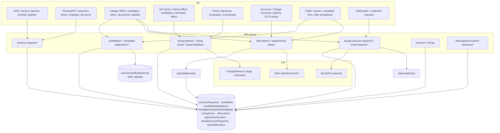

# M2 — Architecture (as-is)

## Frontend
- **Pipeline boards** (per-role variants of one stepper): HOD `hod/pipeline/PipelineBoard.tsx`, Principal `principal/vacancies/PrincipalPipelineBoard.tsx`, College Office `college-office/pipeline/OfficePipelineBoard.tsx`, Accounts `accounts/pipeline/AccountsPipelineBoard.tsx`, College Accounts `college-accounts/hiring/CollegeAccountsHiringBoard.tsx` — all call `getCurrentStage`/`stateForStage` (`src/lib/hiringPipeline.ts:11-27`, referencedBy confirms).
- **Interview day UX**: `/coordinator/[batchId]` (QR session coordinator), `/evaluation/[batchId]/[candidateId]` (scoring), `/panel/interviews`, public `/location-interview/[id]` self check-in.
- **Documents vault**: `/college-office/documents/[department]/[vacancyId]`, `/documents/candidate/[applicationId]` (certificate/resume downloads).
- **Offer workspace**: `/college-office/offers` (+new), `/hr-admin/offers/new`, public `/offer-acceptance/[collegeId]/[offerId]`.
- **Webmaster handoff**: `/webmaster/credential-requests`.
- State: TanStack Query; forms react-hook-form; FileUpload for resumes/certificates (`api/upload/resume|certificate`).

## Backend
- Controllers: route handlers per endpoint (college-scoped `requireCollegeMember` (+isCollegeAdmin checks), location `requireLocationMember`, admin `requireSuperAdmin`/`requireCollegeMember` mix for general-admin vacancies).
- Services:
  - `src/lib/firestore/hiring.ts` — batch/application helpers.
  - `src/lib/firestore/offerLetterDecision.ts` — decision transaction: letter approval updates `candidates` status APPROVED (lines 22-62).
  - `src/lib/firestore/offerLetterCc.ts` — resolves CC list once at send (Principal/VP/panel/HOD/Accounts; location ACCOUNTS via `locations/{id}/locationUsers` where role==ACCOUNTS, lines 16-31).
  - `src/lib/firestore/facultyProvisioning.ts` — post-hire account creation: `facultyMembers` count (line 24), letter read (46), candidate read (70), tx creates facultyMember + user (119-123), systemUsers mirror (182); handles existing-uid reuse path (208-266).
  - `src/lib/hiringPipeline.ts` — pure functions (stage/status machines).
- Notifications: `notify`/`notifyRole` call sites incl. candidate-applications, hiring-batches (excludeLeadershipUids for panel prompts), vacancy-requests (getDepartmentHeadUids), faculty-account-requests (notify.ts referencedBy).
- PDF: `/api/pdf/generate` for offer/appointment letters; uploads `/api/upload/resume`, `/api/upload/certificate`, `/api/upload/joining-letter`.

## Data architecture
- Collections & key statuses (types/recruitment.ts):
  - `VacancyRequest.status: WorkflowStatus` (core.ts:268), `principalResponse`, ratio data (studentStrength/cadreRatioData:30-37), `hiringMode` ONLINE/OFFLINE (:98), `hodAcknowledged`.
  - `CandidateStage` DEMO→INTERVIEW→SALARY_NEGOTIATION→DECISION (:61-66); sub-stage PANEL_IN_PROGRESS/INTERVIEW_DONE (:71).
  - `BatchPhase` PRINCIPAL_REVIEW→HOD_FINAL_SETUP→INTERVIEW_READY→IN_PROGRESS→PANEL_INTERVIEW→PRINCIPAL_FINAL_REVIEW→COMPLETED (:284-294) — batch born at PRINCIPAL_REVIEW (comment :281-283).
  - `HiringBatch` (:305): panelMemberUids, interview venue/platform/link, coordinator, positionCategory (SUPPORTING_STAFF skips demo), applicationIds, principalFinalApproval.
  - `PanelFeedback` (:359) — subcollection per batch; demoRatings (6 criteria) + demoOverallScore 1-10; panelScores (7 criteria 1-10, two added later → optional, average must tolerate missing — comment :380-386); panel ratings 1-5 (:399+).
  - `OfferLetter` (:458): status DRAFT|GENERATED|SENT|ACCEPTED|REJECTED; terms snapshot `offeredTerms` (not template ref — comment :440-443); CC resolved at send; candidate self-acceptance fields (respondedAt/By: CANDIDATE or staff override uid).
  - `AppointmentLetter` (:492): status DRAFT|GENERATED|SENT; `facultyId` set post-hire.
  - `FacultyAccountRequest` (:538) status SUBMITTED|IN_PROGRESS|CREDENTIALS_CREATED|COMPLETED (:520).
- Indexes (firestore.indexes.json): hiringBatches [hodUid, createdAt desc], [status, createdAt desc], [currentPhase, interviewDate asc]; candidateApplications 4 composites; panelFeedback [candidateId, submittedAt desc], [candidateId, panelUid].
- No migrations; schema evolution by optional fields (e.g., communication/ictTools added post-launch).

## Integration architecture
- Public ingress: `/candidate-form/[collegeId]/[candidateId]` + `POST api/public/candidate-form/...` writes candidateApplication; careers page `GET /api/college/colleges-directory` + vacancies for public listing `[UNVERIFIED exact public careers API]`.
- Email: offer send + CC via nodemailer; account-request updates notify webmaster/office.
- Storage: resume/certificate/joining-letter uploads.
- PDF: offer/appointment letter generation (puppeteer; HTML fallback).

## Security/tenancy
- College tenancy via guards; panel scoring restricted to `batch.panelMemberUids` (+ Principal/VP/HOD locked-in panels per notify.ts LEADERSHIP_ROLES comment :44-53).
- Public endpoints unauthenticated — tokenized by `[collegeId]/[candidateId]`/`[offerId]` path params (entropy `[UNVERIFIED]`).
- general-admin vacancies: SUPER_ADMIN + ADMINISTRATION with requireCollegeMember on college twin `[UNVERIFIED exact split]`.

## Runtime/deployment
- No jobs; everything request-time. PDF fallback path documented (AGENTS.md).

## Mermaid — component diagram

*Explanation: six role surfaces converge on five API groups over ten collections; provisioning (facultyMembers) is the exit into M3–M5.*

## Dependencies and boundaries
- In: M10 public forms; M1 users/webmaster; M3 subjects (requirement ratios); M9 notify.
- Out: creates facultyMembers/users (M1), feeding M3–M5; CTC data for M7.
