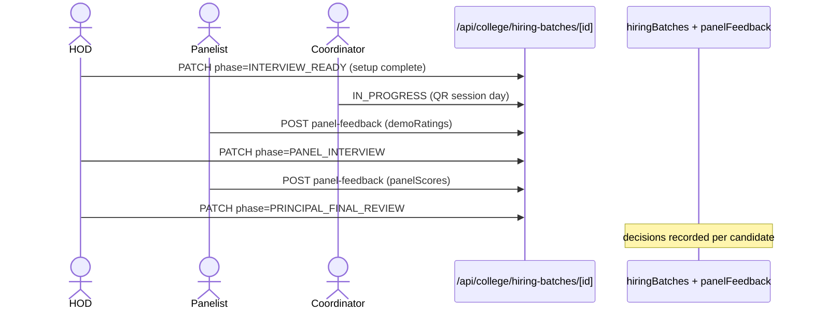
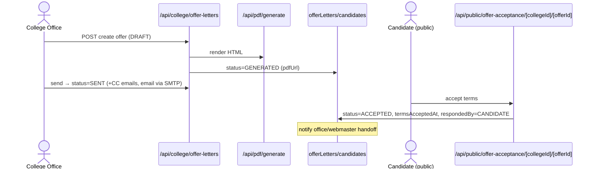

# M2 — Data Flow (as-is)

## M2-SM1 Vacancy request → approval

**Actors:** HOD (raise), Principal/VP (approve/reject/return), Administration/HR (location), Super Admin (general-admin).
**Flow:** HOD submits with ratio-backed data (cadreRatioData from requirement panel — types/recruitment.ts:30-37) → `POST /api/college/vacancy-requests` → Principal approves (`principalResponse` + status) → HOD `hodAcknowledged` → proceed to batch creation.
**Stores:** `vacancyRequests`. **Sync.** **Errors:** 403 wrong role, 400 validation, 409 concurrent decision `[ASSUMPTION]`.

## M2-SM2 Candidates & applications

**Actors:** HOD (shortlist/add), public candidate (form), HR/Admin Office (location), College Office (docs).
**Flow:** Public `POST api/public/candidate-form/[collegeId]/[candidateId]` writes application (walk-in/careers sources — CandidateSource :86-90) → HOD shortlist (`/hod/shortlist/[vacancyId]`) → `candidateApplications` staged; documents uploaded to Storage.
**Sync; notifications to HOD on public submission (notify referencedBy).**

## M2-SM3 Interviews & panel scoring

**Actors:** HOD (setup: venue/coordinator/panel), coordinator faculty (QR session), panel members (score), Principal/VP (locked-in panel members).
**Phases:** batch born at PRINCIPAL_REVIEW (no pre-batch phase — comment recruitment.ts:281-283) → HOD_FINAL_SETUP (demo classroom + coordinator) → INTERVIEW_READY → IN_PROGRESS (demo day, QR session, demoRatings) → PANEL_INTERVIEW (panelScores) → PRINCIPAL_FINAL_REVIEW → COMPLETED.
**Online mode:** meeting link/platform instead of venue; student demo feedback skipped for ONLINE + SUPPORTING_STAFF (positionCategory copy comment :313-317).
**Stores:** `hiringBatches`, subcollection `panelFeedback` (one doc per candidate×panelist — idempotent overwrite `[UNVERIFIED]`).

## M2-SM4 Offer letters & acceptance

**Actors:** College Office (generate/send), Accounts (verify/CTC), Principal (negotiate `/principal/negotiate/[id]`), candidate (public accept), HR (location offers).
**Flow:** Decision → offer DRAFT→GENERATED (PDF via `/api/pdf/generate`) → SENT (email + CC resolved once — offerLetterCc.ts:16-31) → candidate accepts at `/offer-acceptance/[collegeId]/[offerId]` (offeredTerms snapshot accepted; `respondedBy: CANDIDATE`) or staff manual override → ACCEPTED → documents verification → joining letter upload.
**Decision transaction:** `offerLetterDecision.ts:22-62` — approval writes `candidates.status=APPROVED` in same tx.

## M2-SM5 Credential requests (onboarding)

**Actors:** College Office (request), Webmaster (fulfill), Accounts (verify).
**Flow:** Office "Request Faculty Account" on accepted candidate → `facultyAccountRequests` created at SUBMITTED (comment recruitment.ts:529-537: pre-request "Pending" is UI-only eligibility gate) → Webmaster IN_PROGRESS → email-requests `check-availability` → CREDENTIALS_CREATED → COMPLETED → faculty provisioning if not yet (facultyProvisioning creates `facultyMembers` + `users` + systemUsers mirror).
**Detailed status machine** (`hiringPipeline.ts:66-97`) computes INTERVIEW_COMPLETED→…→HIRING_COMPLETED purely from existing fields — no schema changes.

## M2-SM6 Hiring batches/terms

**Terms templates:** `/principal/settings` selects active template; offers store text snapshot (comment recruitment.ts:440-443) — deactivating a template never changes sent offers.

## Error paths & retries
- Email send failures: fire-and-forget; CC resolution at send time only.
- Public form errors: validation 400; expired/unknown ids 404.
- Provisioning: existing-uid reuse path (facultyProvisioning.ts:208-266) prevents duplicate faculty records.

## Async/sync
- All synchronous; notifications are best-effort writes; PDF is inline.
