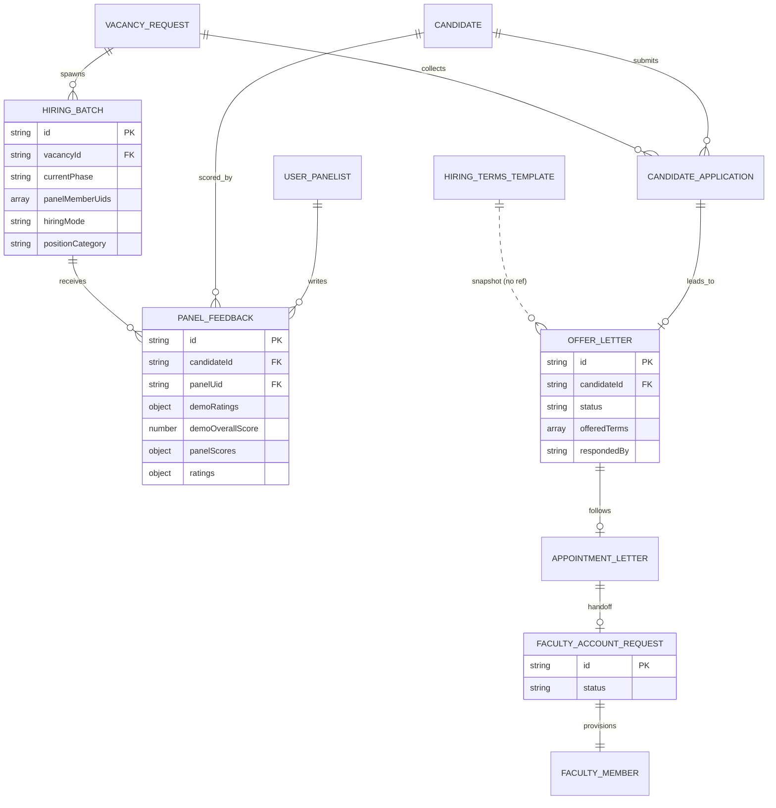

# M2 — Data Model (as-is)

## Entities (all college-scoped unless noted; `src/types/recruitment.ts`)

| Entity | Path | Status/phase enums | Lines |
|---|---|---|---|
| VacancyRequest | `vacancyRequests/{id}` | WorkflowStatus (core.ts:268); principalResponse; hiringMode ONLINE/OFFLINE (:98); positionCategory TEACHING/SUPPORTING_STAFF/GENERAL_ADMIN (:10) | :14-52 |
| Candidate | `candidates/{id}` | status (PENDING…, CandidateStatus :74+); stage DEMO/INTERVIEW/SALARY_NEGOTIATION/DECISION (:61); source/referral fields | :86-227 |
| CandidateApplication | `candidateApplications/{id}` | stage + substage; batch link | :229-282 |
| HiringBatch | `hiringBatches/{id}` | BatchPhase 7 values (:284-294); currentPhase; panelMemberUids; setupComplete/demoComplete; principalFinalApproval | :305-357 |
| PanelFeedback | `hiringBatches/{bid}/panelFeedback/{id}` | demoRatings (6 levels), demoOverallScore 1-10, panelScores (7×1-10, 2 optional), ratings (1-5) | :359-436 |
| HiringTermsTemplate | `hiringTerms/{id}` | isActive; text snapshot copied to offers | :446-456 |
| OfferLetter | `offerLetters/{id}` | DRAFT/GENERATED/SENT/ACCEPTED/REJECTED (:477); offeredTerms snapshot; credentials handoff fields; candidate acceptance fields | :458-490 |
| AppointmentLetter | `appointmentLetters/{id}` | DRAFT/GENERATED/SENT; facultyId post-hire | :492-518 |
| FacultyAccountRequest | `facultyAccountRequests/{id}` | SUBMITTED/IN_PROGRESS/CREDENTIALS_CREATED/COMPLETED (:520) | :538-564 |

Location hiring twins (locationCandidates/interviews/offers) exist via `api/location/*` with parallel shapes `[UNVERIFIED — store names not confirmed]`.

## Mermaid ER

*Note: `PANEL_FEEDBACK` is a subcollection of `HIRING_BATCH` physically; ER drawn logically. `HIRING_TERMS_TEMPLATE` has no FK to offers by design (snapshot).*

## Indexes (M2)
- hiringBatches: [hodUid,createdAt↓], [status,createdAt↓], [currentPhase,interviewDate↑]
- candidateApplications: [batchId,currentStage↑], [vacancyRequestId,isShortlisted↑], [candidateId,createdAt↓], [vacancyRequestId,batchId]
- panelFeedback: [candidateId,submittedAt↓], [candidateId,panelUid]
- studentFeedback: [candidateId,submittedAt↓]

## Migrations
None; evolution via optional fields (communication/ictTools added post-launch with tolerance note recruitment.ts:380-386).
