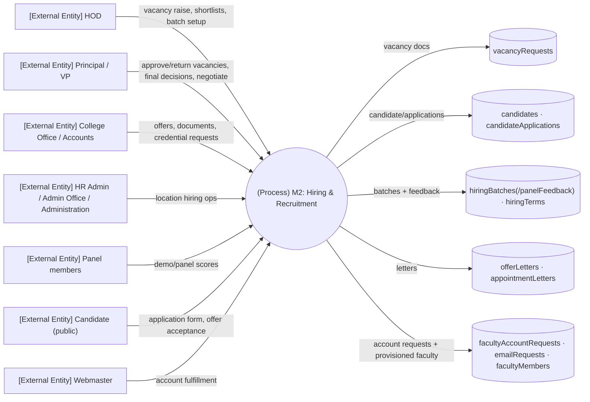

# M2 — DFD Level 0 (context)

```mermaid
flowchart LR
    HOD["[External Entity] HOD"]
    PR["[External Entity] Principal / VP"]
    CO["[External Entity] College Office / Accounts"]
    HR["[External Entity] HR Admin / Admin Office / Administration"]
    PM["[External Entity] Panel members"]
    CAND["[External Entity] Candidate (public)"]
    WM["[External Entity] Webmaster"]

    M2(("(Process) M2: Hiring & Recruitment"))

    DV[("vacancyRequests")]
    DC[("candidates · candidateApplications")]
    DB[("hiringBatches(/panelFeedback) · hiringTerms")]
    DO[("offerLetters · appointmentLetters")]
    DF[("facultyAccountRequests · emailRequests · facultyMembers")]

    HOD -->|"vacancy raise, shortlists, batch setup"| M2
    PR -->|"approve/return vacancies, final decisions, negotiate"| M2
    CO -->|"offers, documents, credential requests"| M2
    HR -->|"location hiring ops"| M2
    PM -->|"demo/panel scores"| M2
    CAND -->|"application form, offer acceptance"| M2
    WM -->|"account fulfillment"| M2

    M2 -->|"vacancy docs"| DV
    M2 -->|"candidate/applications"| DC
    M2 -->|"batches + feedback"| DB
    M2 -->|"letters"| DO
    M2 -->|"account requests + provisioned faculty"| DF
```

*Explanation: M2 is the widest external surface (public candidates + 7 staff roles), producing provisioned faculty as its terminal output.*
