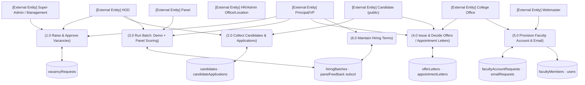

# M2 — DFD Level 1

```mermaid
flowchart TD
    HOD["[External Entity] HOD"]
    PR["[External Entity] Principal/VP"]
    CO["[External Entity] College Office"]
    HR["[External Entity] HR/Admin Office/Location"]
    PM["[External Entity] Panel"]
    CAND["[External Entity] Candidate (public)"]
    WM["[External Entity] Webmaster"]
    SA["[External Entity] Super Admin / Management"]

    P1("(1.0 Raise & Approve Vacancies)")
    P2("(2.0 Collect Candidates & Applications)")
    P3("(3.0 Run Batch: Demo + Panel Scoring)")
    P4("(4.0 Issue & Decide Offers / Appointment Letters)")
    P5("(5.0 Provision Faculty Account & Email)")
    P6("(6.0 Maintain Hiring Terms)")

    DV[("vacancyRequests")]
    DC[("candidates · candidateApplications")]
    DB[("hiringBatches · panelFeedback subcol")]
    DO[("offerLetters · appointmentLetters")]
    DFR[("facultyAccountRequests · emailRequests")]
    DFM[("facultyMembers · users")]

    HOD-->P1; P1<-->DV; PR-->P1
    CAND-->P2; HOD-->P2; P2<-->DC
    HOD-->P3; PM-->P3; P3<-->DB; PR-->P3
    CO-->P4; PR-->P4; CAND-->P4; P4<-->DO
    CO-->P5; WM-->P5; P5<-->DFR; P5-->DFM
    PR-->P6; P6<-->DB
    SA-->P1
```

*Explanation: six processes; P5 is the bridge to M1/M3 (facultyMembers/users).*
