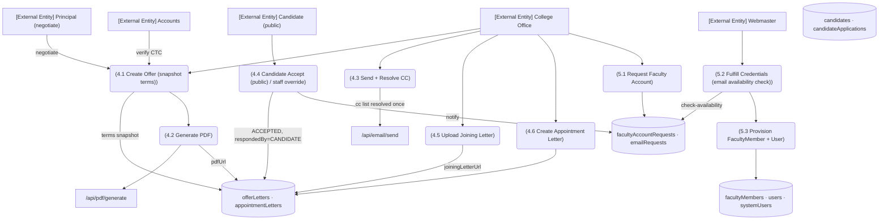

# M2 — DFD Level 2: M2-SM4/S M5 Offer, Acceptance & Provisioning

*Evidence: OfferLetter status machine + offeredTerms snapshot `recruitment.ts:458-490`; FacultyAccountRequest statuses :520; provisioning tx `facultyProvisioning.ts:119-123,182,208-266`; CC `offerLetterCc.ts:16-31`; decision tx `offerLetterDecision.ts:22-62`.*
