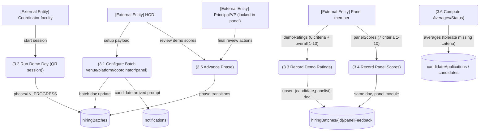

# M2 — DFD Level 2: M2-SM3 Interviews & Panel Scoring

*Evidence: PanelFeedback shape `src/types/recruitment.ts:359-399+` (demo module, panel module, optional criteria note :380-386); phases :284-294; leadership exclusion `src/lib/notify.ts:44-64`; coordinator/evaluation pages `/coordinator/[batchId]`, `/evaluation/[batchId]/[candidateId]`.*
