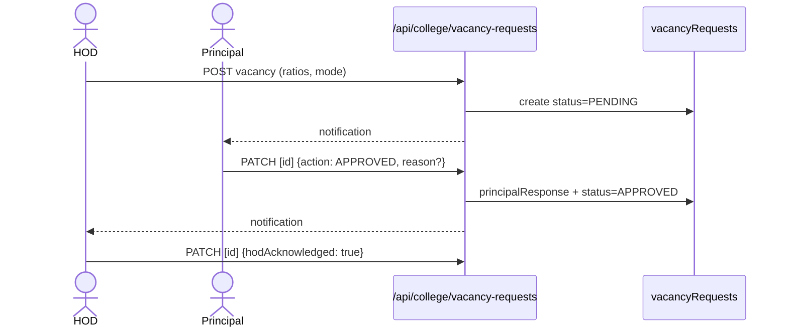

# Flow — M2-F1: Vacancy Request & Principal Approval

- **Flow ID:** M2-F1
- **Actors/Roles:** HOD (raise), PRINCIPAL/VP (decide), ADMINISTRATION/HR_ADMIN (location twins), SUPER_ADMIN (general-admin)
- **Trigger:** HOD submits requirement from faculty-requirement panel
- **Preconditions:** session HOD-context; department set; ratio data computed
- **Main success scenario:**
  1. `POST /api/college/vacancy-requests` (requireCollegeMember + HOD role) with `positionCategory` (TEACHING/SUPPORTING_STAFF/GENERAL_ADMIN), requiredCount, cadreRatioData, hiringMode.
  2. `vacancyRequests` doc created `status=PENDING` (WorkflowStatus core.ts:268).
  3. Principal notified (getDepartmentHeadUids → notifyRole chain — notify.ts referencedBy).
  4. Principal PATCH decision → `principalResponse {action, reason, respondedAt, principalUid}` (recruitment.ts:39-44).
  5. HOD acknowledges (`hodAcknowledged`) before collecting candidates.
- **Alternate/error:** return-for-changes (status back), reject with reason; 403 non-HOD; 400 invalid counts.
- **UI:** `/hod/vacancy`, `/hod/vacancy/new`, `/principal/vacancies` (+`[id]/approve|reject`, `department/[department]`, `general-admin`), `/administration/vacancies*`, `/hr-admin/vacancies*`, `/admin-office/vacancies`, `/location-dept-head/vacancies*`, `/super-admin/vacancies*`.
- **API:** `api/college/vacancy-requests` + `[id]`; `api/location/vacancy-requests` + `[id]`; `api/admin/general-admin-vacancies` + `[id]`.
- **Backend:** inline route logic + `lib/hiringPipeline.ts` (stage=1 until APPROVED — getCurrentStage:11-19).
- **DB:** `vacancyRequests`; indexes [hodUid, createdAt desc], [status, createdAt desc].
- **Permissions:** backend guards; frontend nav.
- **Validation:** requiredCount ≥1; qualification text; positionCategory enum.
- **State transitions:** PENDING → (APPROVED | REJECTED | RETURNED) via principalResponse.action.
- **Side effects:** notifications (HOD on decision; Principal on raise); audit `[UNVERIFIED]`.
- **Reports:** department summary board (`PrincipalDepartmentSummary.tsx`).
- **Concurrency:** single decision doc update; idempotent by status guard `[ASSUMPTION]`.
- **Code evidence:** types/recruitment.ts:14-52 (VacancyRequest); hiringPipeline.ts:11-19; notify.ts referencedBy (vacancy-requests callsites).

