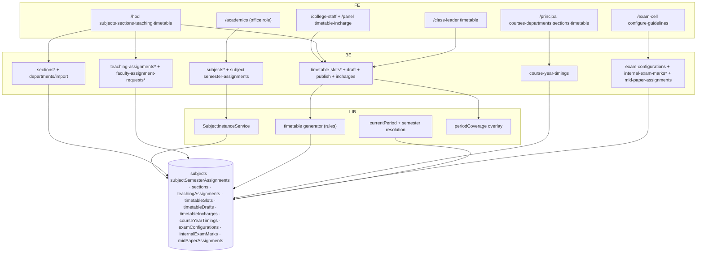

# M3 — Architecture (as-is)

## Frontend
- **Academics office** (`/academics`, 12 pages): subjects list/new/edit/import, assign-semester, own leave/profile.
- **HOD** (`/hod`): subjects, sections (new/edit/[id]), teaching-assignments, timetable (`[courseId]/[year]/[sectionId]` + teaching-assignments drill), internal-exam, mid-paper-setter, assignment-requests.
- **Principal/VP**: courses, departments CRUD + import, sections, timetable (view), internal-marks, vacancy-adjacent approvals.
- **College Staff/Panel**: `timetable-incharge/[courseId]/[year]` (+sectionId, teaching-assignments) — delegated editors; assignment-requests inbox.
- **Exam Cell**: configure, guidelines, circulars (M9), attendance reports (M5).
- **Class Leader**: read-only timetable (`/class-leader/timetable`).
- Components: `src/components/academics/*`, `src/components/timetable/*` (TeachingAssignmentsEditor with per-row Lab Batch field — teaching.ts:267-275 comment), shared DataTable.

## Backend
- Route handlers per endpoint; notable services:
  - `SubjectInstanceService` (`src/lib/subjects/services/SubjectInstanceService.ts`): master subject → semester instance expansion (courseId_yearN timing read :52-81, master doc read :84, dept/course context :112-113, parent-department handling :160, instance doc id + upsert :185, list :271-273).
  - Timetable generator: draft build + publish (`timetable/draft`, `timetable/publish`), rules from `settings/timetableRules` (loadContext.ts:64), solver constraints TimetableRules (teaching.ts:344-371: 4 hard caps, 2 soft prefs; DEFAULT_TIMETABLE_RULES :373-383).
  - `currentPeriod.ts` (`src/lib/timetable/currentPeriod.ts`): today-periods with IST window, substitute-aware resolution (:63-111,165-183,251-273), split-lab awareness.
  - Substitution overlay: `lib/leave/periodCoverage.ts getActiveSubstitutionsForDates` applied at read time by GET timetable-slots, class-leader/timetable, teaching-assignments (teaching.ts:310-330 doc comment) — never persisted on slot.
  - Timetable incharge: doc id `courseId_yearN` (`departments/timetableIncharge.ts:22-23`), authority = incharge faculty OR HOD.
- Guards: requireCollegeMember (+ department scope for HOD), requireRole for exam-cell routes; academic sessions/years via requireCollegeContext (global-role read paths).

## Data architecture
- Subject dual model (AGENTS.md + report gap-fix on branch): **master** = courseId+regulation (no year/department); **semester-scoped** = department+semester. Validation tests `src/app/api/college/subjects/__tests__/validation.test.ts`.
- Section (core.ts:2651): courseId, year, section name, facultyInchargeUid, secondaryDepartments, labBatches; SectionListItem :2696.
- CourseYearTiming (core.ts:780): id `courseId_yearN`, periods[], semesters[] — slot periodNumber resolved against it.
- TimetableSlot (teaching.ts:256-340): day×periodNumber×sectionId×assignmentId; labBatch split-label (two rows same section+day+period different labBatch = deliberate split, `StagedSlot.allowSplit`); source MANUAL/GENERATED; semester + academicYear stamps (history preserved — prior semesters' slots never deleted, excluded from live reads via matchesCurrentSemester/matchesCurrentAcademicYear — doc comments :289-309); substitute fields read-time only.
- TimetableDraft: `timetableDrafts/{sectionId}` (teaching.ts:378-380), status DRAFT/PUBLISHED (:384).
- Semester propagation tests: `src/lib/college/__tests__/semester-propagation.test.ts` (11 tests incl. legacy null-semester compatibility).
- Indexes: sections 7 composites; teachingAssignments 3; timetable read patterns per currentPeriod (where facultyId/sectionId in chunks — periodCoverage.ts:429 chunk(30)).

## Integration architecture
- Excel import: subjects (`subjects/import`), departments (`departments/import`).
- Exam circulars/guidelines reuse upload + notification patterns.
- No external integrations.

## Security/tenancy
- College scoping everywhere; HOD dept scope; timetable-incharge delegation gates writes; class-leader read-only by seat; panel read for mid-bank/internal-exam `[UNVERIFIED exact guards]`.

## Runtime
- No jobs. Publish is a synchronous heavy op (generator) — potential long request `[RISK]`.

## Mermaid — component diagram

*Explanation: office role owns subject definitions; HOD/staff own assignments and grid; generator + overlay live in libs; exam submodule separate.*
