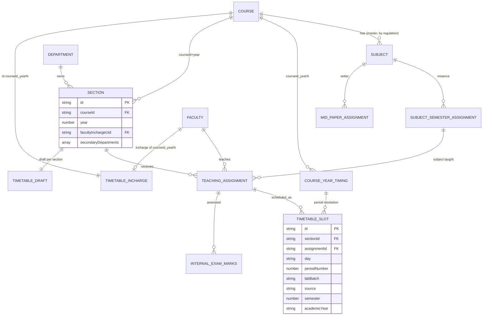

# M3 — Data Model (as-is)

## Key entities (`src/types/teaching.ts` unless noted)

| Entity | Path | Key fields | Lines |
|---|---|---|---|
| Subject | `subjects/{id}` | dual model: master (courseId+regulation, no year/dept) vs semester-scoped (department+semester); SubjectType THEORY/PRACTICAL/TUTORIAL/PROJECT (:5); SubjectCategory (:17) | :34-101 |
| SubjectSemesterAssignment | `subjectSemesterAssignments/{id}` | instanceDocId (courseId_year_semester_subject); links master → dept/semester | :103-139 |
| Section | `sections/{id}` | courseId, year, name, facultyInchargeUid, secondaryDepartments, labBatches; batch (cohort session) | core.ts:2651-2695 |
| TeachingAssignment | `teachingAssignments/{id}` | facultyId, subjectId, sectionId, semester vs assignmentSemester distinct; shapes for course/section vs semester | :141-206 |
| FacultyAssignmentRequest | `facultyAssignmentRequests/{id}` | status PENDING/ALLOCATED/DECLINED | :208-253 |
| TimetableSlot | `timetableSlots/{id}` | day, periodNumber, sectionId, assignmentId, facultyId, subjectId, labBatch?, source, isPinned, semester?, academicYear? | :256-340 |
| TimetableRules | `settings/timetableRules` | workingDays, 4 hard caps, labBlockSize, allowLabAcrossBreaks, 2 soft prefs | :344-383 |
| TimetableDraft | `timetableDrafts/{sectionId}` | staged slots; status DRAFT/PUBLISHED | :384-430+ |
| CourseYearTiming | `courseYearTimings/{courseId_yearN}` | collegeStart/End, periods[], semesters[] | core.ts:780-823 |
| TimetableIncharge | `timetableIncharges/{courseId_yearN}` | facultyId (delegation) | core.ts:825+ |
| ExamConfiguration | `examConfigurations/{id}` | id=examConfigId(courseId,year,examType); status ACTIVE/INACTIVE | examConfig.ts:29-31 |
| InternalExamMarksBatch | `internalExamMarks/{id}` | status DRAFT/SUBMITTED | exams.ts:11-21 |
| MidPaperAssignment | `midPaperAssignments/{id}` | status ASSIGNED (single-state) | midPaper.ts:15-17 |
| ExamCircular / ExamGuideline | `examCirculars`, `examGuidelines` | docs + pdf | examCirculars.ts, examGuidelines.ts |

## Mermaid ER

## Indexes
- sections: 7 composites (dept/courseId/year, secondaryDepartments variants, facultyInchargeUid variants) — firestore.indexes.json.
- teachingAssignments: [facultyId, academicYear↓], [department, academicYear, semester], [courseId, year].
- timetable reads: where(facultyId) / where(sectionId in chunk30) (periodCoverage.ts:429).

## Soft-delete/history
- Timetable history preserved (never delete prior semester/session slots — teaching.ts:289-309). Sections/students use status fields; no generic soft delete.
