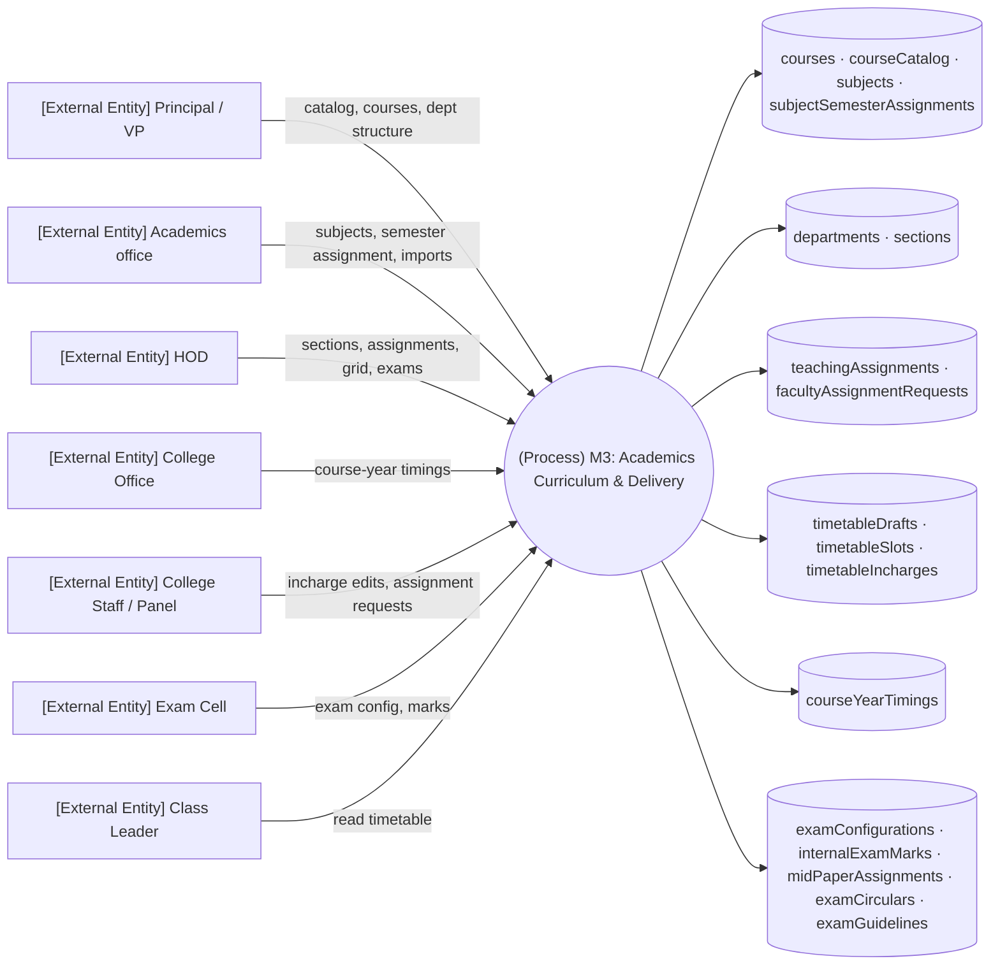

# M3 — DFD Level 0 (context)

```mermaid
flowchart LR
    PR["[External Entity] Principal / VP"]
    HOD["[External Entity] HOD"]
    ACAD["[External Entity] Academics office"]
    CO["[External Entity] College Office"]
    STAFF["[External Entity] College Staff / Panel"]
    EXAM["[External Entity] Exam Cell"]
    CL["[External Entity] Class Leader"]

    M3(("(Process) M3: Academics Curriculum & Delivery"))

    D1[("courses · courseCatalog · subjects · subjectSemesterAssignments")]
    D2[("departments · sections")]
    D3[("teachingAssignments · facultyAssignmentRequests")]
    D4[("timetableDrafts · timetableSlots · timetableIncharges")]
    D5[("courseYearTimings")]
    D6[("examConfigurations · internalExamMarks · midPaperAssignments · examCirculars · examGuidelines")]

    PR -->|"catalog, courses, dept structure"| M3
    ACAD -->|"subjects, semester assignment, imports"| M3
    HOD -->|"sections, assignments, grid, exams"| M3
    CO -->|"course-year timings"| M3
    STAFF -->|"incharge edits, assignment requests"| M3
    EXAM -->|"exam config, marks"| M3
    CL -->|"read timetable"| M3

    M3 --> D1
    M3 --> D2
    M3 --> D3
    M3 --> D4
    M3 --> D5
    M3 --> D6
```
