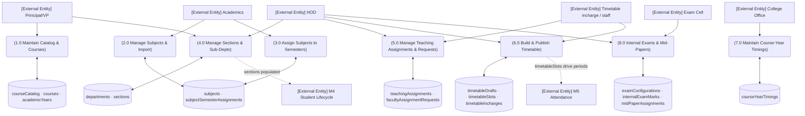

# M3 — DFD Level 1

```mermaid
flowchart TD
    PR["[External Entity] Principal/VP"]
    ACAD["[External Entity] Academics"]
    HOD["[External Entity] HOD"]
    STAFF["[External Entity] Timetable incharge / staff"]
    EXAM["[External Entity] Exam Cell"]
    M4["[External Entity] M4 Student Lifecycle"]
    M5["[External Entity] M5 Attendance"]

    P1("(1.0 Maintain Catalog & Courses)")
    P2("(2.0 Manage Subjects & Import)")
    P3("(3.0 Assign Subjects to Semesters)")
    P4("(4.0 Manage Sections & Sub-Depts)")
    P5("(5.0 Manage Teaching Assignments & Requests)")
    P6("(6.0 Build & Publish Timetable)")
    P7("(7.0 Maintain Course-Year Timings)")
    P8("(8.0 Internal Exams & Mid-Papers)")

    D1[("courseCatalog · courses · academicYears")]
    D2[("subjects · subjectSemesterAssignments")]
    D3[("departments · sections")]
    D4[("teachingAssignments · facultyAssignmentRequests")]
    D5[("timetableDrafts · timetableSlots · timetableIncharges")]
    D6[("courseYearTimings")]
    D7[("examConfigurations · internalExamMarks · midPaperAssignments")]

    PR-->P1; P1<-->D1
    ACAD-->P2; P2<-->D2
    ACAD-->P3; P3<-->D2
    HOD-->P4; PR-->P4; P4<-->D3
    HOD-->P5; STAFF-->P5; P5<-->D4
    STAFF-->P6; HOD-->P6; P6<-->D5
    CO2["[External Entity] College Office"]-->P7; P7<-->D6
    EXAM-->P8; HOD-->P8; P8<-->D7
    P4 -.->|"sections populated"| M4
    P6 -.->|"timetableSlots drive periods"| M5
```
