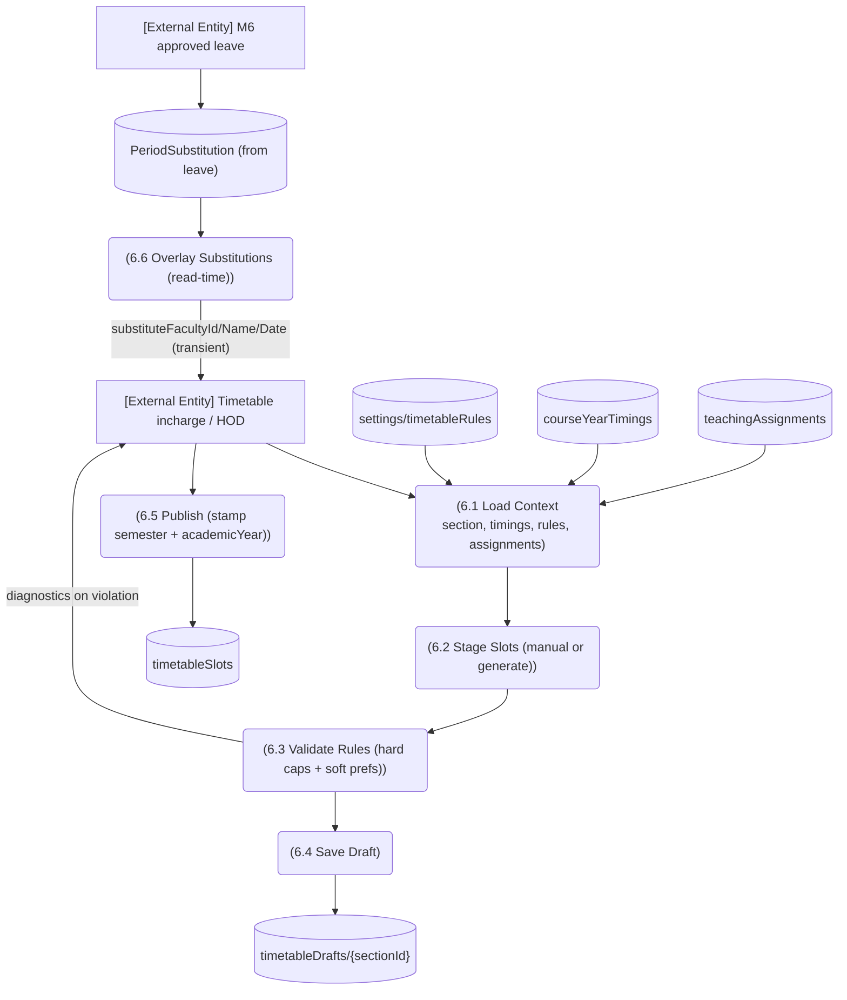

# M3 — DFD Level 2: M3-SM6 Timetable Draft & Publish

*Evidence: loadContext.ts:49-85; rules teaching.ts:344-383 (4 hard, 2 soft, DEFAULT_TIMETABLE_RULES); draft doc path teaching.ts:378-380; history-preserving publish semantics teaching.ts:289-309; overlay via periodCoverage (teaching.ts:310-330).*
