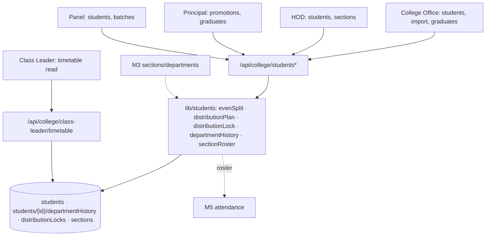

# M4 — Architecture (as-is)

## Frontend
- College Office: roster table with import wizard (`/students/import`), graduates list.
- HOD: per-department students, per-student detail (+attendance drill → M5), sections management (shared M3 UI).
- Principal: promotions center (`/promotions`), graduates, students browse.
- Panel: `/panel/students`, `/panel/students/batches` (lab batches view).
- Class Leader: minimal dashboard — timetable read + profile.

## Backend
- `api/college/students` CRUD with college guard; import via `import-excel` (exceljs + fieldConstraints validation); `distribute-cohort` plans even split (`evenSplit.ts:11`) with dryRun preflight and 409 naming missing target sections (AGENTS.md cohort ops); `distribute` legacy; `promote`/advance-year shares `departmentHistory.ts` (writes `students/{id}/departmentHistory` — :24-26) and `distributionLock.ts` (lock docs at :24).
- Class leader: read-only timetable route + class-work-records (deliberately not a separate collection per route comment class-work-records/route.ts:19).

## Data
- `StudentRecord`: department (real branch), section, year, labBatch?, status REGULAR/GRADUATED, secondaryDepartment (management view — never the student's own dept per AGENTS.md), batch.
- `distributionLocks/{lockKey}` guards concurrent distribution.
- `departmentHistory` subcollection per student — audit trail of dept changes.

## Integration
- Excel import (students); photo via upload/staff-photo? (student photos `[UNVERIFIED]`).

## Security
- College guard; HOD dept scope; Principal/CO college-wide; Panel read; Class Leader seat read-only.

## Mermaid — component diagram

