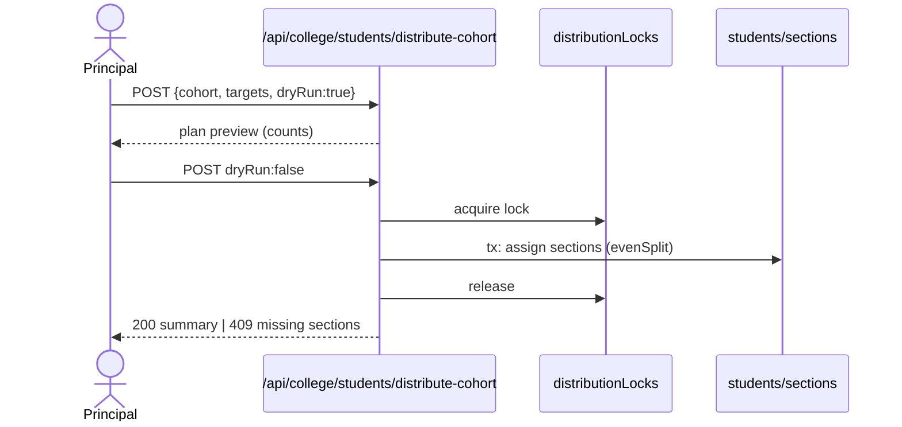

# M4 — Data Flow (as-is)

## M4-SM1 Import/CRUD
Import: Excel → `POST students/import-excel` → validate (fieldConstraints) → batch create `students` (ChunkedBatch for >500). CRUD inline. Sync; 400 on row errors with row numbers `[ASSUMPTION]`.

## M4-SM3 Cohort distribution (distribute-cohort)
**Actors:** Principal/VP (or HOD dept-scoped). **Trigger:** `/principal/sections` distribute action.
**Flow:** plan (distributionPlan) → dryRun preflight → acquire `distributionLocks/{lockKey}` (distributionLock.ts:24) → evenSplit across target sections (evenSplit.ts:11) → transactional roster writes + section counts → release lock. Missing target sections → 409 naming each (AGENTS.md).
**Stores:** `students`, `sections`, `distributionLocks`.

## M4-SM2 Promotions & graduation
`POST students/promote` (advance-year): promotes cohort year+1 with 409 naming missing target sections; departmentHistory appended per student (departmentHistory.ts:24-26); graduated students → status GRADUATED (retained, `/graduates` views).

## M4-SM4 Class leader
Binding: leader user created/role assigned (M1); `/class-leader/timetable` read-only grid with substitution overlay; class-work-records log teaching artifacts (route comment: deliberately part of another doc model — class-work-records/route.ts:19).
