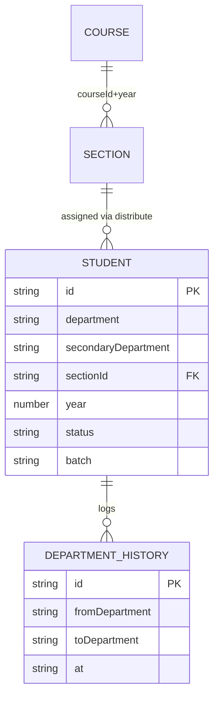

# M4 — Data Model (as-is)

## Entities

| Entity | Path | Key fields | Evidence |
|---|---|---|---|
| Student | `students/{id}` | name, department (real branch), secondaryDepartment?, section, year, labBatch?, status REGULAR/GRADUATED, batch (session cohort), contacts | sectionRoster.ts:50-53 (primary+secondary merge), AGENTS.md academic structure |
| DepartmentHistory | `students/{id}/departmentHistory/{id}` | from/to department, at, by | departmentHistory.ts:24-26 |
| DistributionLock | `distributionLocks/{lockKey}` | holder, expiresAt? | distributionLock.ts:24 |
| Section (shared M3) | `sections/{id}` | roster counts implied | sectionRoster |
| ClassWorkRecord | `classWorkRecords?` | route-derived `[UNVERIFIED]` | class-work-records/route.ts |

## Mermaid ER

## Indexes (M4)
- students: [section, year], [department, section, year], [department, year], [secondaryDepartment, section, year], [secondaryDepartment, year] (firestore.indexes.json).

## Notes
- No soft-delete collection; status field governs. Bulk delete is hard delete `[GAP]`.
