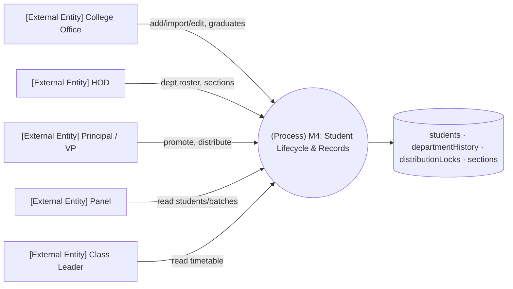

# M4 — DFD Level 0 (context)

```mermaid
flowchart LR
    CO["[External Entity] College Office"]
    HOD["[External Entity] HOD"]
    PR["[External Entity] Principal / VP"]
    PAN["[External Entity] Panel"]
    CL["[External Entity] Class Leader"]

    M4(("(Process) M4: Student Lifecycle & Records"))

    DS[("students · departmentHistory · distributionLocks · sections")]

    CO -->|"add/import/edit, graduates"| M4
    HOD -->|"dept roster, sections"| M4
    PR -->|"promote, distribute"| M4
    PAN -->|"read students/batches"| M4
    CL -->|"read timetable"| M4
    M4 --> DS
```
