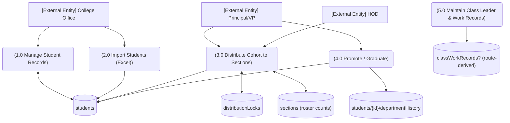

# M4 — DFD Level 1

```mermaid
flowchart TD
    CO["[External Entity] College Office"]
    PR["[External Entity] Principal/VP"]
    HOD["[External Entity] HOD"]

    P1("(1.0 Manage Student Records)")
    P2("(2.0 Import Students (Excel))")
    P3("(3.0 Distribute Cohort to Sections)")
    P4("(4.0 Promote / Graduate)")
    P5("(5.0 Maintain Class Leader & Work Records)")

    D1[("students")]
    D2[("distributionLocks")]
    D3[("students/{id}/departmentHistory")]
    D4[("sections (roster counts)")]
    D5[("classWorkRecords? (route-derived)")]

    CO-->P1; P1<-->D1
    CO-->P2; P2-->D1
    PR-->P3; HOD-->P3; P3<-->D2; P3-->D1; P3<-->D4
    PR-->P4; P4-->D1; P4-->D3
    P5-->D5
```
