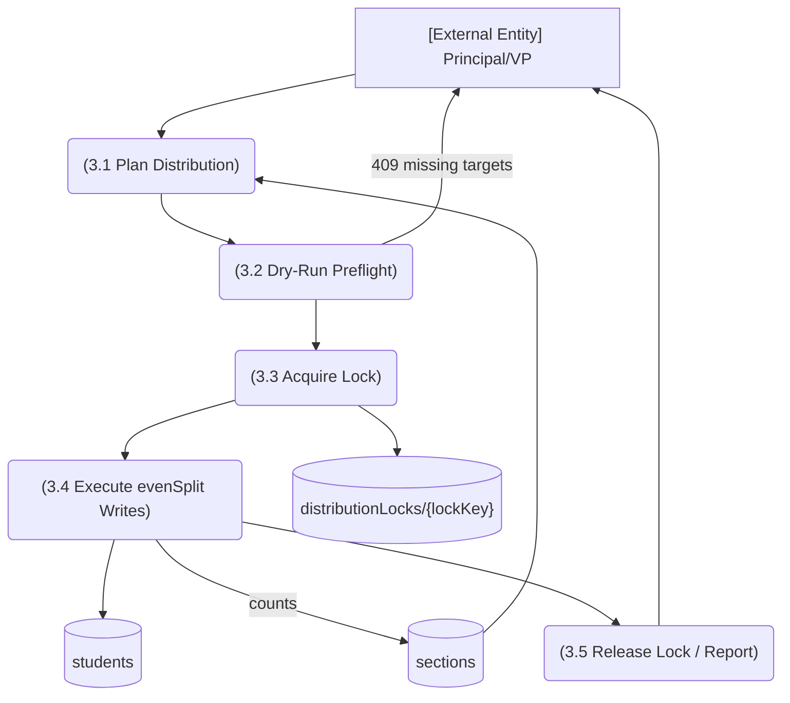

# M4 — DFD Level 2: M4-SM3 Cohort Distribution

*Evidence: `lib/students/distributionLock.ts:24`, `evenSplit.ts:11`, AGENTS.md cohort ops (409 naming missing sections, dryRun preflight); tests `distributionPlan.test.ts`, `evenSplit.test.ts`.*
