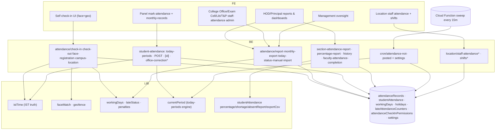

# M5 — Architecture (as-is)

## Frontend
- **Self check-in** (all staff roles): face capture (face-api.js models from `/models` — proxy PUBLIC_PATHS:28-30), geofence map (leaflet), offline queue banner.
- **HOD/Principal**: dashboards for today status, reports (faculty + student), completion, faculty-not-posted, monthly exports.
- **Panel**: `/panel/mark-attendance`, `/panel/monthly-records/**` (per section/year/month/date drill).
- **College Office/Exam Cell/Library/T&P**: staff-attendance admin twins + import.
- **Management**: cross-college attendance oversight incl. principal/VP attendance and reset.
- **Location staff**: `/location-staff-admin/attendance*`, `/location-dept-head/attendance/shift*` — shift-wise views (branch's new work: ShiftWiseAttendanceView, ShiftRotationRosterView components).

## Backend
- Check-in/out: geofence + leave/holiday/Sunday gates; face verify; late check-in detection (09:05 cutoff) with idempotent penalty transaction (`lateAttendancePenalty.ts` via runTransaction; check-in/route.ts:79 per AGENTS.md); check-in permission cascade PRINCIPAL/VP→HOD/unit-head (`checkInPermission.ts:8`).
- Report: HOD dept-tree vs Principal college-wide (`report/route.ts:147` fixed 2026-09 for overridden Sundays — AGENTS.md).
- Manual: 1-tier approval cascade + 25th payroll lock + audit + notify (`attendance/manual`).
- Import: Excel for staff attendance.
- Monthly export: `attendance/monthly-export` + management twin.
- Student marking: `today-periods` (all periods with IST-open windows, substitute-aware `resolveSubstituteSlotsForDate` currentPeriod.ts:106, labBatch awareness) → `POST` (early-return if already SUBMITTED; transactional roster-merge write; blank-section 400) → `PATCH [id]` (versioned `expectedUpdatedAt`→409; 0-student allow with notes; IN_PROGRESS status periodAttendanceStatus.ts:9) → `office-correction` (HOD on-behalf + `[id]`).
- Reports: `section-attendance-report` modes absentOnly/shortage/threshold/consolidated/dailyPercent; `attendance-percentage-report`; `student-attendance-history`; `faculty-attendance-completion` (from/to|allTime|year+month).
- Cron: `POST /api/cron/attendance-not-posted` — Bearer CRON_SECRET; per-college settings gate (`notPostedSettings.ts:24`), cutoff + once/day via lastRunDate; reuses same period-window logic (functions/src/index.ts comment:9-13).
- Location staff: `location/staff-attendance` + `/report` + `location/shifts*` (incl. `rotate`) — branch work-in-progress (git status).

## Data
- `attendanceRecords` per staff-day; `studentAttendance` id `assign_date_period` (types/studentAttendance.ts); `lateAttendanceCounters`; `attendanceCheckInPermissions`; `workingDays` per-role Sunday override; `holidays`/`summerHolidays`.
- Indexes: studentAttendance 4 COLLECTION_GROUP composites (status+sectionId+date, status+facultyId+date, status+subjectId+date, status+department+date); attendanceRecords [facultyId,date↓], [department,date↓].

## Integration
- face-api.js client-side; geofence via campus-location settings; Storage: reference-photo, face-registration photos.
- Email/notifications via notify (manual attendance, not-posted sweep).

## Security/tenancy
- College member guards; HOD dept-tree scoping; Management global oversight (read) + sanctioned reset; cron Bearer secret; location staff under location tenancy.

## Runtime
- Sweep needs Firebase Blaze (functions/README.md) — silent no-op if not deployed `[OPERATIONAL RISK]`.

## Mermaid — component diagram

