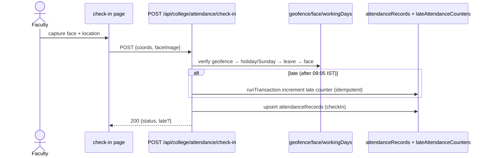
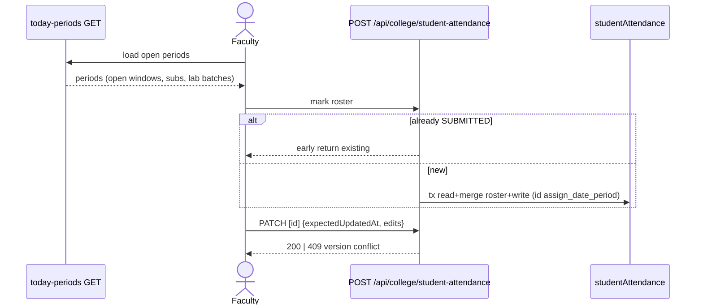
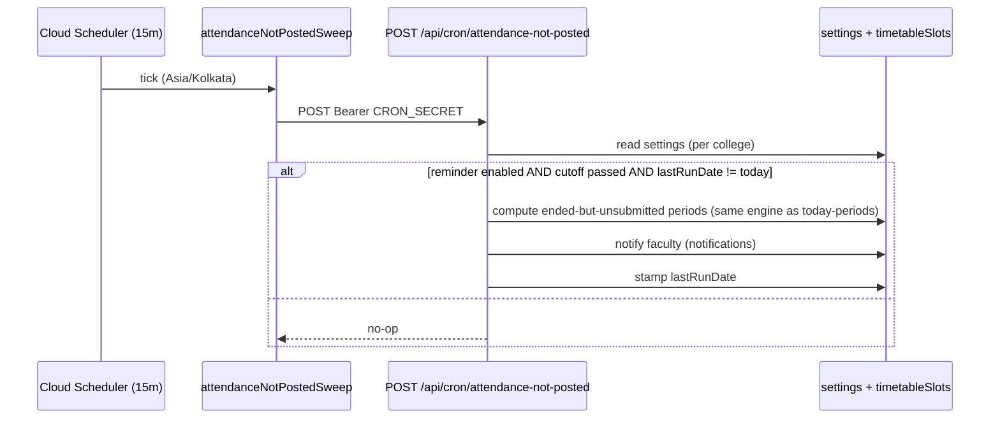

# M5 — Data Flow (as-is)

## M5-SM1 Faculty check-in

**Actors:** any staff role. **Trigger:** arriving on campus.
**Preconditions:** within geofence (or permission cascade); not on approved leave; working day (or Sunday override); face registered.
**Main flow:**
1. `POST /api/college/attendance/check-in` — geofence verify (geofence.ts) → holiday/Sunday gates (workingDays.ts, holidaysCount via leave lib) → face verify (faceMatch EAR/yaw) → late detection (lateStatus 09:05 cutoff) → penalty tx if late (`lateAttendancePenalty.ts`, idempotent runTransaction — check-in/route.ts:79) → write `attendanceRecords`.
2. Check-out similar; missed checkouts closed by `closeMissedCheckouts` (admin-triggered `[UNVERIFIED trigger]`).
**Offline:** queue submissions client-side (offlineSubmitQueue) and replay.
**Errors:** OUTSIDE_GEOFENCE / ON_LEAVE / NON_WORKING_DAY / FACE_MISMATCH → 4xx with reason.

## M5-SM3 Student attendance marking

**Actors:** faculty (assigned slot), substitute, HOD (office correction). **Trigger:** period start.
**Flow:**
1. `GET today-periods` — currentPeriod engine: slots for today with `isOpen` IST windows, substitute-aware (`resolveSubstituteSlotsForDate` :106), labBatch split awareness.
2. `POST /api/college/student-attendance` {assignmentId, date, period, roster} — already-SUBMITTED → early return; transactional read+merge+write (roster merge handles late-added students); blank section → 400.
3. `PATCH [id]` {expectedUpdatedAt} — version conflict → 409; 0-students allowed with notes; status IN_PROGRESS (periodAttendanceStatus.ts:9).
4. `POST office-correction` (HOD) + `PATCH office-correction/[id]`.
**Id:** `assign_date_period` (types/studentAttendance.ts).

## M5-SM4 Reports
- Section report modes (absentOnly/shortage/threshold/consolidated/dailyPercent) — server aggregates over `studentAttendance` COLLECTION_GROUP queries; CSV export (`exportCsv.ts`); percentage engine (`percentage.ts`); absent reports (`absentReport.ts`).
- Faculty completion: `faculty-attendance-completion` ranges from/to|allTime|year+month.

## M5-SM5 Not-posted sweep

## M5-SM6 Location staff & shifts
`location/staff-attendance` mark + `/report`; `location/shifts` CRUD + `[id]/assign` + `rotate` (rotation roster) — active branch work; components ShiftWiseAttendanceView/ShiftRotationRosterView/ShiftAssignedStaffView.
