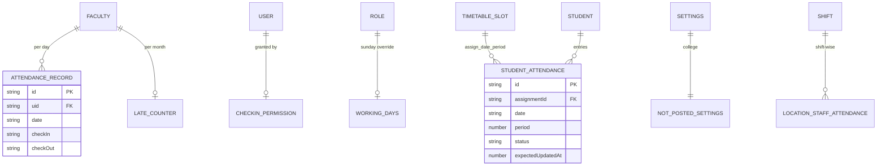

# M5 — Data Model (as-is)

## Entities

| Entity | Path | Key fields | Evidence |
|---|---|---|---|
| AttendanceRecord | `colleges/{id}/attendanceRecords/{id}` | facultyId/uid, date (istDateKey), checkIn/checkOut, source, late?, status | report/manual routes; lateStatus |
| LateAttendanceCounter | `colleges/{id}/lateAttendanceCounters/{uid?}` | count, month key | lateAttendancePenalty.ts:8 |
| CheckInPermission | `colleges/{id}/attendanceCheckInPermissions/{id}` | granter→grantee cascade | checkInPermission.ts:8 |
| WorkingDays | `colleges/{id}/workingDays/{roleId?}` | per-role Sunday override | workingDays.ts:18 |
| Holiday | `colleges/{id}/holidays/{id}` + `summerHolidays` | date ranges | leave/holidaysCount.ts:26-94 |
| StudentAttendanceSession | `colleges/{id}/{dept}/studentAttendance/{id}` (COLLECTION_GROUP) | id `assign_date_period`; entries[]; status IN_PROGRESS/SUBMITTED; expectedUpdatedAt | types/studentAttendance.ts; periodAttendanceStatus.ts:9 |
| NotPostedSettings | `colleges/{id}/settings/{doc}` | enabled, cutoff, lastRunDate | notPostedSettings.ts:24 |
| Location staff attendance / shifts | location-scoped collections | shiftId, rotate history | lib/location/* `[UNVERIFIED names]` |

## Mermaid ER

## Indexes (M5)
- studentAttendance COLLECTION_GROUP: [status,sectionId,date], [status,facultyId,date], [status,subjectId,date], [status,department,date].
- attendanceRecords: [facultyId,date↓], [department,date↓].
- notifications: [toUid,createdAt↓], [toUid,read,createdAt↓].
