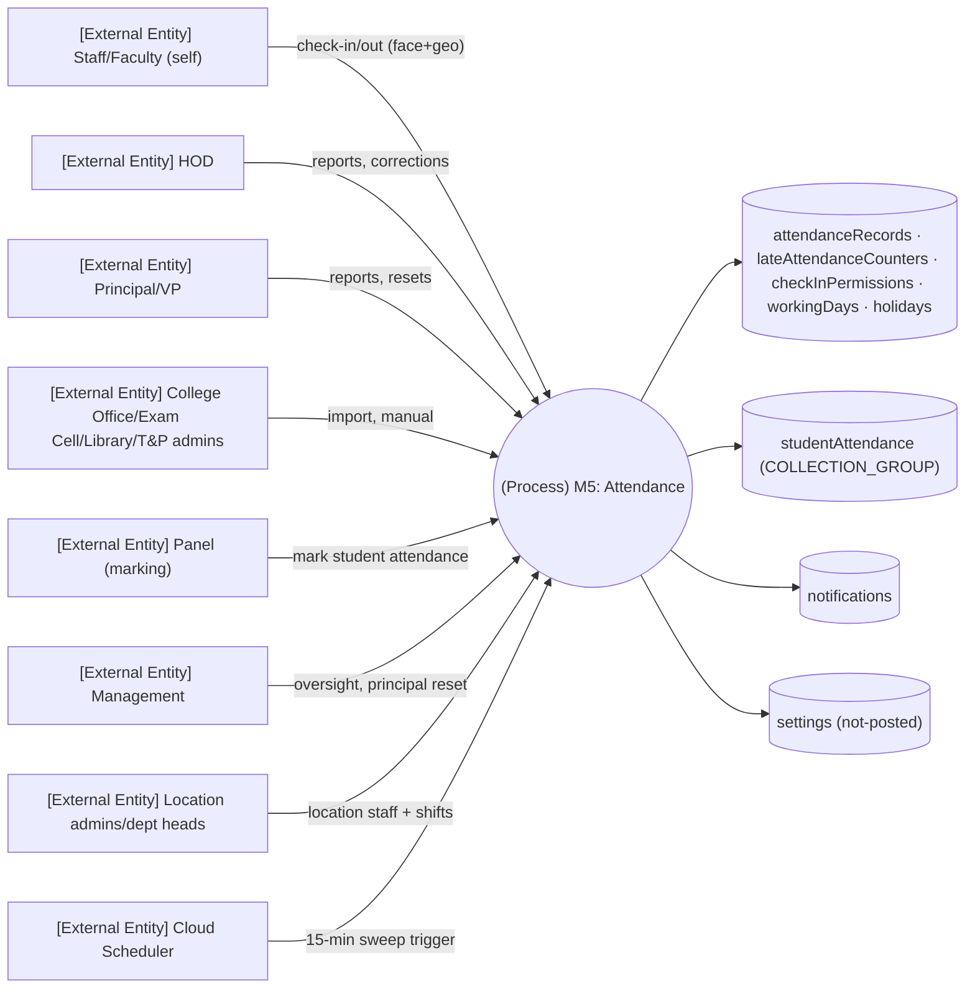

# M5 — DFD Level 0 (context)

```mermaid
flowchart LR
    STAFF["[External Entity] Staff/Faculty (self)"]
    HOD["[External Entity] HOD"]
    PR["[External Entity] Principal/VP"]
    ADM["[External Entity] College Office/Exam Cell/Library/T&P admins"]
    PAN["[External Entity] Panel (marking)"]
    MGMT["[External Entity] Management"]
    LOC["[External Entity] Location admins/dept heads"]
    SCH["[External Entity] Cloud Scheduler"]

    M5(("(Process) M5: Attendance"))

    DA[("attendanceRecords · lateAttendanceCounters · checkInPermissions · workingDays · holidays")]
    DS[("studentAttendance (COLLECTION_GROUP)")]
    DN[("notifications")]
    DSET[("settings (not-posted)")]

    STAFF -->|"check-in/out (face+geo)"| M5
    HOD -->|"reports, corrections"| M5
    PR -->|"reports, resets"| M5
    ADM -->|"import, manual"| M5
    PAN -->|"mark student attendance"| M5
    MGMT -->|"oversight, principal reset"| M5
    LOC -->|"location staff + shifts"| M5
    SCH -->|"15-min sweep trigger"| M5
    M5 --> DA
    M5 --> DS
    M5 --> DN
    M5 --> DSET
```
