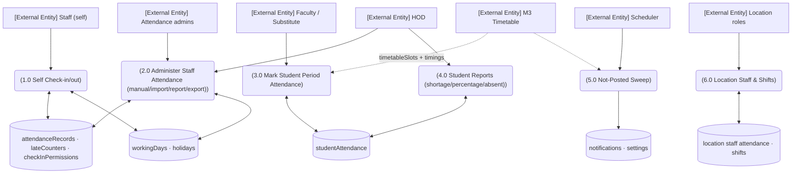

# M5 — DFD Level 1

```mermaid
flowchart TD
    STAFF["[External Entity] Staff (self)"]
    HOD["[External Entity] HOD"]
    ADM["[External Entity] Attendance admins"]
    FAC_T["[External Entity] Faculty / Substitute"]
    SCH["[External Entity] Scheduler"]
    M3["[External Entity] M3 Timetable"]

    P1("(1.0 Self Check-in/out)")
    P2("(2.0 Administer Staff Attendance (manual/import/report/export))")
    P3("(3.0 Mark Student Period Attendance)")
    P4("(4.0 Student Reports (shortage/percentage/absent))")
    P5("(5.0 Not-Posted Sweep)")
    P6("(6.0 Location Staff & Shifts)")

    D1[("attendanceRecords · lateCounters · checkInPermissions")]
    D2[("workingDays · holidays")]
    D3[("studentAttendance")]
    D4[("notifications · settings")]
    D5[("location staff attendance · shifts")]

    STAFF-->P1; P1<-->D1; P1<-->D2
    ADM-->P2; HOD-->P2; P2<-->D1; P2<-->D2
    FAC_T-->P3; P3<-->D3; M3-.->|"timetableSlots + timings"|P3
    HOD-->P4; P4<-->D3
    SCH-->P5; M3-.->P5; P5-->D4
    LOC2["[External Entity] Location roles"]-->P6; P6<-->D5
```
