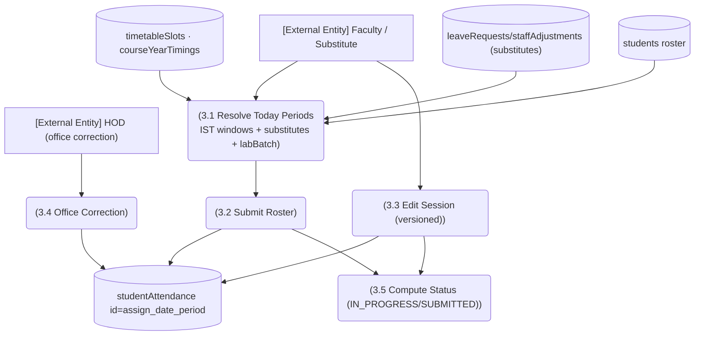

# M5 — DFD Level 2: M5-SM3 Student Period Attendance Marking

*Evidence: currentPeriod.ts:63-273 (windows, substitute resolution :106, split-lab), types/studentAttendance.ts (id), periodAttendanceStatus.ts:9, office-correction routes.*
