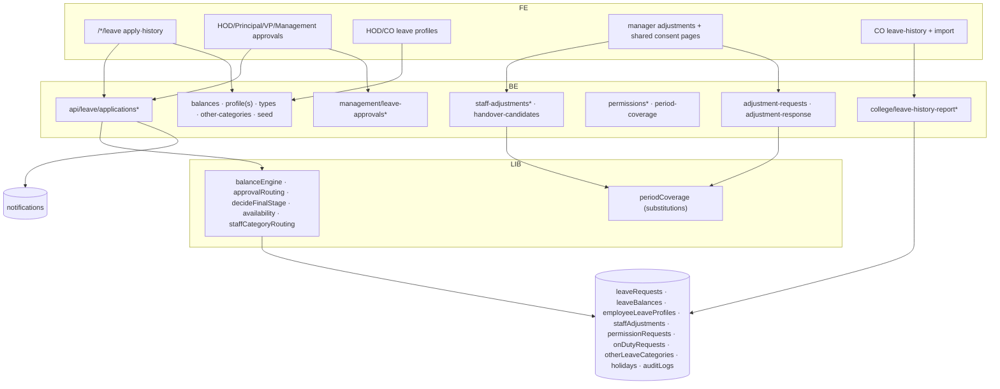

# M6 — Architecture (as-is)

## Frontend
- Self-service: every role root has `/leave` (+`/apply`, `/history/[type]`) — shared components `src/components/leave/*`.
- Approvals: HOD `/hod/leave-approvals`, Principal/VP `/principal/leave-approvals`, Management `/management/leave-approvals` (Principal's own leave — no one else can decide).
- Profiles: HOD `/hod/leave/profiles/[uid]/edit`, College Office `/college-office/leave/profiles*`.
- Adjustments: manager views `/hod|principal|college-office/adjustments`; shared consent pages `/leave/adjustments`, `/leave/revise/[id]`; OD proof `/leave/od-proof/[id]`.
- College-wide history: `/college-office/leave-history/**` (dept→uid→type drill + import).

## Backend
- `api/leave/applications` GET (own/dept) / POST (apply) — balance checks via balanceEngine; approvals PATCH `[id]` with routing per `approvalRouting.ts` (dept HOD → Principal/VP; Principal's own → Management) and final stage `decideFinalStage.ts` (writes auditLogs :93).
- Staff adjustments: manager assigns substitute (`staff-adjustments`, options endpoint lists candidates) — status ACTIVE|CANCELLED (leave.ts:296); scope check `staffAdjustmentScope.ts:60`.
- Self-service: `adjustment-requests` (invite) → target accepts/declines at `applications/[id]/adjustment-response`; decline → revise pick (`/leave/revise/[id]`).
- Permissions (short-leave): `permissionRequests` + notify (`permissionNotify.ts`); OD: `onDutyRequests` + proof upload + `odProofNotify.ts`.
- Coverage engine: `periodCoverage.ts` — approved leave + ACTIVE adjustments → PeriodSubstitution per slot (:135-167,207-216,402-429 chunks); consumed by M5/M3 reads.
- Handover candidates: `handover-candidates` (who can take over periods).
- History reports: `college/leave-history-report` (+absent-today, active-now, yearly, import) via `reportRoster.ts` (users+facultyMembers+supportingStaff merge :36-103).

## Data
- leaveRequests (status workflow + type + dates + adjustment fields), leaveBalances (per uid/year/type), employeeLeaveProfiles (annual entitlements), staffAdjustments, permissionRequests, onDutyRequests, otherLeaveCategories.
- Indexes: leaveRequests [uid,createdAt↓], [department,status,createdAt↓], [status,createdAt↓], COLLECTION_GROUP [status]; budgetRequests COLLECTION_GROUP status (M7). leaveBalances rules `allow write: if false` (historical no-op — SHARED_FILES.md).

## Integration
- Notifications via notify/notifyRole + specialized permissionNotify/odProofNotify.
- M5: approved leave blocks check-in gates; substitutions overlay.
- Import: leave-history-report/import (Excel).

## Security
- College guard everywhere; dept routing (approvalRouting/staffCategoryRouting for faculty vs supporting staff); Management only via sanctioned route; seed route SUPER_ADMIN.

## Mermaid — component diagram

