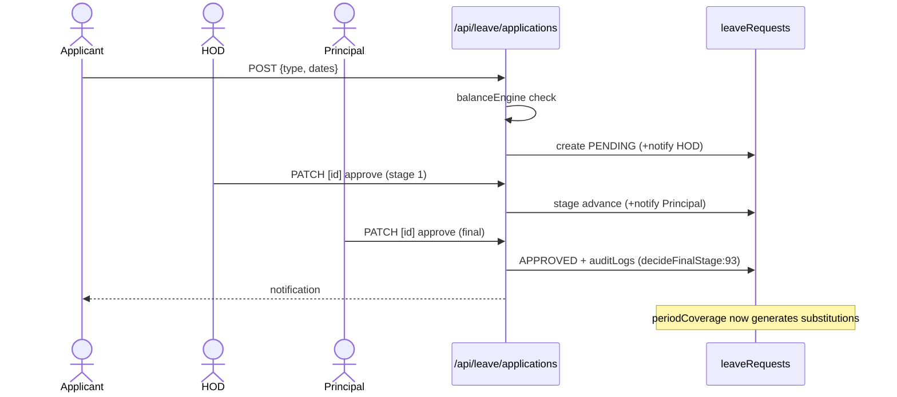
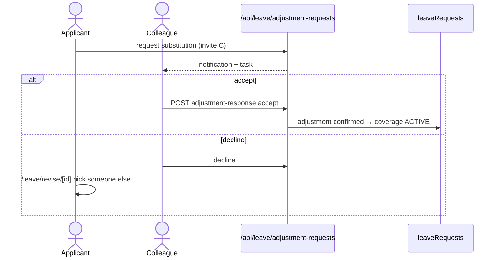

# M6 — Data Flow (as-is)

## M6-SM1 Apply → approve

**Actors:** applicant (any staff), HOD (dept), Principal/VP, Management (Principal's own).
**Flow:**
1. `POST /api/leave/applications` {type CL|SL|SCL|EL|OD|SH, dates, reason} → balance check (balanceEngine) → leaveRequests PENDING (or type-specific initial).
2. Routing: approvalRouting determines approver chain by identity (faculty vs supporting staff via staffCategoryRouting + identity.ts:47-114) — dept HOD first, then Principal/VP; Principal's own → `management/leave-approvals`.
3. Decision PATCH `[id]` → decideFinalStage → status APPROVED/REJECTED; audit log (decideFinalStage.ts:93); notify applicant.
4. APPROVED leave feeds: check-in gates (M5), PeriodSubstitution generation (periodCoverage), history reports.
**OD:** proof upload at `/leave/od-proof/[id]` → odProofNotify to approvers.
**Permissions (short-leave):** permissionRequests with own notify chain.

## M6-SM3 Manager-assigned staff adjustment

**Actors:** HOD/Principal/College Office (manager), substitute.
**Flow:** `GET staff-adjustments/options` (candidates with availability) → `POST staff-adjustments` {faculty, substitute, dates, periods} → status ACTIVE → overrides slots in coverage; `staffAdjustmentScope.ts:60` validates manager authority over the user doc. CANCELLED on revoke.

## M6-SM4 Self-service adjustment request (consent)

**Actors:** applicant, invited colleague.
**Flow:** application created with requested substitute → `adjustment-requests` pending → colleague sees at `/leave/adjustments` → accept (`adjustment-response` approve) or decline → decline → applicant revises pick at `/leave/revise/[id]` → re-request. Availability engine (`availability.ts:117-120`) excludes conflicting leave/adjustments.

## M6-SM2 Profiles/balances/history
Profiles edited by HOD/CO (`employeeLeaveProfiles`); balances computed (balanceEngine) not hand-edited; history: `leave-history-report` (+yearly, absent-today, active-now) via reportRoster merging users/facultyMembers/supportingStaff (:36-103); Excel import for legacy history.

## Error paths
Insufficient balance → 400 with entitlement detail; invalid date range → 400; unauthorized approver → 403; decline-with-no-alternative → applicant revises.
