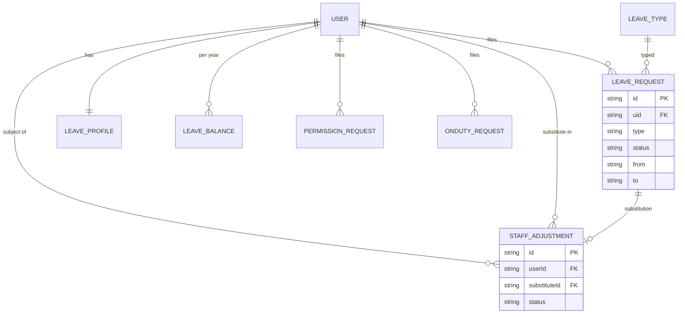

# M6 — Data Model (as-is)

## Entities

| Entity | Path | Key fields | Evidence |
|---|---|---|---|
| LeaveRequest | `colleges/{id}/leaveRequests/{id}` | uid, type (CL/SL/SCL/EL/OD/SH — leave.ts:31), from/to, status workflow, adjustment fields (requested/accepted substitute), stages | balanceEngine.ts:40 |
| EmployeeLeaveProfile | `colleges/{id}/employeeLeaveProfiles/{uid}` | annual entitlements per type | balanceEngine.ts:43 |
| LeaveBalance | `colleges/{id}/leaveBalances/{uid}_{year?}` | per-type remaining | balanceEngine.ts:37 |
| StaffAdjustment | `colleges/{id}/staffAdjustments/{id}` | user, substitute, dates, status ACTIVE/CANCELLED (leave.ts:296) | availability.ts:120 |
| OtherLeaveCategory | `colleges/{id}/otherLeaveCategories/{id}` | custom type defs | otherCategories.ts:9 |
| PermissionRequest | `colleges/{id}/permissionRequests/{id}` | short-leave window, status | permission.ts:19 |
| OnDutyRequest | `colleges/{id}/onDutyRequests/{id}` | OD with proof URL | odProof |
| Holiday | `colleges/{id}/holidays|summerHolidays` | date ranges | holidaysCount.ts:26-94 |

## Mermaid ER

## Indexes
- leaveRequests: [uid,createdAt↓], [department,status,createdAt↓], [status,createdAt↓], COLLECTION_GROUP [status]; permissionRequests: [facultyId,date↓], [department,status]; onDutyRequests: [facultyId,fromDate↓], [department,status].
