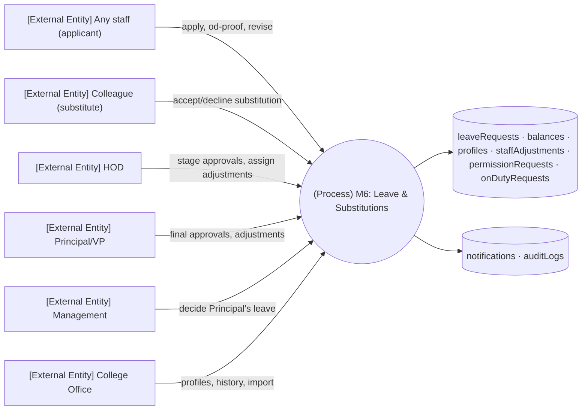

# M6 — DFD Level 0 (context)

```mermaid
flowchart LR
    EMP["[External Entity] Any staff (applicant)"]
    COL["[External Entity] Colleague (substitute)"]
    HOD["[External Entity] HOD"]
    PR["[External Entity] Principal/VP"]
    MGMT["[External Entity] Management"]
    CO["[External Entity] College Office"]

    M6(("(Process) M6: Leave & Substitutions"))

    DL[("leaveRequests · balances · profiles · staffAdjustments · permissionRequests · onDutyRequests")]
    DN[("notifications · auditLogs")]

    EMP -->|"apply, od-proof, revise"| M6
    COL -->|"accept/decline substitution"| M6
    HOD -->|"stage approvals, assign adjustments"| M6
    PR -->|"final approvals, adjustments"| M6
    MGMT -->|"decide Principal's leave"| M6
    CO -->|"profiles, history, import"| M6
    M6 --> DL
    M6 --> DN
```
