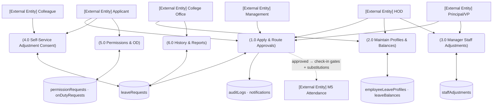

# M6 — DFD Level 1

```mermaid
flowchart TD
    EMP["[External Entity] Applicant"]
    COL["[External Entity] Colleague"]
    HOD["[External Entity] HOD"]
    PR["[External Entity] Principal/VP"]
    MGMT["[External Entity] Management"]
    CO["[External Entity] College Office"]
    M5["[External Entity] M5 Attendance"]

    P1("(1.0 Apply & Route Approvals)")
    P2("(2.0 Maintain Profiles & Balances)")
    P3("(3.0 Manager Staff Adjustments)")
    P4("(4.0 Self-Service Adjustment Consent)")
    P5("(5.0 Permissions & OD)")
    P6("(6.0 History & Reports)")

    D1[("leaveRequests")]
    D2[("employeeLeaveProfiles · leaveBalances")]
    D3[("staffAdjustments")]
    D4[("permissionRequests · onDutyRequests")]
    D5[("auditLogs · notifications")]

    EMP-->P1; P1<-->D1; HOD-->P1; PR-->P1; MGMT-->P1
    HOD-->P2; CO-->P2; P2<-->D2
    HOD-->P3; PR-->P3; P3<-->D3
    EMP-->P4; COL-->P4; P4<-->D1
    EMP-->P5; P5<-->D4
    CO-->P6; P6<-->D1
    P1-->D5
    P1-.->|"approved → check-in gates + substitutions"|M5
```
